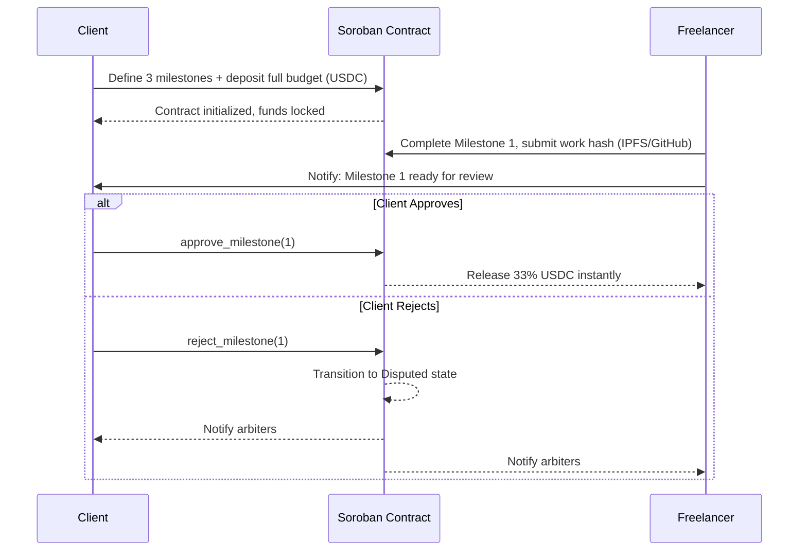
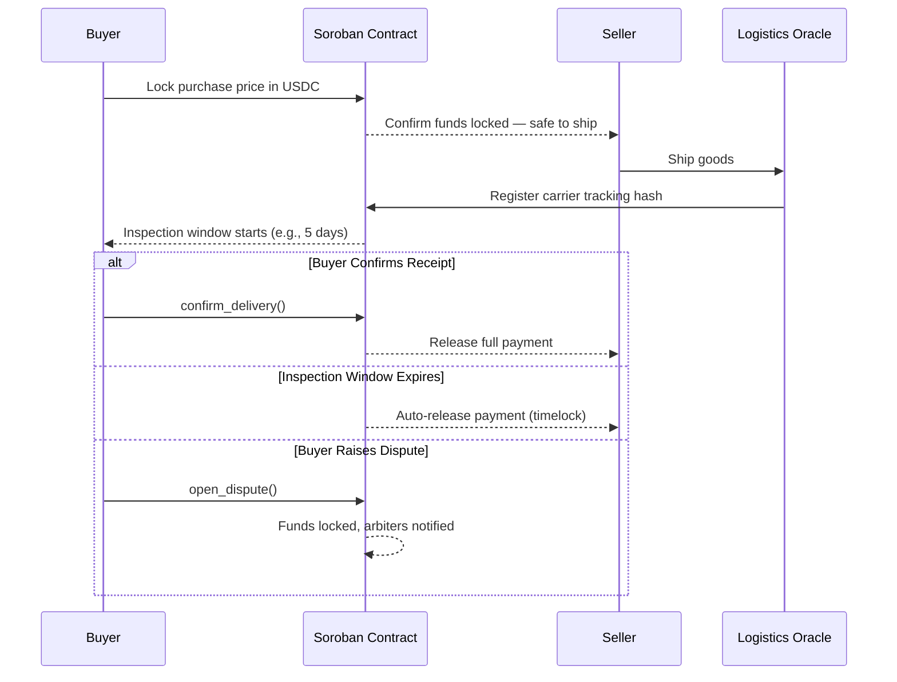
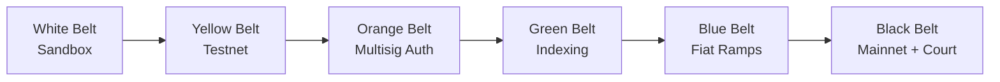

# Stellar Guardian — Product Discovery

> **Status:** Draft
> **Version:** 1.1
> **Last Updated:** 2026-07-08
> **Owner:** Product & Engineering

---

## Table of Contents

1. [Executive Summary](#1-executive-summary)
2. [Problem Statement](#2-problem-statement)
3. [Market Opportunity](#3-market-opportunity)
4. [User Research & Personas](#4-user-research--personas)
5. [Jobs To Be Done](#5-jobs-to-be-done)
6. [Competitive Landscape](#6-competitive-landscape)
7. [Product Vision, Mission & Core Values](#7-product-vision-mission--core-values)
8. [Product Principles & Engineering Philosophy](#8-product-principles--engineering-philosophy)
9. [Business Model](#9-business-model)
10. [Risk Analysis](#10-risk-analysis)
11. [Blue Ocean Strategy](#11-blue-ocean-strategy)
12. [Product Success Metrics](#12-product-success-metrics)
13. [Assumptions](#13-assumptions)
14. [Constraints](#14-constraints)
15. [Out of Scope](#15-out-of-scope)
16. [Stakeholders](#16-stakeholders)
17. [Product Requirements Traceability](#17-product-requirements-traceability)
18. [Future Vision](#18-future-vision)
19. [Journey to Mastery Roadmap](#19-journey-to-mastery-roadmap)
20. [Documentation Roadmap](#20-documentation-roadmap)
21. [References](#21-references)
22. [Glossary](#22-glossary)

---

## 1. Executive Summary

**Stellar Guardian** is a non-custodial, decentralized trust and escrow infrastructure built on the Stellar network using Soroban smart contracts. It is a programmable trust layer — not a wallet, not a payment processor, not a centralized intermediary.

### The Core Problem

Every peer-to-peer and cross-border transaction carries the same structural risk: one party must act first. The buyer sends money or the seller ships goods — and one of them absorbs the full exposure to fraud. This is not a UI problem. It is a trust infrastructure problem.

Existing solutions address it badly. Centralized escrow platforms (Escrow.com, Upwork, PayPal) charge 3–10% fees, exclude billions of unbanked users, freeze accounts arbitrarily, and hold custodial control over user funds. Blockchain-based alternatives (Ethereum, Kleros) solve custody but introduce unpredictable gas fees, state bloat, and friction that makes them unusable at scale for micro-transactions.

### Why Stellar Guardian

The Stellar network — with sub-cent transaction fees, ~5-second finality, native USDC/EURC stablecoin support, and Soroban's optimized smart contract runtime — provides the only production-viable foundation for a decentralized escrow protocol that works equally well for a $10 freelance task and a $50,000 B2B shipment.

Stellar Guardian is being built to close this gap: a fully open, non-custodial, programmable escrow layer that any developer, marketplace, or enterprise can integrate or extend.

---

## 2. Problem Statement

### 2.1 Discovery Methodology

Product discovery began with a human-centered research process focused on understanding real-world friction before any technical decisions were made. The research relied on:

- Direct user interviews with freelancers, e-commerce buyers, B2B merchants, and NGO operators
- Review of academic papers and industry case studies on P2P commerce failure modes
- Behavioral pattern analysis — distinguishing emotional friction from functional gaps
- Deliberate separation of developer assumptions from actual user needs

The result is a problem statement grounded in observed behavior, not speculation.

### 2.2 The Trust Asymmetry in P2P Commerce

Global peer-to-peer commerce is structurally broken for one reason: **counterparty trust**. The classic game-theoretic dilemma — who performs first? — creates an unavoidable exposure window in every unmediated transaction. Fraud, chargebacks, non-delivery, and scope disputes are not edge cases. They are the default risk.

Traditional platforms resolve this with centralized escrow intermediaries. This works, but at significant cost:

| Systemic Failure Mode | Real-World Impact |
|---|---|
| High transaction fees (3–10%) | Micro-transactions become economically unviable |
| Geographic and banking restrictions | Billions of unbanked/underbanked users excluded from global commerce |
| Arbitrary account freezes | Sovereign platform control over user funds with no appeal path |
| Slow settlement (14–30 days) | Capital locked, cash flow disrupted for small operators |
| Custodial risk | Platform insolvency or compromise exposes all user funds |

These are not incidental flaws — they are structural consequences of centralized custody.

### 2.3 Why Existing Blockchain Solutions Fall Short

EVM-based smart contract escrows were the obvious first attempt at a decentralized alternative. They eliminated custodial risk but created new failure modes:

- **Unpredictable gas fees** — ranging from $2 to $100+ per transaction, making micro-escrows economically absurd
- **State bloat** — Ethereum's unbounded state model creates compounding infrastructure costs
- **Poor dispute resolution** — centralized admin keys or crowd-sourced courts (Kleros) that take days and cost more in fees than many escrow values
- **Onboarding friction** — seed phrase management, gas token acquisition, and wrap/unwrap mechanics exclude non-technical users by default

The problem is not decentralization as a concept. The problem is that existing decentralized solutions optimize for the wrong constraints.

### 2.4 The Gap

There is no production-ready, developer-friendly, cost-predictable, non-custodial escrow protocol that:

- Works for transactions under $100
- Operates without a bank account or western payment rail
- Handles milestone-based freelance agreements and physical goods shipments with equal precision
- Provides deterministic dispute resolution without centralized admin control
- Runs at scale without unsustainable infrastructure cost

Stellar Guardian is built to be that protocol.

---

## 3. Market Opportunity

### 3.1 Structural Tailwinds

Several macro forces converge to make this the right moment to build this infrastructure:

**Global freelance market growth.** The global freelance economy exceeded $455B in 2023 and continues to expand as remote work normalizes. Milestone-based payment security is one of the top unresolved pain points for independent workers, particularly outside North America and Western Europe.

**Emerging market demand for stable digital currency.** In economies experiencing high inflation (Argentina, Nigeria, Turkey, Venezuela), access to stable USD-denominated assets is a survival need, not a feature request. Stellar's USDC integration provides this access without requiring a traditional bank account.

**Trade finance inefficiency.** Letters of Credit — the dominant tool for cross-border B2B settlements — are slow (5–10 business days), expensive, and require relationships with correspondent banks that most SMEs cannot establish. A programmable on-chain alternative addresses a multi-trillion dollar inefficiency.

**Non-custodial regulatory positioning.** The global regulatory environment is tightening around custodial crypto services. Non-custodial protocols — where the platform never holds private keys — occupy a structurally different (and more defensible) legal position in most jurisdictions.

### 3.2 PESTLE Analysis

| Dimension | Signal | Implication for Stellar Guardian |
|---|---|---|
| **Political** | Global stablecoin compliance push; Stellar's institutional partnerships (Circle, SDF) | Enterprise-readiness and regulatory alignment are already partially established |
| **Economic** | Persistent inflation in developing economies; rising demand for USD-stable assets | Direct product-market fit for SEP-24 fiat on-ramp to stablecoin escrow |
| **Social** | Normalization of remote work, digital nomadism, and cross-border P2P commerce | Expands the addressable user base beyond traditional fintech customers |
| **Technological** | Maturity of Rust/Soroban smart contract tooling; Mercury indexing infrastructure | Core technical dependencies are production-ready |
| **Legal** | Non-custodial architecture avoids direct custodial escrow licensing in most jurisdictions | Lower regulatory surface area than custodial competitors |
| **Environmental** | Stellar uses Federated Byzantine Agreement (FBA) — near-zero energy consumption | Defensible ESG positioning; no proof-of-work carbon exposure |

### 3.3 SWOT Analysis

**Strengths**
- Sub-cent transaction fees with ~5-second finality make micro-escrows economically viable
- Native USDC/EURC stablecoin integration via Stellar Asset Contract
- Soroban's rent-based state model prevents unbounded storage growth
- Non-custodial architecture — the platform never controls user funds
- Rust-based contracts provide type safety and deterministic execution

**Weaknesses**
- Stellar ecosystem has lower name recognition than Ethereum/Solana among developers
- Ecosystem liquidity is smaller; fewer anchor integrations than mature networks
- Custom authorization logic in Soroban is complex to audit correctly
- Dependency on Mercury indexer infrastructure introduces an external operational dependency

**Opportunities**
- No direct competitor offers a production-ready, open-source Soroban escrow SDK
- Emerging markets represent an underserved user base with acute need
- White-label integration opportunity with existing freelance and B2B marketplace operators
- Disruption of traditional Letters of Credit for SME cross-border trade

**Threats**
- Evolving global stablecoin regulation could impose retroactive compliance requirements
- Competitors on other chains could replicate contract logic with higher marketing budgets
- Web3 security attack surface continues to expand — novel exploit vectors emerge regularly
- Stellar protocol upgrades could introduce breaking changes in Soroban SDK behavior

---

## 4. User Research & Personas

### 4.1 Human Needs Validation Matrix

Research mapped observed pain points to functional system requirements and the technical mechanisms that satisfy them.

| Human Need | Observed Pain Point | System Requirement | Technical Implementation |
|---|---|---|---|
| Financial security | Fear that the counterparty will cancel or withhold after receiving value | Funds held in secure, inaccessible on-chain collateral | Non-custodial escrow with multi-party cryptographic locks |
| Fair treatment | Payment trapped indefinitely by an unresponsive buyer | Automatic, unconditional release after a defined period | `claim_after` UNIX timestamp timelocks |
| Geographic inclusion | Excluded from western payment infrastructure and bank approvals | No bank account required; accessible via stablecoin wallet | Low-fee Stellar USDC with SEP-24 fiat on-ramp |
| Privacy and safety | Fear of retaliation for leaving honest negative feedback | Non-identifiable review submission path | One-time cryptographic review identifiers |
| Capital efficiency | Funds locked in escrow for 14–30 days arbitrarily | Defined, contractually enforced release schedules | Programmatic milestone-release logic in Soroban |

### 4.2 User Persona Matrix

| Role | Core Goals | Key Frustrations | Critical Pain Points |
|---|---|---|---|
| **Buyer / Payer** | Purchase goods and services globally with fraud protection | Fraud, slow dispute cycles, no recourse for defective goods | No enforceable mechanism to require delivery before payment |
| **Seller / Payee** | Receive guaranteed payment without chargeback risk | Chargeback fraud, platform-mandated 14–30 day holds | Funds withheld by platform with no transparent timeline |
| **Freelancer** | Secure milestone-based payment throughout a project | Scope creep, client ghosting after work is delivered | 40+ hours of work delivered with no payment and no recourse |
| **NGO / Donor** | Ensure donations reach their intended field destination | High administrative overhead, opaque fund flows | Donated funds diverted or absorbed by intermediary overhead |
| **B2B Merchant** | Secure payment for cross-border import/export transactions | Slow wire processing, complex Letter of Credit administration | Capital locked in traditional banking for weeks per shipment |
| **Arbiter** | Fairly resolve disputes between counterparties | No verifiable evidence standard, social pressure from parties | Dispute context lost; no structured framework for rulings |

### 4.3 User Journey: Freelancer Milestone Escrow

*Figure 1 — Freelancer milestone escrow flow with approval and dispute paths.*

### 4.4 User Journey: Cross-Border Physical Goods

*Figure 2 — Physical goods escrow with oracle-registered shipment and automatic timelock release.*

---

## 5. Jobs To Be Done

**Jobs To Be Done (JTBD)** frames user motivation as a job the product is hired to complete. These are the atomic use cases driving design and contract logic.

| User | Job Statement |
|---|---|
| Buyer | "Lock my payment in a smart contract that only releases when I confirm delivery, so I'm protected from fraud regardless of where the seller is located." |
| Seller | "Verify on-chain that funds are locked before I ship, so I know I'll receive payment without chargeback risk or platform interference." |
| Freelancer | "Have my project budget locked per milestone before I start work, so I never deliver unpaid and have a clear path if the client disappears." |
| NGO / Donor | "Trace my donation to a verifiable on-chain disbursement event, so I know funds reached the intended recipient." |
| B2B Merchant | "Replace Letters of Credit with a smart contract that auto-releases upon verified delivery confirmation, cutting settlement time from weeks to hours." |
| Arbiter | "Access all escrow state, submitted evidence, and contract history in a structured format, so I can issue a fair ruling based on facts rather than assertions." |

---

## 6. Competitive Landscape

### 6.1 Competitor Matrix

| Platform | Model | Strengths | Weaknesses | Unaddressed Gap |
|---|---|---|---|---|
| **Escrow.com** | Centralized institution | High trust, regulatory compliance, established brand | 3–10% fees, slow settlement, geographic restrictions | Instant cross-border stablecoin settlement; no bank required |
| **Utrust / xMoney** | Centralized crypto gateway | Relatively smooth UX for merchants | Custodial, merchant-only focus, not a P2P protocol | Decentralized P2P escrow with milestone logic |
| **Kleros Escrow V1** | Ethereum + crowd-sourced arbitration | Robust decentralized dispute justice | High ETH gas, complex UX, dispute resolution takes days | Cost-effective micro-escrows; fast mobile-first experience |
| **Trustless Work / SecureFlow** | Stellar-native Soroban escrow | Sub-second finality, near-zero fees, non-custodial | No scalable off-chain indexer; limited escrow patterns; no consumer UI | Full-stack, production-ready marketplace application with SDK |

### 6.2 Competitive Positioning

Stellar Guardian occupies a distinct position: the only full-stack, open-source, non-custodial escrow platform built natively on Soroban with a production-ready consumer application, a developer SDK, and a modular dispute resolution system.

The closest competitors either sacrifice decentralization (Escrow.com, Utrust) or sacrifice usability and cost efficiency (Kleros). Trustless Work is the most structurally similar but lacks the application layer and indexing infrastructure required for production adoption.

---

## 7. Product Vision, Mission & Core Values

### Mission

To democratize economic trust by building a globally accessible, high-performance, non-custodial escrow infrastructure for P2P and B2B commerce.

### Vision

To become the default open-source trust layer for global digital and physical commerce — powering everything from a local freelance agreement to a complex cross-border logistics supply chain — without ever holding a user's funds.

### Core Values

**1. Uncompromising Autonomy**
Non-custodial by default. Assets are governed exclusively by smart contract logic. No admin key, no platform operator, and no third party can access escrowed funds outside a pre-defined contractual path.

**2. Economic Inclusivity**
Transaction costs must be low enough that a street merchant in Lagos and a software developer in Berlin transact on equal footing. Sub-cent fees are not a feature — they are a prerequisite for this product to exist.

**3. Radical Transparency**
Every escrow state, dispute resolution event, and contract condition is verifiable on-chain. Users do not need to trust Stellar Guardian — they can verify it.

**4. State Efficiency**
Ledger footprint is a real cost. Every contract design decision treats storage consumption as a first-class engineering constraint, not an afterthought.

---

## 8. Product Principles & Engineering Philosophy

### Product Principles

**Design for the 99%**
The blockchain must be invisible to the end user. Users interact with stablecoin amounts, not gas fees or trustline mechanics. Wallet connection, fee-bump sponsorship, and SEP interactions are handled transparently by the platform.

**Code is the Custodian**
No administrative key may access escrowed funds except through a pre-defined, auditable dispute resolution path. "Trust us" is not an architecture.

**Every Escrow Must Decay**
Every escrow must have a mathematically guaranteed exit path via timelock expiry. Permanent fund trapping is not an acceptable failure mode. If no party acts, the contract's decay function returns funds to their default beneficiary.

**Modularity Over Monolithism (in contract design)**
Escrow logic, dispute resolution, reputation scoring, and marketplace coordination are separate Soroban contracts with defined interfaces. Each can be upgraded, replaced, or extended without migrating the others.

### Engineering Philosophy

The contract layer is written in **Rust targeting Soroban (WASM)**. Rust's ownership model and type system eliminate entire classes of bugs at compile time — memory safety, integer overflow, and state inconsistency errors that have caused hundreds of millions in losses on other platforms.

Application architecture follows **Clean Architecture** principles: domain logic is isolated from transport, storage, and UI concerns. This allows the same escrow domain logic to serve a web UI, an API, a CLI, and a third-party SDK without duplication.

The engineering baseline is predictability. Deterministic execution paths over complex abstractions. Explicit state transitions over implicit side effects. Pinned dependency versions over open ranges.

> **Note:** Architectural Decision Records (ADRs) — including the phased backend introduction strategy (ADR-004) — are documented in [`03_ARCHITECTURE_REVIEW.md`](./03_ARCHITECTURE_REVIEW.md).

---

## 9. Business Model

### 9.1 Business Model Canvas

| Block | Detail |
|---|---|
| **Key Partners** | Stellar Development Foundation (SDF); Circle (USDC anchor); fiat on-ramp anchor operators (MoneyGram, Coinbase); security audit firms; freelance and B2B marketplace integrators |
| **Key Activities** | Rust/Soroban smart contract development and auditing; off-chain indexer maintenance (Mercury/Zephyr); REST API and SDK development; dispute resolution system operation |
| **Key Resources** | Soroban contract suite; Mercury indexer infrastructure; developer documentation; open-source community; security audit track record |
| **Value Propositions** | Non-custodial escrow with sub-cent fees; geographic inclusivity without bank accounts; instant stablecoin settlement; modular dispute resolution; open-source SDK for marketplace integration |
| **Customer Segments** | Independent freelancers (global); cross-border B2B merchants (SME); digital marketplace operators; NGOs and donors; developers building on Stellar |
| **Channels** | Direct web application; open-source developer SDK; white-label integration with existing marketplaces; developer documentation and Stellar ecosystem exposure |
| **Customer Relationships** | Self-service for end users; developer relations and integration support for platform partners; community-driven dispute resolution participation |
| **Revenue Streams** | 0.5% platform service fee on completed escrows (capped at 50 USDC per transaction); dispute filing fees (deterrent mechanism); white-label integration licensing fees |
| **Cost Structure** | Smart contract development and external security audits; off-chain infrastructure hosting (indexer, API, monitoring); developer relations and documentation; legal and compliance review |

### 9.2 Revenue Model Detail

| Revenue Stream | Rate | Notes |
|---|---|---|
| Platform service fee | 0.5% of escrow value | Capped at 50 USDC per transaction; waived for donation escrows |
| Dispute filing fee | Fixed (TBD) | Charged to the party initiating a dispute; deterrent against frivolous claims |
| White-label integration | Negotiated | Per-integration licensing for marketplace operators embedding the SDK |

### 9.3 Fee Philosophy

The 0.5% fee is positioned to be:
- **Below the threshold of any centralized competitor** (all charge 3–10%)
- **Sustainable at volume** — a $10,000 monthly escrow flow generates $50 in revenue; at $10M/month, $50,000
- **Transparent and on-chain** — the fee mechanism is verifiable in the smart contract, not in a terms-of-service document

Donation escrows carry zero platform fees by design. This is a deliberate value statement, not a marketing gesture.

---

## 10. Risk Analysis

| Risk | Impact | Likelihood | Mitigation Strategy |
|---|---|---|---|
| **Smart contract exploit** | Severe — direct fund loss | Low | Triple-pass external audits; Scout Audit static analysis on every CI PR; 3-of-5 multisig emergency pause control |
| **Soroban state expiration** | High — active escrows become inaccessible | Medium | Programmatic `extend_ttl` called on every state-altering interaction; off-chain TTL monitoring workers with automated alerts |
| **Regulatory action** | High — operational or geographic restriction | Medium | Strict non-custodial architecture (platform never holds keys); legal review confirms protocol-layer positioning in target jurisdictions |
| **Stablecoin depeg or anchor failure** | High — user funds lose value or become inaccessible | Low–Medium | Multi-stablecoin support (USDC primary, EURC secondary); anchor diversification via SEP-24; user-visible stablecoin risk disclosure |
| **Indexer infrastructure failure** | Medium — read layer unavailable; contracts unaffected | Medium | Mercury primary + fallback RPC polling; on-chain state always recoverable; graceful degradation in UI |
| **Liquidity constraints** | Medium — insufficient anchor depth for large transactions | High | Direct SEP-24 and SEP-38 integration with established anchors (MoneyGram, Circle); large-transaction advisory thresholds |
| **Competitor replication** | Low–Medium — loss of first-mover advantage | Medium | Open-source moat via community, documentation quality, and audit history; network effects from integrated marketplaces |

> **Note on smart contract risk:** The highest-severity risk category is smart contract exploit. This project treats security auditing as a non-negotiable cost, not an optional line item. No mainnet deployment occurs without at least one external audit from a recognized Rust/Soroban security firm.

---

## 11. Blue Ocean Strategy

Stellar Guardian does not compete on incremental improvement within the existing escrow market. It redefines the competitive space by eliminating constraints that every incumbent treats as fixed.

| Action | Specific Changes |
|---|---|
| **Eliminate** | High platform fees (3–10%); geographic banking requirements; custodial control over user funds; complex EVM gas management; state bloat |
| **Reduce** | Escrow setup time (from hours/days to under 5 seconds); crypto terminology exposure to end users; on-chain execution cost to sub-cent levels |
| **Raise** | Transaction finality speed; mobile-first accessibility; on-chain transparency of all contract states; dispute resolution modularity |
| **Create** | Embeddable payment links and checkout buttons for any marketplace; automatic TTL extension protocols preventing accidental fund trapping; plug-and-play B2B trade finance modules; open-source SDK for third-party integration |

The strategic logic: every major competitor is optimizing within constraints (fees, geography, custody) that Stellar + Soroban allow Stellar Guardian to simply discard. The result is not a better escrow service — it is a structurally different category of product.

---

## 12. Product Success Metrics

These metrics define what success looks like. They are the basis for product decisions, phase-gate evaluations, and post-launch monitoring.

### 12.1 Business KPIs

| Metric | Description | Target (Black Belt Launch) |
|---|---|---|
| **Monthly Active Users (MAU)** | Unique wallet addresses initiating or participating in at least one escrow per month | 1,000 MAU within 90 days of Mainnet |
| **Escrows Created** | Total new escrow contracts deployed | 500/month by end of Yellow Belt |
| **Escrow Completion Rate** | % of escrows reaching a completed state (released or refunded) without manual intervention | ≥ 85% |
| **Escrow Volume (USD)** | Total USD value of USDC/EURC locked across active and completed escrows | $100K/month by Blue Belt |
| **Platform Revenue** | Net revenue from service fees and dispute filing fees | $500/month by Black Belt |
| **Marketplace Integrations** | Number of third-party platforms embedding the Stellar Guardian SDK | 3 integrations by Black Belt |

### 12.2 Technical KPIs

| Metric | Description | Acceptable Threshold |
|---|---|---|
| **Contract Invocation Success Rate** | % of Soroban function calls that complete without error | ≥ 99.5% |
| **Average Transaction Confirmation Time** | Time from transaction submission to ledger inclusion | ≤ 10 seconds (p95) |
| **RPC Latency** | p95 latency for Stellar RPC read calls | ≤ 500 ms |
| **Indexer Lag** | Time delta between on-chain event and PostgreSQL read-cache update | ≤ 5 seconds (p95) |
| **API Availability** | Uptime for the REST API layer (Green Belt+) | ≥ 99.5% |
| **Smart Contract Failure Rate** | % of contract calls returning error responses | ≤ 0.5% |
| **TTL Extension Coverage** | % of active escrows with TTL extended before expiry window | 100% |

### 12.3 UX KPIs

| Metric | Description | Target |
|---|---|---|
| **Wallet Connection Success Rate** | % of users who successfully connect a wallet on first attempt | ≥ 90% |
| **Escrow Creation Time** | Median time from first interaction to funded escrow contract | ≤ 3 minutes |
| **User Satisfaction (CSAT)** | Post-transaction satisfaction score | ≥ 4.2 / 5.0 |
| **Net Promoter Score (NPS)** | Likelihood of recommending Stellar Guardian | ≥ 40 |
| **Support Ticket Rate** | Support tickets per 100 completed escrows | ≤ 5 tickets |
| **Dispute Rate** | % of escrows escalated to formal dispute | ≤ 8% |

---

## 13. Assumptions

The following assumptions underlie the product strategy. If any are invalidated, the affected areas of the product plan must be reassessed.

| # | Assumption | Risk if False | Mitigation |
|---|---|---|---|
| A-01 | Users already possess or can acquire a Stellar-compatible wallet (Freighter, Lobstr, or Hana) | Severe onboarding friction; user drop-off before first escrow | SEP-10 wallet-kit abstracts provider; onboarding flow includes guided wallet setup |
| A-02 | USDC liquidity on Stellar remains stable and anchor-redeemable | Users cannot convert escrow proceeds to fiat | Multi-anchor strategy via SEP-24; EURC as fallback; user-visible stablecoin disclosures |
| A-03 | SEP-24 anchor operators (MoneyGram, Circle) remain available and compliant | Fiat on-ramp feature (Blue Belt) fails | Diversify anchor integrations early; support direct wallet funding as a fallback |
| A-04 | Mercury / Zephyr VM remains maintained and operationally reliable | Indexing layer fails; read API returns stale data | Fallback to direct Stellar RPC polling in UI; manual recovery path documented |
| A-05 | Soroban continues evolving with backward-compatible SDK versioning | Contract upgrades introduce breaking changes | SDK version pinned; upgradability path documented per contract; staging testnet before any upgrade |
| A-06 | Non-custodial architecture remains outside the scope of custodial escrow licensing in target jurisdictions | Retroactive compliance requirement forces operational restructuring | Legal review conducted per jurisdiction prior to launch; architecture documentation maintained for regulatory review |
| A-07 | The Stellar network's sub-cent fee structure remains stable | Micro-transaction economic model becomes unviable | Fee model is monitored; contract design does not depend on fees below a fixed floor |
| A-08 | Target users (freelancers, SMB merchants) are willing to use stablecoin payments rather than fiat | Adoption blocked by crypto familiarity barrier | SEP-24 fiat on-ramp specifically designed to abstract stablecoin mechanics from end users |

---

## 14. Constraints

These are hard limits on the project that are not negotiable and must be respected in every design and implementation decision.

### 14.1 Technical Constraints

| Constraint | Description |
|---|---|
| **Soroban runtime only** | All on-chain logic must run on Soroban. EVM, CosmWasm, or other runtimes are out of scope. |
| **Rust contract language** | Smart contracts are written exclusively in Rust. No Solidity, Move, or other languages. |
| **Non-custodial by architecture** | The platform must never hold private keys or have unilateral control over user funds at any phase. |
| **Stellar network only** | No cross-chain bridges, no multi-chain deployment. The infrastructure is Stellar-native. |
| **Soroban SDK pinned to ≥ 25.3.0** | Required for CVE-2026-32322 fix. No deployment on earlier versions. |
| **Fixed-point math library pinned to ≥ 1.3.1** | Required for CVE-2026-24783 fix. |

### 14.2 Business Constraints

| Constraint | Description |
|---|---|
| **Phase-gated development** | Features are delivered in the Journey to Mastery belt sequence. No Black Belt features are built before Green Belt infrastructure is stable. |
| **No backend before Green Belt** | The `apps/api/` backend is not introduced until Green Belt phase per ADR-004. |
| **External audit before Mainnet** | At least one external Rust/Soroban security audit is required before any Mainnet deployment. This is a hard gate, not a preference. |
| **Monorepo with Turborepo** | All application code lives in the Turborepo monorepo. No separate repositories for frontend, contracts, or packages. |
| **pnpm only** | npm and yarn are not used in this workspace. All package management uses pnpm. |

### 14.3 Team & Timeline Constraints

| Constraint | Description |
|---|---|
| **Small founding team** | Initial development is executed by a small team. Architecture must prioritize simplicity and maintainability over premature optimization. |
| **Hackathon phase deadline** | White Belt and Yellow Belt deliverables are targeted for the active hackathon submission window. |
| **Open-source first** | All core contracts and SDK code are open-source from day one. No proprietary contract logic in Phase 1. |

---

## 15. Out of Scope

The following are explicitly not part of Stellar Guardian at any phase of the current roadmap, unless a future product decision formally extends the scope.

| Out of Scope | Rationale |
|---|---|
| **DAO governance** | Requires token infrastructure, governance smart contracts, and legal framework not aligned with V1 goals |
| **Cross-chain bridges** | Stellar-native architecture is a deliberate constraint; multi-chain adds attack surface without proportional user value |
| **NFT escrow** | NFT market dynamics and metadata standards are outside the current P2P commerce and freelance escrow focus |
| **AI-assisted dispute resolution** | Introduces model opacity into a trust-critical path; deferred to future research after decentralized court matures |
| **Native mobile applications** | iOS/Android apps are post-Black-Belt; mobile-first web (PWA) is the V1 mobile strategy |
| **KYC / AML identity verification** | Non-custodial architecture intentionally avoids identity requirements; KYC would require custodial reclassification |
| **Insurance products** | Escrow failure coverage and smart contract insurance are third-party integration territory, not core protocol |
| **Fiat-denominated escrows** | Settlement is exclusively in on-chain stablecoins (USDC/EURC). Fiat conversion is at the on-ramp/off-ramp layer only |
| **Token / ICO / governance token** | Stellar Guardian is not a token project. No native token is planned. |
| **EVM / Solidity contracts** | Not in scope. Platform is Soroban-only. |
| **Custodial wallet features** | Key management, seed phrase backup, and multi-device sync are wallet concerns, not protocol concerns |

---

## 16. Stakeholders

| Stakeholder | Role | Interest | Influence Level |
|---|---|---|---|
| **Product Owner** | Defines product priorities; approves requirement changes | Feature scope, delivery timeline, and business model | High |
| **Smart Contract Engineers** | Design and implement Soroban contract logic | Contract correctness, security, and gas efficiency | High |
| **Frontend Engineers** | Build `apps/web/` and `apps/admin/` | UX quality, wallet kit integration, RPC performance | High |
| **Backend Engineers** (Green Belt+) | Build API, indexer integration, and data layer | API design, database schema, Mercury integration | High |
| **UI/UX Designer** | Design system, flows, and accessibility | Component library, interaction patterns, user testing | Medium |
| **Security Auditors** | External audit of smart contracts before Mainnet | Contract correctness, exploit surface, access control | High |
| **Stellar Development Foundation (SDF)** | Ecosystem partner; Soroban tooling maintainer | Protocol compliance, SEP compatibility, ecosystem grant eligibility | Medium |
| **Circle** | USDC issuer and anchor operator | Stablecoin availability, SEP-24 compliance, regulatory alignment | Medium |
| **Anchor Operators** | Fiat on-ramp / off-ramp service providers | SEP-24/38 integration quality, geographic coverage | Medium |
| **End Users** | Buyers, sellers, freelancers, NGOs, B2B merchants | Usability, cost, speed, and security of escrow operations | High |
| **Marketplace Integrators** | Third-party platforms embedding the Stellar Guardian SDK | SDK quality, documentation, white-label licensing terms | Medium |
| **Hackathon Judges** | Evaluate the project submission | Technical depth, product clarity, innovation, and feasibility | High (Phase 1) |

---

## 17. Product Requirements Traceability

This matrix traces the path from observed user problem to the smart contract mechanism that resolves it. It provides a single-source mapping that links discovery to implementation.

| Problem Observed | User Need | Product Requirement | Feature | Contract Function | Testable Condition |
|---|---|---|---|---|---|
| Buyer pays; seller disappears | Funds held until delivery confirmed | Escrow must lock funds on creation | Escrow creation flow | `initialize_escrow()` | Funds deducted from buyer and locked in contract; contract state = `Active` |
| Seller ships; buyer stalls indefinitely | Automatic release if buyer is unresponsive | Timelock auto-release after defined period | Timelock expiry | `claim_after()` | Funds auto-released to seller after UNIX timestamp; no buyer action required |
| Client disputes partial delivery | Fair, evidence-based dispute path | Dispute state must freeze funds and notify arbiters | Dispute initiation | `open_dispute()` | Contract state transitions to `Disputed`; funds locked; arbiter notified |
| Freelancer needs milestone payment security | Budget locked per milestone before work starts | Milestone release logic with per-milestone approval | Milestone escrow | `approve_milestone(n)` | Proportional USDC released on approval; remaining milestones unaffected |
| NGO donor cannot trace fund usage | Transparent, verifiable disbursement | All escrow events must be on-chain and indexable | Donation escrow + indexer | All state transitions emit `Events` | Mercury indexes every state change; all events queryable via API |
| B2B merchant stuck in slow LC process | Automated release on delivery confirmation | Oracle-registered delivery hash triggers release | Logistics oracle integration | `register_delivery()` | Delivery hash stored on-chain; auto-release triggered after inspection window |
| User funds trapped if escrow expires | Funds must always have a recovery path | Every escrow must have a default beneficiary and TTL | TTL extension + expiry | `extend_ttl()` | Contract TTL extended on every interaction; expired contracts return funds to buyer |

---

## 18. Future Vision

Stellar Guardian is infrastructure, not a product category. The current roadmap delivers the protocol foundation. The following vision describes how that foundation compounds over time.

### 3-Year Vision (2026–2029)

Stellar Guardian is the default open-source escrow SDK for the Stellar ecosystem. 50+ marketplaces and freelance platforms have embedded the white-label checkout button. The decentralized juror pool handles hundreds of disputes per month with game-theoretic incentives that make honest rulings the dominant strategy. The reputation contract creates a portable, on-chain trust score that follows users across platforms.

### 5-Year Vision (2027–2031)

Stellar Guardian has displaced a measurable percentage of traditional Letter of Credit volume for SME cross-border trade in Latin America, Southeast Asia, and Sub-Saharan Africa. The protocol handles $1B+ in annual escrow volume. The juror pool has grown into a standalone decentralized court system — usable by any Stellar-based protocol, not just Stellar Guardian. The platform fee sustains a self-funding engineering team and audit program.

### 10-Year Vision (2033+)

Stellar Guardian is recognized as a public infrastructure primitive alongside DNS, HTTPS, and SMTP — a trust layer that any two parties anywhere in the world can use without permission, intermediaries, or geographic restrictions. The protocol has been formally verified. The codebase has undergone multiple independent audits. Forks and extensions of the protocol power dozens of specialized escrow markets (real estate, supply chain, media licensing, gig economy). The founding team has transitioned to a foundation model, with protocol governance distributed among auditors, integrators, and major user communities.

---

## 19. Journey to Mastery Roadmap

The implementation roadmap is structured as six progressive capability phases, each building on the previous. This is not an arbitrary sprint plan — it reflects the genuine technical dependency chain from local contract deployment to globally distributed decentralized infrastructure.

*Figure 3 — Journey to Mastery phase progression.*

### Phase Breakdown

| Belt | Phase Name | Key Deliverable | Technical Milestone |
|---|---|---|---|
| **White Belt** | Sandbox Deployment | Local Docker environment with working time-locked escrow | Compile and deploy `escrow_core` contract locally; successful lock and release cycle |
| **Yellow Belt** | Testnet Multi-Milestone | Full multi-milestone escrow on Stellar Testnet | Deploy contract with dynamic milestone definitions; trigger releases via testnet wallets |
| **Orange Belt** | Custom Auth & Multisig | 2-of-3 multisig escrows with fee-bump sponsorship | Implement `check-auth` flows; validate custom signer authorization logic |
| **Green Belt** | High-Performance Indexing | Real-time PostgreSQL read-cache from on-chain events | Deploy Mercury Retroshades; normalized event database updating in real time |
| **Blue Belt** | Fiat Ramps & Interoperability | Live card-to-stablecoin escrow funding | Embed SEP-24 deposits and SEP-38 quotes; end-to-end checkout from bank card to funded escrow |
| **Black Belt** | Mainnet + Decentralized Court | Fully decentralized trust infrastructure on Mainnet | Game-theoretic juror pool with token staking; production deployment handling real B2B and freelance transactions |

> **ADR-004 reminder:** The backend API (`apps/api/`) is not introduced until Green Belt. White and Yellow Belt phases operate with the frontend communicating directly with Soroban contracts via Stellar RPC. This is an intentional architectural decision, not a shortcut.

---

## 20. Documentation Roadmap

This document is the first in a series of fourteen technical and product documents. Each builds directly on the previous. No document in this series should be authored before its predecessor is complete and approved.

| # | Document | Answers |
|---|---|---|
| **01** | `01_PRODUCT_DISCOVERY.md` ← *this document* | Why are we building this? |
| 02 | `02_REQUIREMENTS_SRS.md` | What must the system do? |
| 03 | `03_ARCHITECTURE_REVIEW.md` | How is the system structured at the macro level? |
| 04 | `04_ENGINEERING_BLUEPRINT.md` | How are each layer and service implemented? |
| 05 | `05_DOMAIN_MODEL.md` | What are the core entities, states, and transitions? |
| 06 | `06_DATABASE_DESIGN.md` | How is off-chain state persisted and indexed? |
| 07 | `07_API_SPECIFICATION.md` | What are the REST API contracts? |
| 08 | `08_SMART_CONTRACT_SPEC.md` | What are the Soroban contract interfaces and state machines? |
| 09 | `09_UI_UX_SYSTEM.md` | What are the UI components, flows, and design tokens? |
| 10 | `10_SECURITY.md` | What are the threat model and security controls? |
| 11 | `11_TESTING_STRATEGY.md` | How is correctness verified at every layer? |
| 12 | `12_DEVOPS.md` | How is the system deployed, monitored, and operated? |
| 13 | `13_AGILE_ROADMAP.md` | What is the sprint-level execution plan? |
| 14 | `14_IMPLEMENTATION_GUIDE.md` | How does a new engineer get productive on this codebase? |

---

## 21. References

The following sources informed the product discovery, competitive analysis, and technical design decisions in this document.

### Stellar & Soroban

- [Stellar Developer Documentation](https://developers.stellar.org/docs) — Official reference for Stellar network, Soroban smart contracts, and SEP standards
- [Soroban Smart Contract SDK](https://docs.rs/soroban-sdk/latest/soroban_sdk/) — Rust SDK documentation for Soroban contract development
- [SEP-10: Stellar Web Authentication](https://github.com/stellar/stellar-protocol/blob/master/ecosystem/sep-0010.md) — Non-custodial wallet authentication standard
- [SEP-24: Hosted Deposit and Withdrawal](https://github.com/stellar/stellar-protocol/blob/master/ecosystem/sep-0024.md) — Fiat-to-stablecoin anchor integration standard
- [SEP-38: Anchor RFQ](https://github.com/stellar/stellar-protocol/blob/master/ecosystem/sep-0038.md) — Real-time exchange rate quote standard
- [Mercury Indexer Documentation](https://mercurydata.app/) — Stellar-native off-chain event indexing infrastructure

### Security

- CVE-2026-32322 — Soroban SDK integer overflow vulnerability (fixed in soroban-sdk ≥ 25.3.0)
- CVE-2026-24783 — Fixed-point math library precision error (fixed in fixed-point-math ≥ 1.3.1)
- [Scout Audit](https://github.com/CoinFabrik/scout) — Static analysis tool for Soroban smart contracts

### Competitive Landscape

- [Escrow.com Terms and Fees](https://www.escrow.com/support/transaction-costs) — Centralized escrow fee structure reference
- [Kleros Escrow](https://kleros.io/escrow) — Ethereum-based decentralized dispute resolution
- [Trustless Work](https://trustlesswork.com/) — Soroban-native escrow protocol reference implementation

### Market Research

- [Upwork Future Workforce Report 2023](https://www.upwork.com/research/future-workforce-report) — Global freelance economy size and trends
- [World Bank Global Findex Database 2021](https://globalfindex.worldbank.org/) — Unbanked population data and financial inclusion indicators
- [ICC Trade Register 2023](https://iccwbo.org/publication/icc-trade-register-report/) — Trade finance default rates and Letter of Credit market data

### Architecture & Engineering

- [Clean Architecture — Robert C. Martin](https://www.oreilly.com/library/view/clean-architecture-a/9780134494272/) — Architectural principles applied to application layer design
- [Turborepo Documentation](https://turbo.build/repo/docs) — Monorepo build system used in this project
- [Federated Byzantine Agreement — Stellar Whitepaper](https://www.stellar.org/papers/stellar-consensus-protocol) — Stellar consensus mechanism

---

## 22. Glossary

| Term | Definition |
|---|---|
| **Soroban** | The smart contract runtime for the Stellar network. Contracts are written in Rust and compiled to WebAssembly (WASM). |
| **Escrow** | A financial arrangement where a third party (in this case, a smart contract) holds funds on behalf of two transacting parties until predefined conditions are met. |
| **Non-custodial** | An architecture where the platform operator never holds, controls, or has access to user funds. Funds are governed exclusively by smart contract logic. |
| **USDC** | USD Coin — a regulated, fully-reserved US dollar stablecoin issued by Circle. The primary settlement currency on Stellar Guardian. |
| **EURC** | Euro Coin — Circle's EUR-denominated stablecoin. Supported as a secondary settlement currency. |
| **SEP-10** | Stellar Ecosystem Proposal 10 — the Stellar Web Authentication standard. Provides non-custodial, wallet-based authentication using signed challenge transactions. |
| **SEP-24** | Stellar Ecosystem Proposal 24 — the Hosted Deposit and Withdrawal standard. Enables fiat-to-stablecoin and stablecoin-to-fiat conversion via anchor operators. |
| **SEP-38** | Stellar Ecosystem Proposal 38 — the Anchor RFQ (Request for Quote) standard. Enables real-time exchange rate quotes between assets. |
| **Mercury / Zephyr VM** | A Stellar-native off-chain indexing infrastructure that processes on-chain Soroban events and maintains a normalized PostgreSQL read database. |
| **TTL (Time-to-Live)** | The Soroban storage lifetime parameter for persistent contract state entries. Must be extended programmatically to prevent state expiration. |
| **FBA (Federated Byzantine Agreement)** | The consensus mechanism used by the Stellar network. Provides fast finality with near-zero energy consumption — no proof-of-work mining. |
| **Timelock** | A smart contract mechanism that automatically releases (or returns) funds after a specified UNIX timestamp, regardless of party action. |
| **Arbiter** | A trusted third party (human or contract-based) authorized to resolve disputes between escrow counterparties. |
| **Letter of Credit (LC)** | A traditional banking instrument guaranteeing payment in cross-border trade. Typically takes 5–10 days to process and requires correspondent bank relationships. |
| **JTBD** | Jobs To Be Done — a product research framework that frames user motivation as functional and emotional jobs the product is hired to accomplish. |
| **Milestone** | A defined deliverable or condition within a multi-stage escrow. Funds are released proportionally as each milestone is approved by the designated approver. |
| **Turborepo** | A high-performance build system for JavaScript/TypeScript monorepos. Used for the Stellar Guardian application codebase. |
| **pnpm** | A performant Node.js package manager with workspace support. Used across all `apps/` and `packages/` in the monorepo. |

---

*Document classification: Internal — Product & Engineering*
*Next document: [`02_REQUIREMENTS_SRS.md`](./02_REQUIREMENTS_SRS.md)*
*Source material: Stellar Guardian Product Discovery PDF v0.9 (internal research)*
*Revision notes: v1.0 — Initial authored version. Rewrote, reorganized, and expanded from PDF research draft. Added Mermaid diagrams, JTBD table, Blue Ocean matrix, and complete glossary.*
*Revision notes: v1.1 — Added sections: Product Success Metrics (§12), Assumptions (§13), Constraints (§14), Out of Scope (§15), Stakeholders (§16), Product Requirements Traceability (§17), Future Vision (§18), References (§21). Moved ADR-004 detail to 03_ARCHITECTURE_REVIEW.md cross-reference. Renumbered all sections. Replaced "Source Material" with structured References.*
