# Stellar Guardian — Architecture Review

> **Status:** Draft
> **Version:** 1.1
> **Last Updated:** 2026-07-08
> **Owner:** Engineering

---

## Table of Contents

1. [Purpose & Scope](#1-purpose--scope)
2. [System Context (C4 Level 1)](#2-system-context-c4-level-1)
3. [Container Diagram (C4 Level 2)](#3-container-diagram-c4-level-2)
4. [Component Diagrams (C4 Level 3)](#4-component-diagrams-c4-level-3)
5. [Smart Contract Architecture](#5-smart-contract-architecture)
6. [Application Layer Architecture](#6-application-layer-architecture)
7. [Domain Architecture](#7-domain-architecture)
8. [Event-Driven Architecture](#8-event-driven-architecture)
9. [Data Layer Architecture](#9-data-layer-architecture)
10. [Authentication & Authorization Architecture](#10-authentication--authorization-architecture)
11. [API Boundary Map](#11-api-boundary-map)
12. [Sequence Diagrams](#12-sequence-diagrams)
13. [Deployment Diagram](#13-deployment-diagram)
14. [Network Boundaries & Trust Zones](#14-network-boundaries--trust-zones)
15. [Infrastructure Layer](#15-infrastructure-layer)
16. [Observability Architecture](#16-observability-architecture)
17. [Contract Upgrade Architecture](#17-contract-upgrade-architecture)
18. [Data Ownership Map](#18-data-ownership-map)
19. [Non-Functional Requirements Mapping](#19-non-functional-requirements-mapping)
20. [Failure Scenarios](#20-failure-scenarios)
21. [Architectural Principles](#21-architectural-principles)
22. [Phase-Gated Architecture Evolution](#22-phase-gated-architecture-evolution)
23. [Architecture Decision Records](#23-architecture-decision-records)
24. [Security Architecture](#24-security-architecture)
25. [External Dependencies & Risk Assessment](#25-external-dependencies--risk-assessment)
26. [Architectural Risks & Open Issues](#26-architectural-risks--open-issues)
27. [Improvement Recommendations](#27-improvement-recommendations)
28. [Glossary](#28-glossary)

---

## 1. Purpose & Scope

This document describes the macro-level architecture of **Stellar Guardian** — a non-custodial, decentralized trust and escrow infrastructure built on the Stellar network using Soroban smart contracts. It answers the question: *how is the system structured at the macro level?*

The document covers the system's major structural components, their responsibilities and interactions, the architectural decisions that define those structures, and the security model that underpins them. It is the authoritative reference for all subsequent technical documents in the series.

**Prerequisite reading:** [`01_PRODUCT_DISCOVERY.md`](./01_PRODUCT_DISCOVERY.md)

**Scope boundaries:**
- This document covers system architecture, not implementation detail. For detailed contract interfaces and state machines, see `08_SMART_CONTRACT_SPEC.md`. For database schema, see `06_DATABASE_DESIGN.md`.
- The architecture described here covers the full Black Belt target state unless otherwise noted. Phase-specific constraints are called out explicitly in [Section 8](#8-phase-gated-architecture-evolution).

---

## 2. System Context (C4 Level 1)

The system context view identifies every actor and external system that Stellar Guardian interacts with. Understanding these boundaries is a prerequisite for evaluating every architectural decision.

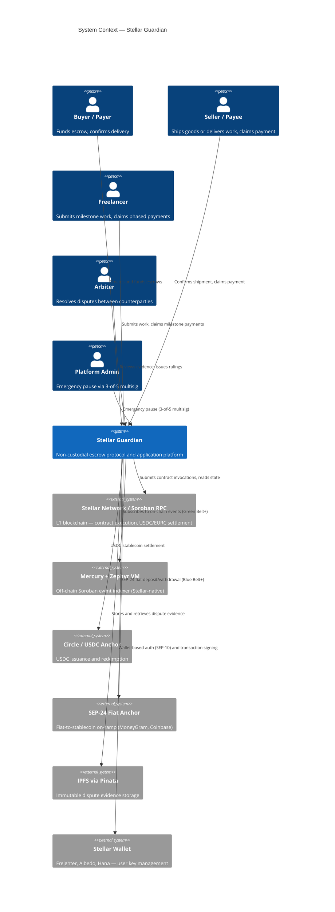
*Figure 1 — System context showing all actors and external system dependencies.*

### Key Observations

- The Stellar Network is the only authoritative source of escrow state. All other components are derived views or auxiliary services.
- Mercury is an optional read-optimization layer — its failure does not affect fund safety or contract execution.
- Stellar Guardian never holds private keys. The wallet is always the user's own client-side software.
- IPFS evidence is write-once and content-addressed; Pinata is a pinning service, not a custodian.

---

## 3. Container Diagram (C4 Level 2)

The container view shows the major deployable units within Stellar Guardian and how they communicate.

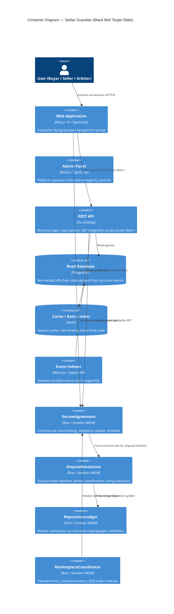
*Figure 2 — Container diagram showing all major deployable units and their communication paths.*

> **Note:** The Go REST API (`api`) does not exist in White or Yellow Belt phases. The web application communicates directly with Soroban contracts via Stellar RPC. This is documented as ADR-004 and is an intentional architectural decision — see [Section 23](#23-architecture-decision-records).

---

## 4. Component Diagrams (C4 Level 3)

Component diagrams decompose each container into its internal modules. These define the internal structure that enforces the modular monolith boundary (ADR-001) and the Clean Architecture dependency rule.

### 4.1 Web Application Components (`apps/web/`)

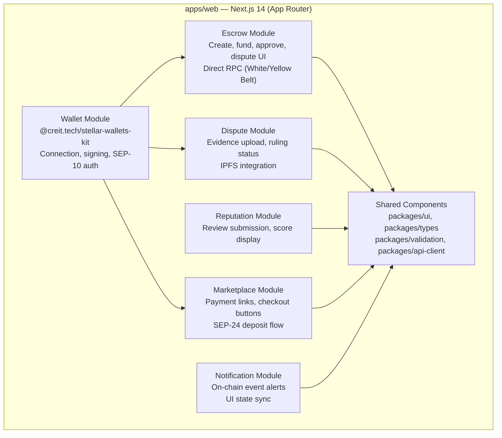
*Figure 3 — Web application internal module decomposition.*

### 4.2 Go REST API Components (`apps/api/` — Green Belt+)

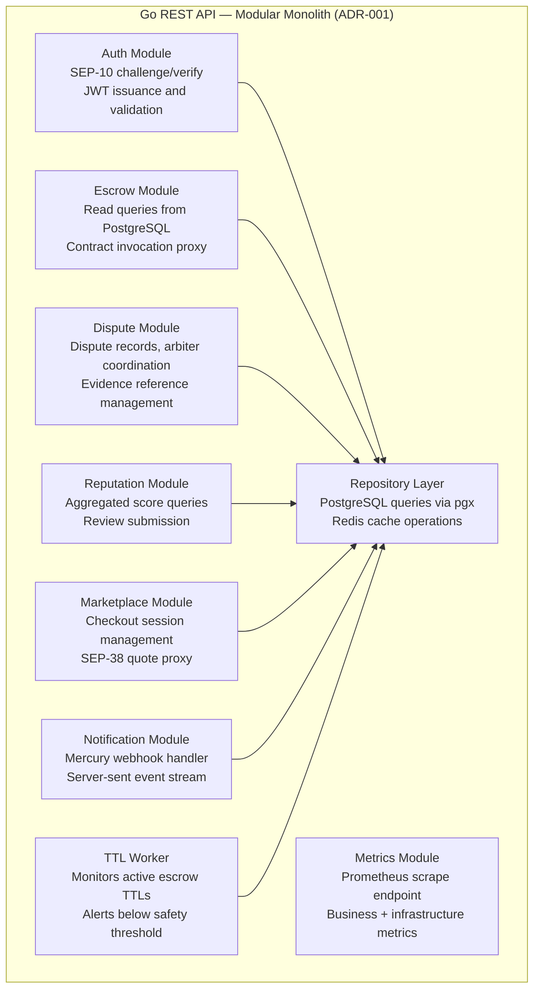
*Figure 4 — Go REST API internal module decomposition. All modules communicate via defined Go interfaces — no direct struct access across module boundaries.*

> **ADR-001 enforcement:** Module boundaries are enforced by Go interfaces. Each module (escrow, dispute, reputation, marketplace) exposes a typed interface to other modules. Direct struct access across module boundaries is prohibited. This prevents the modular monolith from silently degrading into tightly-coupled spaghetti.

---

## 5. Smart Contract Architecture

The smart contract layer is the core of Stellar Guardian. All fund custody, state transitions, and dispute logic execute on-chain in Soroban. The application layer is a convenience wrapper around these contracts — it adds no trust-critical logic.

### 5.1 Contract Inventory

| Contract | Soroban Name | Owned State | Primary Responsibility |
|---|---|---|---|
| `contracts/escrow/` | `EscrowAgreement` | Escrow records, milestone definitions, balances | Fund locking, milestone release, timelock decay, fee collection |
| `contracts/dispute/` | `DisputeResolution` | Dispute records, arbiter assignments, evidence hashes | Dispute state machine, ruling execution, evidence anchoring |
| `contracts/reputation/` | `ReputationLedger` | Review records, identity commitments | Anonymous review submission, aggregated reputation scores |
| `contracts/marketplace/` | `MarketplaceCoordinator` | Trade listings, checkout sessions | Payment link generation, B2B trade module coordination |

### 5.2 EscrowAgreement State Machine

Every escrow instance follows a deterministic state machine. No state transition is possible outside the defined paths.

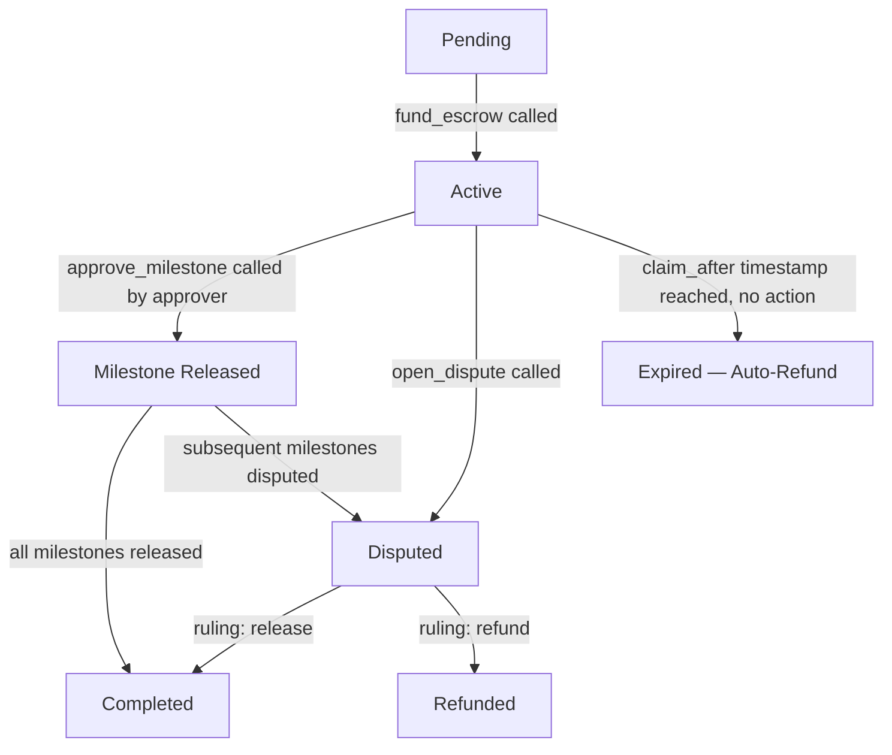
*Figure 3 — EscrowAgreement state machine. Every path is deterministic and timelock-guaranteed.*

**Key state properties:**
- `claim_after`: UNIX timestamp. When reached with no counterparty action, the contract routes funds to the default beneficiary (payer). No permanent fund trapping is possible.
- `milestones`: Array of `(description_hash, amount, status)`. Release is proportional and sequential.
- `fee_basis_points`: Platform fee expressed in basis points (50 = 0.5%). Collected at the `Completed` transition.

### 5.3 Storage Strategy

Soroban offers three storage tiers with different cost and TTL characteristics.

| Storage Type | Used For | TTL Behavior |
|---|---|---|
| **Persistent** | Active escrow state, dispute records, reputation scores | Manually extended via `extend_ttl` on every state-altering call |
| **Instance** | Contract configuration (fee rate, admin multisig address, paused flag) | Extended on every invocation |
| **Temporary** | Intra-transaction scratch state | Expires automatically; not relied upon across calls |

> **ADR-003 rationale:** Soroban's rent model charges for storage time. Active escrows must never expire while funds are held. The architecture mandates calling `extend_ttl` on the relevant storage entry in every state-altering function. An off-chain TTL monitoring worker (introduced at Green Belt) alerts when any escrow TTL falls below a safety threshold.

### 5.4 Cross-Contract Interaction Pattern

Contracts call each other via Soroban's `invoke_contract` host function. All cross-contract calls are synchronous within a single transaction.

```mermaid
sequenceDiagram
    participant C as Client (wallet)
    participant EA as EscrowAgreement
    participant DR as DisputeResolution
    participant RL as ReputationLedger

    C->>EA: open_dispute(escrow_id, evidence_hash)
    EA->>EA: require_auth(caller)
    EA->>EA: transition state to Disputed
    EA->>DR: register_dispute(escrow_id, parties, evidence_hash)
    DR-->>EA: dispute_id
    EA-->>C: Ok(dispute_id)

    Note over DR: Arbiters review off-chain; ruling submitted on-chain

    C->>DR: submit_ruling(dispute_id, ruling)
    DR->>DR: require_auth(arbiter)
    DR->>EA: execute_ruling(escrow_id, ruling)
    EA->>EA: route funds per ruling
    EA->>RL: record_outcome(parties, escrow_id)
    RL-->>EA: Ok
    EA-->>C: Ok
```
*Figure 4 — Cross-contract call sequence for dispute initiation and resolution.*

### 5.5 Fee Collection Architecture

The platform fee (0.5%, capped at 50 USDC) is collected at the `Completed` transition within `EscrowAgreement`. The fee destination is the platform treasury address stored in Instance Storage. The fee logic is on-chain and auditable — it is not controlled by the API or backend.

**Fee exemption:** Donation escrows set a `donation_flag` at initialization. The `Completed` transition checks this flag and skips fee deduction. This logic is in the contract, not in the UI.

---

## 6. Application Layer Architecture

### 6.1 Monorepo Structure

The application codebase is organized as a Turborepo monorepo with pnpm workspaces (ADR-005). This structure enforces separation of concerns across deployable units while sharing code through versioned internal packages.

```
stellar-guardian/
├── apps/
│   ├── web/          # Next.js 14 — customer-facing portal (SSR + API routes)
│   ├── admin/        # Next.js — platform operator panel
│   └── docs/         # Documentation site
├── packages/
│   ├── ui/           # Shared React components (TailwindCSS)
│   ├── types/        # Shared TypeScript types and interfaces
│   ├── validation/   # Zod schemas — input validation, contract parameter encoding
│   ├── api-client/   # SDK for interacting with REST API and Soroban contracts
│   ├── shared/       # Common utilities (date formatting, currency display, etc.)
│   └── config/       # Shared ESLint, TypeScript, Tailwind configuration
├── contracts/
│   ├── escrow/
│   ├── dispute/
│   ├── reputation/
│   └── marketplace/
├── infrastructure/
│   ├── docker/       # Docker Compose for local development
│   ├── nginx/        # Reverse proxy configuration
│   └── monitoring/   # Prometheus + Grafana configuration
├── tooling/
│   ├── scripts/      # Build, deploy, contract interaction scripts
│   └── generators/   # Code generators for new packages/apps
├── docs/
├── turbo.json
├── pnpm-workspace.yaml
└── package.json
```

### 6.2 Web Application (Next.js)

The `apps/web/` application is the primary user interface. It is a **Next.js 14** application using the App Router, TypeScript, and TailwindCSS.

**Wallet integration:** `@creit.tech/stellar-wallets-kit` aggregates support for Freighter, Albedo, and Hana wallets. The kit handles wallet detection, connection, and transaction signing. The application never receives or handles private keys.

**Direct contract communication (White/Yellow Belt):** Before the Go API is introduced, the web app constructs and submits Soroban transactions directly via Stellar's RPC endpoint using the `@stellar/stellar-sdk`. This removes all backend attack surface during the earliest and most security-critical development phase.

**Server-Side Rendering (SSR):** Public escrow detail pages and reputation profiles are server-rendered for SEO and initial load performance. Wallet-dependent interactions (fund, approve, dispute) are client-side only.

### 6.3 REST API (Go — Green Belt+)

The Go API is a **modular monolith** (ADR-001) introduced at Green Belt. It does not introduce microservices decomposition — all domain logic runs in a single deployable binary with internal module boundaries.

**Responsibilities:**
- Serves the PostgreSQL read-cache to the frontend (escrow lists, history, reputation)
- Proxies SEP-10 challenge verification and SEP-24/SEP-38 anchor interactions
- Runs the TTL monitoring worker for active escrow state entries
- Provides webhook endpoints for Mercury event notifications (as an alternative to direct DB subscription)

**What the API does NOT do:**
- It does not hold custody of user funds or private keys
- It does not authorize or execute contract state transitions on behalf of users
- It is not in the critical path for fund safety — all fund-safety logic lives in the contracts

### 6.4 Internal Package Dependency Rules

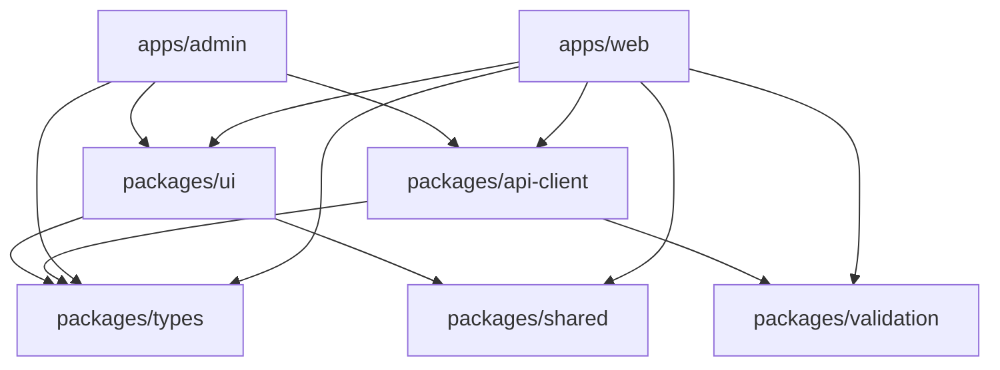
*Figure 5 — Internal package dependency graph. No circular dependencies permitted.*

---

## 7. Domain Architecture

Stellar Guardian's domain model follows **Domain-Driven Design (DDD)** principles. The four bounded contexts map 1:1 to the four Soroban contracts. Each domain has exclusive ownership of its state — no cross-domain direct state access is permitted. Cross-domain interactions occur only through defined contract interfaces.

### 7.1 Bounded Contexts

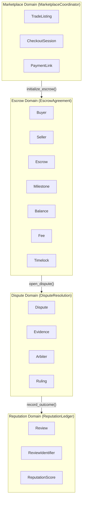
*Figure 6 — Four bounded contexts and their cross-domain call directions.*

### 7.2 Escrow Domain Aggregates

| Aggregate | Key Attributes | Invariants |
|---|---|---|
| **Escrow** | `escrow_id`, `payer`, `payee`, `state`, `claim_after`, `donation_flag` | State transitions are deterministic; `claim_after` must be set at initialization |
| **Milestone** | `index`, `description_hash`, `amount`, `status` | Total milestone amounts must equal escrow balance; status is sequential |
| **Balance** | `locked_amount`, `asset_code`, `asset_issuer` | Locked amount never decreases outside an approved state transition |
| **Fee** | `fee_basis_points`, `treasury_address` | Fee rate in integer basis points; no floating-point arithmetic |
| **Timelock** | `claim_after` (UNIX timestamp) | Every escrow must have a timelock; no indefinite fund locking |

### 7.3 Dispute Domain Aggregates

| Aggregate | Key Attributes | Invariants |
|---|---|---|
| **Dispute** | `dispute_id`, `escrow_id`, `initiator`, `state`, `created_at` | Only one active dispute per escrow at a time |
| **Evidence** | `evidence_hash` (IPFS CID), `submitter`, `timestamp` | Evidence is append-only; hashes are immutable once stored |
| **Arbiter** | `arbiter_address`, `assigned_at` | Arbiter set is defined at escrow initialization; cannot be changed mid-dispute |
| **Ruling** | `direction` (release / refund / split), `executed_at` | Ruling executes atomically; partial execution is not possible |

### 7.4 Reputation Domain Aggregates

| Aggregate | Key Attributes | Invariants |
|---|---|---|
| **Review** | `escrow_id`, `identifier_commitment`, `rating`, `content_hash` | One review per party per escrow; identifier is one-time use |
| **ReviewIdentifier** | `commitment` (hash), `nullifier` | Nullifier prevents double-submission; reviewer address cannot be derived from commitment |
| **ReputationScore** | `address`, `score`, `review_count` | Score is aggregated read-only; updated only by `DisputeResolution` via `record_outcome()` |

### 7.5 Marketplace Domain Aggregates

| Aggregate | Key Attributes | Invariants |
|---|---|---|
| **TradeListing** | `listing_id`, `seller`, `price`, `asset`, `state` | Price is immutable after listing activation |
| **CheckoutSession** | `session_id`, `buyer`, `listing_id`, `escrow_id`, `expires_at` | Session creates at most one escrow; expires if unfunded within window |
| **PaymentLink** | `link_id`, `params` (encoded escrow config), `created_by` | Link parameters are signed; cannot be tampered in transit |

---

## 8. Event-Driven Architecture

Stellar Guardian uses an **event-driven read model**: the Soroban contracts are the write layer; Mercury + Zephyr VM consumes contract events and writes a normalized read layer into PostgreSQL. The Go API serves the read layer. No component writes to PostgreSQL directly except the Mercury indexer.

### 8.1 Event Catalog

| Event | Emitted By | Trigger | Consumers | Stored In |
|---|---|---|---|---|
| `EscrowInitialized` | `EscrowAgreement` | `initialize_escrow()` called | Mercury → PostgreSQL | `escrow_agreements` |
| `EscrowFunded` | `EscrowAgreement` | `fund_escrow()` called; state → Active | Mercury → PostgreSQL | `escrow_agreements` |
| `MilestoneApproved` | `EscrowAgreement` | `approve_milestone(n)` called | Mercury → PostgreSQL | `escrow_milestones` |
| `MilestoneReleased` | `EscrowAgreement` | Funds transferred to payee for milestone | Mercury → PostgreSQL | `escrow_milestones` |
| `EscrowCompleted` | `EscrowAgreement` | All milestones released; fee collected | Mercury → PostgreSQL | `escrow_agreements`, `platform_events` |
| `DisputeOpened` | `EscrowAgreement` | `open_dispute()` called; state → Disputed | Mercury → PostgreSQL | `dispute_records` |
| `DisputeRegistered` | `DisputeResolution` | `register_dispute()` called | Mercury → PostgreSQL | `dispute_records` |
| `RulingSubmitted` | `DisputeResolution` | `submit_ruling()` called | Mercury → PostgreSQL | `dispute_records` |
| `RulingExecuted` | `DisputeResolution` | `execute_ruling()` called; funds routed | Mercury → PostgreSQL | `dispute_records`, `escrow_agreements` |
| `EscrowRefunded` | `EscrowAgreement` | Ruling → refund; state → Refunded | Mercury → PostgreSQL | `escrow_agreements` |
| `EscrowExpired` | `EscrowAgreement` | `claim_after` timestamp reached; auto-refund | Mercury → PostgreSQL | `escrow_agreements` |
| `ReviewSubmitted` | `ReputationLedger` | `record_outcome()` called | Mercury → PostgreSQL | `reputation_scores` |
| `ReputationUpdated` | `ReputationLedger` | Score recalculated after review | Mercury → PostgreSQL | `reputation_scores` |

### 8.2 Event Flow Architecture

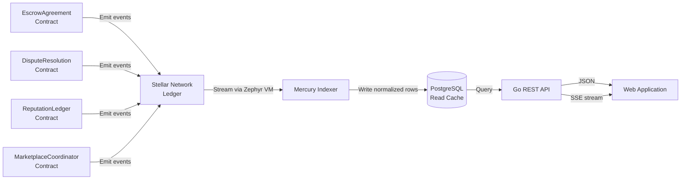
*Figure 7 — Event-driven read model. Contracts write events on-chain; Mercury normalizes them into PostgreSQL; the API serves read queries.*

### 8.3 Event Ordering Guarantees

Soroban events are emitted within a single ledger close. Because Stellar's FBA consensus finalizes ledgers atomically, events within a single transaction are ordered and consistent. Mercury processes ledgers sequentially, ensuring the PostgreSQL read cache reflects the correct event order.

> **Recovery:** If the Mercury indexer is restarted or fails, it replays from the last processed ledger sequence. No events are lost — all events are permanently anchored in Stellar ledger history.

---

## 9. Data Layer Architecture

### 9.1 On-Chain State (Authoritative)

All trust-critical state lives on the Stellar blockchain in Soroban Persistent Storage. The PostgreSQL database is a read-optimization layer — it is always reconstructable from on-chain event history.

| Data Category | Storage Location | TTL Management |
|---|---|---|
| Active escrow state | Soroban Persistent Storage | `extend_ttl` on every state-altering call |
| Contract configuration | Soroban Instance Storage | Extended on every invocation |
| Dispute evidence hashes | Soroban Persistent Storage | Extended alongside escrow state |
| Full evidence files | IPFS via Pinata | Content-addressed; permanent until unpinned |

### 9.2 Off-Chain Read Cache (PostgreSQL)

The PostgreSQL database is populated by the Mercury + Zephyr VM indexer. It provides fast, queryable read access to escrow history, user activity, and platform statistics — queries that would be prohibitively expensive against raw RPC calls.

**Core tables (conceptual — see `06_DATABASE_DESIGN.md` for full schema):**

| Table | Purpose |
|---|---|
| `escrow_agreements` | Denormalized escrow state mirrored from on-chain events |
| `escrow_milestones` | Per-milestone status and release history |
| `dispute_records` | Dispute metadata, assigned arbiters, evidence references |
| `reputation_scores` | Aggregated reputation per address |
| `platform_events` | Raw event log for audit trail and replay |

### 9.3 Event Indexing Flow

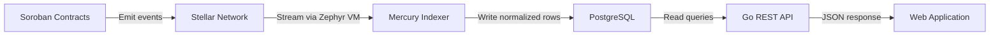
*Figure 19 — Event indexing pipeline (data layer view). See Section 8 for the full event-driven architecture.*

**Fallback behavior:** If Mercury is unavailable, the Go API falls back to direct Stellar RPC polling at a reduced query frequency. The fallback path is read-only — no fund-safety function depends on Mercury availability.

### 9.4 Redis Usage

Redis serves two purposes:
1. **Rate limiting:** API endpoint rate limits per wallet address (not per IP, to support global users behind shared NAT)
2. **Session cache:** SEP-10 challenge nonces and short-lived authenticated session tokens

Redis is not used for durable state. Loss of Redis data degrades performance but does not affect fund safety or data integrity.

---

## 10. Authentication & Authorization Architecture

### 10.1 SEP-10 — Stellar Web Authentication

**SEP-10** (Stellar Ecosystem Proposal 10 — [official spec](https://github.com/stellar/stellar-protocol/blob/master/ecosystem/sep-0010.md)) is the authentication standard used throughout the platform. It is non-custodial: authentication is achieved by signing a challenge transaction with the user's wallet, not by providing a password or email.

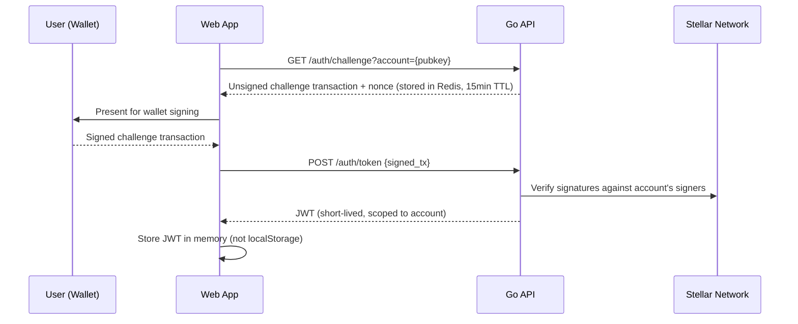
*Figure 7 — SEP-10 authentication flow. No passwords. No private key exposure.*

**JWT scope:** JWTs are scoped to a single Stellar account address. Cross-account actions (such as an arbiter acting on a dispute) require a separate challenge/response cycle for the arbiter's account.

### 10.2 Smart Contract Authorization

Every state-altering contract function calls `Address.require_auth()` on the relevant signer before performing any state mutation. This is a non-negotiable security baseline — see [Section 10](#10-security-architecture).

The authorization matrix for `EscrowAgreement`:

| Function | Authorized Caller |
|---|---|
| `fund_escrow` | Payer (buyer) |
| `approve_milestone` | Approver (buyer, or designated milestone approver) |
| `reject_milestone` | Approver |
| `open_dispute` | Either party (payer or payee) |
| `claim_after_expiry` | Payee (after `claim_after` timestamp) |
| `pause_contract` | 3-of-5 admin multisig |
| `update_fee_rate` | Platform treasury multisig |

### 10.3 Admin & Emergency Controls

The 3-of-5 multisig admin control provides an emergency pause capability. This capability is constrained:

- **What it can do:** Pause the contract (preventing new state transitions), update the platform fee rate, upgrade contract code via a governance-controlled migration path
- **What it cannot do:** Drain active, non-disputed escrow balances; override an arbiter's ruling; access user private keys

> **Design rationale:** The admin multisig addresses the "what if there's a critical contract bug?" operational need without violating the non-custodial guarantee. The pause capability freezes in-flight escrows — it does not redirect funds.

---

## 11. API Boundary Map

The Go API (Green Belt+) is organized into seven top-level resource groups. This section defines the boundary of each group — what it owns and what it does not do. Endpoint details are in `07_API_SPECIFICATION.md`.

| Boundary | Prefix | Owns | Does NOT Do |
|---|---|---|---|
| **Auth** | `/api/v1/auth` | SEP-10 challenge generation, token issuance, JWT validation | Does not hold private keys; does not issue tokens without wallet signature |
| **Escrows** | `/api/v1/escrows` | Read queries for escrow state, milestones, history | Does not execute state transitions; those go directly to Soroban via client wallet |
| **Disputes** | `/api/v1/disputes` | Dispute records, arbiter assignments, evidence references | Does not store evidence files; those go to IPFS; only hashes are stored |
| **Reputation** | `/api/v1/reputation` | Aggregated reputation scores, review submission routing | Does not generate review identifiers; those are generated client-side |
| **Marketplace** | `/api/v1/marketplace` | Checkout session management, SEP-38 quote proxy | Does not hold custody of funds at any point in the checkout flow |
| **Admin** | `/api/v1/admin` | Emergency controls, platform configuration, TTL worker status | Requires 3-of-5 multisig authorization; no single-operator access |
| **Metrics** | `/metrics` | Prometheus scrape endpoint, business and infrastructure KPIs | Read-only; no mutation capability |

> **Write path clarification:** All write operations that change escrow state (fund, approve, dispute, rule) are signed by the user's wallet and submitted directly to Soroban RPC. The Go API does not sit in the write path for fund-safety operations. The API only proxies writes for SEP-10 auth and SEP-24/38 anchor interactions.

---

## 12. Sequence Diagrams

This section documents the primary interaction flows as sequence diagrams. For the dispute resolution flow, see Section 5.4.

### 12.1 Escrow Creation

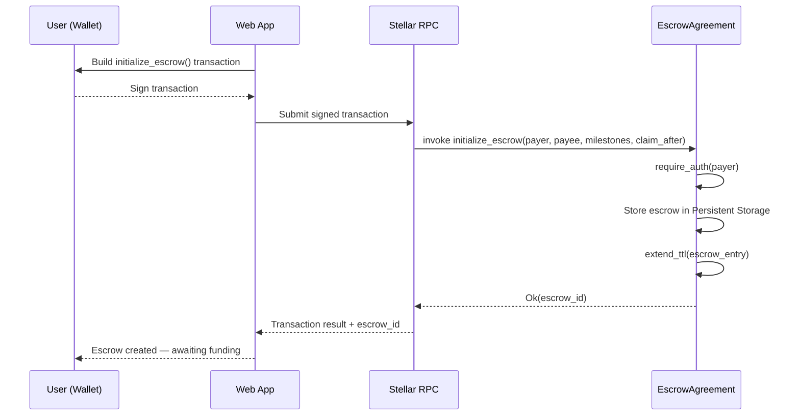
*Figure 8 — Escrow creation flow. No funds move at creation — funding is a separate step.*

### 12.2 Escrow Funding

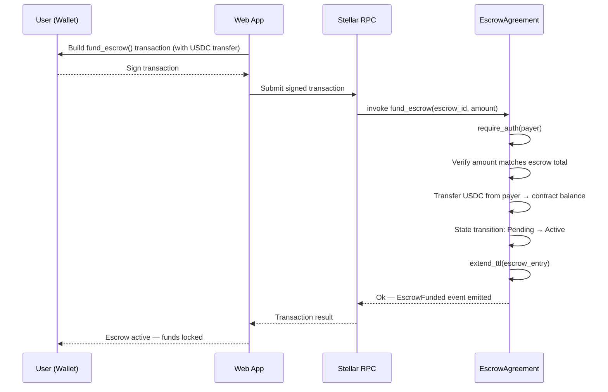
*Figure 9 — Escrow funding flow. State transitions to Active only after USDC is confirmed locked.*

### 12.3 Milestone Release

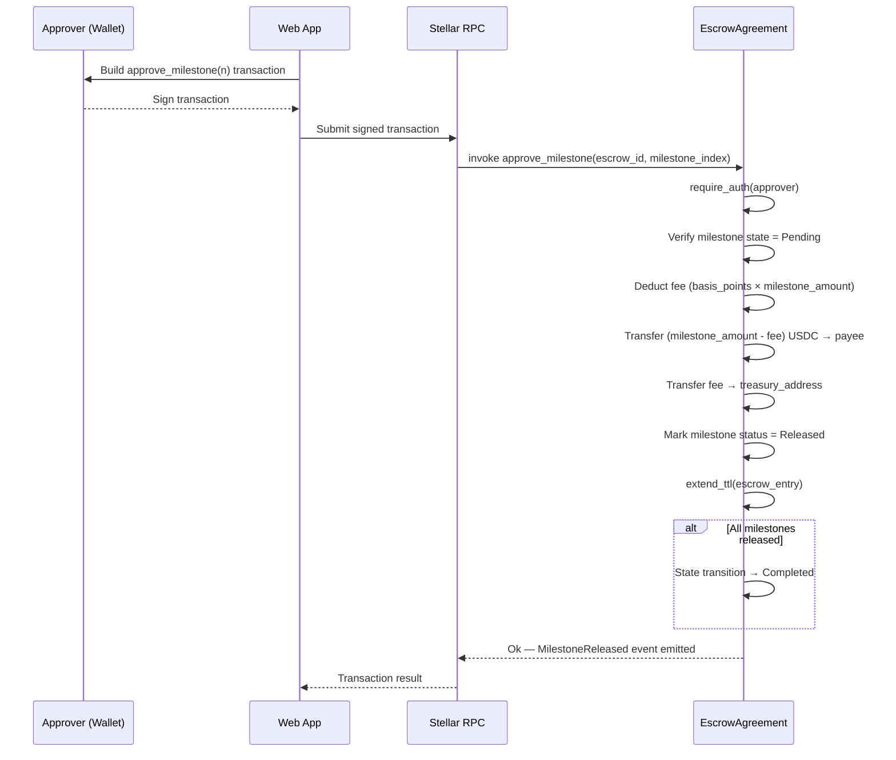
*Figure 10 — Milestone release flow with proportional fee deduction.*

### 12.4 Timelock Auto-Refund

```mermaid
sequenceDiagram
    participant S as Seller (Wallet)
    participant W as Web App
    participant RPC as Stellar RPC
    participant EA as EscrowAgreement

    Note over EA: claim_after timestamp has elapsed; buyer has not acted

    W->>S: User initiates claim_after_expiry()
    S-->>W: Sign transaction
    W->>RPC: Submit signed transaction
    RPC->>EA: invoke claim_after_expiry(escrow_id)
    EA->>EA: require_auth(payee)
    EA->>EA: Verify current_time >= claim_after
    EA->>EA: Transfer remaining balance → payee
    EA->>EA: State transition → Expired (Auto-Refund)
    EA-->>RPC: Ok — EscrowExpired event emitted
    RPC-->>W: Transaction result
    W-->>S: Funds received
```
*Figure 11 — Timelock auto-refund. Payee claims unreleased funds after the claim_after window expires.*

### 12.5 SEP-24 Fiat Deposit (Blue Belt+)

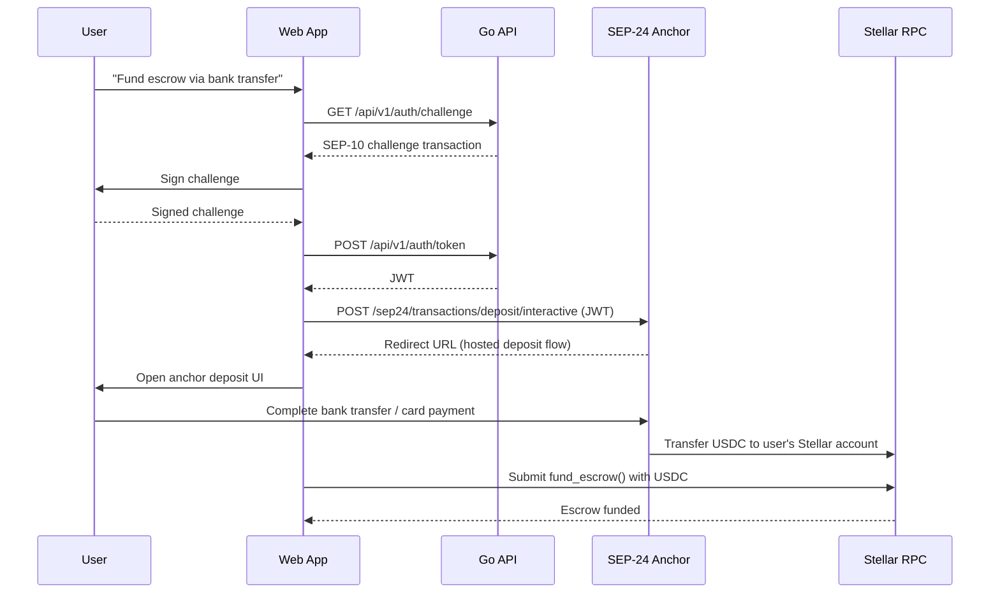
*Figure 12 — SEP-24 fiat-to-stablecoin deposit integrated with escrow funding.*

---

## 13. Deployment Diagram

The following diagram shows the full production deployment topology from the user's browser to the Stellar network. Each layer is labeled with its trust zone classification (see Section 14).

```
Internet (Untrusted)
    │
    ▼
Cloudflare (DDoS protection, CDN, TLS termination)
    │
    ▼
NGINX (Reverse proxy — infrastructure/nginx/)
    ├──► Next.js Web App (apps/web/ — port 3000)
    └──► Go REST API (apps/api/ — port 8080, Green Belt+)
              │
              ├──► Redis (Cache / Rate Limiter — port 6379)
              ├──► PostgreSQL (Read Cache — port 5432)
              └──► Stellar RPC (Contract writes — HTTPS)
                        │
                        ▼
                    Soroban Contracts (Stellar Network)
                        │
                        ▼
                    Stellar Ledger (Authoritative state)

Mercury + Zephyr VM (Separate process — Green Belt+)
    │  Subscribes to Stellar ledger events
    ▼
PostgreSQL (Writes normalized event rows)
```
*Figure 13 — Production deployment topology. Write operations flow through Stellar RPC directly; read operations flow through the Go API and PostgreSQL.*

**Admin Panel (`apps/admin/`)** is deployed behind the same NGINX reverse proxy but on a restricted path. Admin operations require 3-of-5 multisig authorization — the admin panel is a convenience interface, not an elevated-privilege server process.

> **Phase availability:** The full deployment topology above applies from Green Belt onwards. In White and Yellow Belt, the topology is: `Browser → NGINX → Next.js → Stellar RPC → Soroban`. No API, PostgreSQL, Redis, or Mercury processes.

---

## 14. Network Boundaries & Trust Zones

Understanding trust zones is a prerequisite for the threat model in `10_SECURITY.md`. Every component is classified as Trusted, Semi-Trusted, or Untrusted.

### 14.1 Trust Zone Diagram

```
┌─────────────────────────────────────────────────────────┐
│  UNTRUSTED ZONE                                         │
│                                                         │
│   Browser ──────────── Wallet Software                  │
│   (user-controlled)    (user-controlled)                │
│                                                         │
│   SEP-24 Anchors       Logistics Oracle (undefined)     │
│   (external operators) (Risk 1 — trust model TBD)       │
└──────────────────────┬──────────────────────────────────┘
                       │ HTTPS + SEP-10 JWT
┌──────────────────────▼──────────────────────────────────┐
│  SEMI-TRUSTED ZONE                                      │
│                                                         │
│   NGINX / Next.js      Go REST API                      │
│   (platform-operated)  (authorized via SEP-10 JWT)      │
│                                                         │
│   Mercury Indexer      PostgreSQL Read Cache            │
│   (read-only path)     (reconstructable from chain)     │
│                                                         │
│   Redis                IPFS / Pinata                    │
│   (ephemeral only)     (integrity verifiable by hash)   │
└──────────────────────┬──────────────────────────────────┘
                       │ Signed Soroban transactions
┌──────────────────────▼──────────────────────────────────┐
│  TRUSTED ZONE                                           │
│                                                         │
│   Soroban Contracts    Stellar Network (FBA consensus)  │
│   (deterministic,      (finality guaranteed,            │
│    audited Rust/WASM)   no single point of failure)     │
└─────────────────────────────────────────────────────────┘
```
*Figure 14 — Trust zone boundaries. Fund-safety logic exists exclusively in the Trusted zone.*

### 14.2 Trust Zone Properties

| Zone | Components | Trust Basis | Fund-Safety Role |
|---|---|---|---|
| **Trusted** | Soroban contracts, Stellar Network | Deterministic execution, FBA consensus, external audit | Authoritative — all fund custody and state transitions |
| **Semi-Trusted** | NGINX, Next.js, Go API, Mercury, PostgreSQL, Redis, IPFS | Platform-operated or read-only; integrity verifiable independently | Read/convenience layer — failure degrades UX, not fund safety |
| **Untrusted** | Browser, wallet software, SEP-24 anchors, logistics oracle | User-controlled or external; cannot be fully verified | None — never handle fund custody |

> **Security implication:** Any component in the Semi-Trusted zone that is compromised cannot drain escrowed funds. It can only degrade the read experience or delay transactions. This is a direct consequence of the non-custodial architecture.

---

## 15. Infrastructure Layer

This section describes the infrastructure tooling that supports the Stellar Guardian platform. It defines what each tool does architecturally — not how it is configured. Configuration details are in `12_DEVOPS.md`.

### 15.1 Containerization

| Tool | Role | Scope |
|---|---|---|
| **Docker** | Container runtime for all application services | All phases |
| **Docker Compose** | Local development orchestration | `infrastructure/docker/` — White Belt onwards |

Docker Compose provides a single-command local environment: Next.js web app, Go API, PostgreSQL, Redis, and a local Stellar standalone network. Contract deployments use the Soroban CLI toolchain directly.

### 15.2 CI/CD

| Tool | Role | Trigger |
|---|---|---|
| **GitHub Actions** | Continuous integration pipeline | Every pull request and main branch push |
| **Scout Audit** | Soroban smart contract static analysis | Every CI pull request (non-negotiable security baseline) |
| **Turborepo** | Build caching — only changed packages rebuild | Integrated with GitHub Actions pipeline |
| **pnpm** | Deterministic dependency installation | Lockfile committed; `pnpm install --frozen-lockfile` in CI |

### 15.3 Reverse Proxy

| Tool | Role |
|---|---|
| **NGINX** | TLS termination, reverse proxy to Next.js and Go API, static asset serving |

NGINX configuration lives in `infrastructure/nginx/`. It routes `/api/*` to the Go API and all other paths to the Next.js app. Rate limiting at the NGINX layer is supplementary to the Redis-backed per-wallet rate limits in the Go API.

### 15.4 Monitoring & Alerting

| Tool | Role |
|---|---|
| **Prometheus** | Metrics scraping from Go API `/metrics` endpoint and system exporters |
| **Grafana** | Metrics dashboards — business KPIs, infrastructure health, TTL worker status |
| **Loki** | Log aggregation from all containers (Go API, Next.js, NGINX, Mercury) |
| **Sentry** | Error tracking and alerting for the Next.js web app and Go API |
| **OpenTelemetry** | Distributed tracing instrumentation (Go API and Mercury indexer) |

Prometheus and Grafana configuration lives in `infrastructure/monitoring/`. Loki, Sentry, and OpenTelemetry are introduced at Green Belt when the full stack is operational.

---

## 16. Observability Architecture

Observability covers three pillars: logs, metrics, and traces. Each pillar addresses a different class of operational question.

### 16.1 Logs

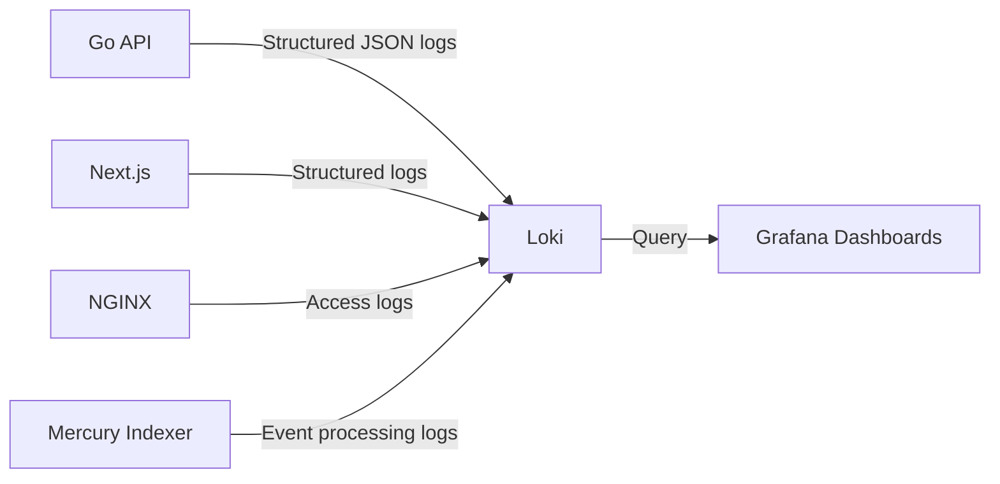
*Figure 15 — Log aggregation pipeline.*

All application logs are structured JSON. Log levels: `ERROR` for actionable failures, `WARN` for degraded states, `INFO` for normal operations, `DEBUG` for development only (disabled in production).

### 16.2 Metrics

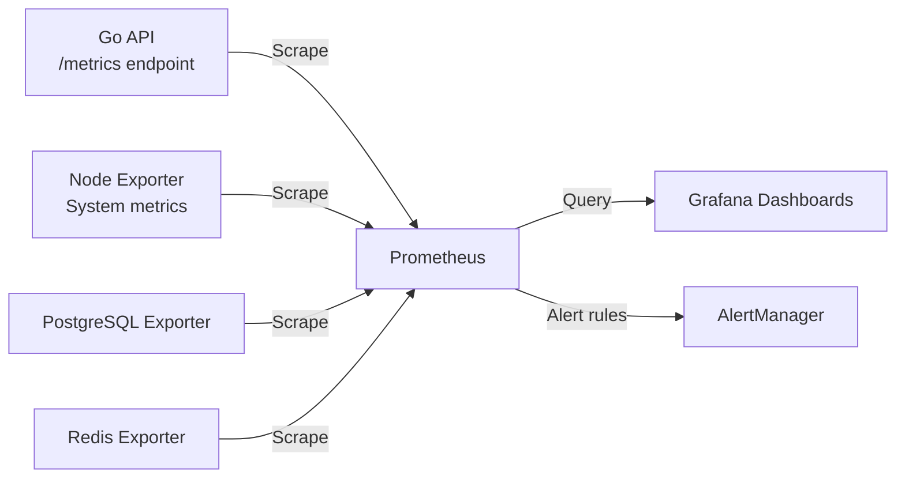
*Figure 16 — Metrics pipeline. Business KPIs and infrastructure health in a single Grafana instance.*

Key metrics exposed by the Go API: active escrow count, escrow volume (USDC), dispute rate, TTL worker status, RPC latency (p50/p95/p99), Mercury indexer lag, API error rate.

### 16.3 Distributed Tracing

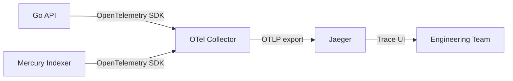
*Figure 17 — Distributed tracing pipeline. Traces span from API request through RPC call to on-chain confirmation.*

Tracing is most valuable for diagnosing latency in the RPC → Soroban call path and in the Mercury → PostgreSQL indexing lag. Trace context propagates from the API handler through the repository layer to the Stellar RPC client.

---

## 17. Contract Upgrade Architecture

Soroban supports on-chain contract code upgrades via the `upgrade()` host function. Because Stellar Guardian holds user funds, the upgrade process must preserve the non-custodial guarantee and protect in-flight escrows.

### 17.1 Upgrade Governance Flow

```mermaid
flowchart TD
    A[Upgrade Proposal\nNew contract WASM hash posted on-chain] --> B[Multisig Review Period\n3-of-5 admin multisig must approve\nMinimum 48-hour review window]
    B --> C[Timelock\nUpgrade scheduled for future ledger\nCommunity can review diff and object]
    C --> D[Pause Affected Contract\n3-of-5 admin multisig pauses contract\nNo new escrows; in-flight escrows frozen]
    D --> E[Upgrade Execution\nNew WASM deployed via upgrade() host function\nState preserved — storage layout must be backward-compatible]
    E --> F[Post-Upgrade Verification\nAutomated tests run against upgraded contract on testnet fork\nArbiter verifies no state corruption]
    F --> G[Resume Contract\n3-of-5 admin multisig lifts pause\nNormal operations resume]
```
*Figure 18 — Contract upgrade governance flow. No single operator can initiate, approve, and execute an upgrade.*

### 17.2 Upgrade Invariants

| Invariant | Enforcement |
|---|---|
| Non-custodial guarantee preserved | Upgrade proposal reviewed for any admin key path to escrowed funds |
| Storage layout backward-compatible | New contract version must deserialize all existing Persistent Storage entries |
| In-flight escrows protected | Contract is paused before upgrade; escrows resume from their last state post-upgrade |
| Minimum review window | 48-hour timelock between approval and execution; cannot be waived |
| No single-operator upgrade | 3-of-5 multisig required at pause, approval, and resume steps |

> **Contract Registry (from Recommendation 13.3):** Upgrading a contract changes its deployed address in some upgrade patterns. A `ContractRegistry` contract in Instance Storage maps contract roles (e.g., `"dispute"` → `<contract_id>`) to their current addresses. Cross-contract callers resolve addresses via the registry, not hardcoded values. This is the recommended path before the first Mainnet upgrade.

---

## 18. Data Ownership Map

Each component has exclusive ownership of specific data. No component may directly read or write another component's owned data — access is only through defined interfaces or event subscriptions.

| Component | Owns | Access Pattern |
|---|---|---|
| **EscrowAgreement contract** | Escrow state, milestone definitions, balances, `fee_basis_points`, `donation_flag`, `claim_after`, platform treasury address | Direct: contract function calls. Read: Stellar RPC state query or Mercury event |
| **DisputeResolution contract** | Dispute records, arbiter assignments, evidence hashes (IPFS CIDs anchored on-chain) | Direct: contract function calls. Read: Stellar RPC or Mercury event |
| **ReputationLedger contract** | Review records, identity commitments (nullifiers), aggregated reputation scores | Direct: contract function calls. Read: Stellar RPC or Mercury event |
| **MarketplaceCoordinator contract** | Trade listings, checkout sessions, payment link parameters | Direct: contract function calls. Read: Stellar RPC or Mercury event |
| **PostgreSQL (read cache)** | Denormalized mirrors of all on-chain state: `escrow_agreements`, `escrow_milestones`, `dispute_records`, `reputation_scores`, `platform_events` | Write: Mercury indexer only. Read: Go API only. Never written by application code directly |
| **Redis** | SEP-10 challenge nonces (15-minute TTL), session JWT references, rate-limit counters | Write: Go API auth module. Read: Go API auth and rate-limit modules. All data is ephemeral |
| **IPFS / Pinata** | Full dispute evidence files (documents, screenshots, delivery records) | Write: client-side upload via Pinata API. Read: anyone with the IPFS CID. Hash anchored on-chain in `DisputeResolution` |
| **Go API** | No durable state. Owns the query composition layer over PostgreSQL | Stateless between requests; all state persisted in PostgreSQL, Redis, or Soroban |

---

## 19. Non-Functional Requirements Mapping

This matrix traces each non-functional requirement to the architectural decisions that fulfill it.

| NFR | Requirement | Architecture Decision | Measurement |
|---|---|---|---|
| **Availability** | API ≥ 99.5% uptime | Modular monolith (ADR-001) deployed behind NGINX with health checks; Go API is stateless and horizontally scalable | Prometheus uptime metric + Grafana alert |
| **Availability** | Fund safety during outage | Non-custodial: funds in Soroban are accessible regardless of API/Mercury/Redis state | Manual test: all services down, funds recoverable via direct RPC |
| **Performance** | RPC latency p95 ≤ 500 ms | Multiple Stellar RPC endpoints; Mercury read cache eliminates most RPC reads in Green Belt+ | OpenTelemetry RPC call traces; Prometheus histogram |
| **Performance** | Indexer lag p95 ≤ 5 seconds | Mercury + Zephyr VM (ADR-002); Redis caches hot reads | Mercury lag metric exported to Prometheus |
| **Performance** | Escrow creation ≤ 3 minutes end-to-end | Direct RPC path (White/Yellow Belt); Soroban ~5-second finality | UX KPI: measured from wallet connect to funded escrow |
| **Security** | Non-custodial guarantee | `Address.require_auth()` on every mutating function; admin multisig cannot drain funds; no backend in write path | External audit; Scout Audit on every CI PR |
| **Security** | Dependency CVEs patched | Soroban SDK pinned `>=25.3.0`; fixed-point math `>=1.3.1` | Cargo audit in CI; Dependabot alerts |
| **Security** | Rate limiting against API abuse | Redis-backed per-wallet rate limiting (not per-IP) | Prometheus rate-limit counter metrics |
| **Scalability** | Read layer scales with user growth | PostgreSQL read cache (ADR-002/ADR-003); stateless Go API scales horizontally | PostgreSQL connection pool metrics; API pod count |
| **Durability** | Escrow state never lost | Soroban Persistent Storage + programmatic `extend_ttl` (ADR-003); TTL monitoring worker | TTL worker heartbeat; active escrow TTL dashboard in Grafana |
| **Auditability** | All state changes verifiable | All transitions emit Soroban events; `platform_events` table is append-only audit log | Mercury replay test: drop and rebuild PostgreSQL from events |
| **Maintainability** | Module boundary enforcement | Go interfaces between internal modules; no direct struct access across module boundaries (ADR-001) | Static analysis: `go vet`, linter boundary rules |
| **Recoverability** | PostgreSQL data loss recovery | PostgreSQL is fully reconstructable from on-chain event history via Mercury replay | Documented recovery runbook in `12_DEVOPS.md` |

---

## 20. Failure Scenarios

This section documents the degradation behavior when each critical dependency fails. The design goal is that no infrastructure failure causes fund loss or permanent escrow inaccessibility.

### 20.1 Mercury Indexer Down

**Symptom:** PostgreSQL read cache stops receiving new events; data becomes stale.

| Layer | Behavior |
|---|---|
| **Soroban contracts** | Unaffected — all fund-safety operations continue normally |
| **Go API** | Detects Mercury lag via health check; switches read queries to direct Stellar RPC polling (reduced frequency: 1 query / 30 seconds) |
| **Web Application** | Displays "Data may be delayed — showing last known state" banner |
| **Fund safety** | Not affected — no fund custody path touches Mercury |

**Recovery:** Mercury restarts and replays from last processed ledger. PostgreSQL is reconciled. Banner removed when lag returns below 5-second threshold.

### 20.2 Redis Down

**Symptom:** SEP-10 nonce verification fails; rate limiting is disabled.

| Layer | Behavior |
|---|---|
| **Authentication** | SEP-10 challenge/token flow fails gracefully; users cannot authenticate until Redis recovers |
| **Rate limiting** | Disabled — API is unprotected against abuse. NGINX-level rate limiting provides partial protection |
| **Escrow operations** | Existing authenticated sessions continue (JWT in memory, not Redis). New auth attempts fail |
| **Fund safety** | Not affected — contracts require on-chain signatures, not API authentication |

**Recovery:** Redis restarts. In-memory JWTs remain valid. Users who had sessions continue uninterrupted; users who needed to re-auth must wait for Redis recovery.

### 20.3 Stellar RPC Down

**Symptom:** All contract write operations fail; on-chain state queries fail.

| Layer | Behavior |
|---|---|
| **Soroban contracts** | Cannot be invoked; all writes (fund, approve, dispute) fail at submission |
| **Go API** | Returns `503 Service Unavailable` for any endpoint requiring on-chain reads not in PostgreSQL cache |
| **Web Application** | Displays maintenance banner: "Stellar network is temporarily unavailable. Your funds are safe." |
| **Read layer** | PostgreSQL read cache continues serving last known state for escrow history, reputation, etc. |
| **Fund safety** | Funds remain safely locked in contract state on-chain. No loss possible during RPC outage |

**Recovery:** RPC connectivity restored; pending transactions may be resubmitted. If transactions were submitted but not confirmed, clients detect status via `getTransaction` polling.

### 20.4 PostgreSQL Down

**Symptom:** All read API queries fail; Mercury cannot write events.

| Layer | Behavior |
|---|---|
| **Go API** | Returns `503` for read endpoints; write operations (contract invocations) route around PostgreSQL |
| **Mercury indexer** | Queues events in memory with a bounded buffer; writes when PostgreSQL recovers |
| **Contract operations** | Unaffected — direct RPC path does not touch PostgreSQL |
| **Fund safety** | Not affected |

**Recovery:** PostgreSQL restarts; Mercury flushes its buffer and reconciles from last processed ledger if buffer was exceeded.

---

## 21. Architectural Principles

These principles govern every architectural decision in Stellar Guardian. When trade-offs arise, these principles define the priority order.

| # | Principle | Statement | Architectural Expression |
|---|---|---|---|
| 1 | **Security First** | Every design decision evaluates security impact before convenience | Non-custodial by architecture; external audit gate before Mainnet; Scout Audit on every CI PR |
| 2 | **Non-Custodial** | The platform never holds, controls, or has a path to access user funds | `Address.require_auth()` on every mutating function; admin multisig cannot drain active escrows |
| 3 | **On-Chain Source of Truth** | Soroban is the authoritative state. All other layers are derived | PostgreSQL is always reconstructable from on-chain events; Mercury failure is graceful degradation |
| 4 | **Immutable Evidence** | Dispute evidence cannot be altered after submission | IPFS content-addressed storage; evidence hash anchored in `DisputeResolution` Persistent Storage |
| 5 | **Least Privilege** | Every component has only the access required for its function | API authorized via SEP-10 JWT per operation; 3-of-5 multisig for admin; no single-operator keys |
| 6 | **Defense in Depth** | No single control failure should produce a catastrophic outcome | Contract auth + multisig + audit + static analysis + rate limiting + non-custodial architecture |
| 7 | **Fail Secure** | When components fail, the system defaults to a safe state | Every escrow has a `claim_after` timelock; no permanent fund trapping; RPC outage = funds safe |
| 8 | **Composable Contracts** | Contract boundaries are enforced; no domain bleeds into another | Four separate Soroban contracts with typed cross-contract interfaces; no shared Persistent Storage |
| 9 | **Event-Driven Read Models** | The read layer is derived from events; never from direct state mutation | PostgreSQL populated exclusively by Mercury from Soroban events; API never writes to PostgreSQL |
| 10 | **Backward Compatible Upgrades** | Contract upgrades must not break existing escrow state | Storage layout compatibility required before upgrade; 48-hour timelock; staging testnet validation |

---

## 22. Phase-Gated Architecture Evolution

The system architecture changes materially across the Journey to Mastery phases. The table below tracks which components exist and how they connect at each phase.

| Component | White Belt | Yellow Belt | Orange Belt | Green Belt | Blue Belt | Black Belt |
|---|---|---|---|---|---|---|
| `EscrowAgreement` contract | Local only | Testnet | Testnet + multisig | Testnet | Testnet | **Mainnet** |
| `DisputeResolution` contract | ❌ | ❌ | ❌ | Testnet | Testnet | **Mainnet** |
| `ReputationLedger` contract | ❌ | ❌ | ❌ | ❌ | Testnet | **Mainnet** |
| `MarketplaceCoordinator` contract | ❌ | ❌ | ❌ | ❌ | ❌ | **Mainnet** |
| Next.js web app | ❌ | Basic | Wallet + multisig | Full UI | + SEP-24 flow | Production |
| Go REST API | ❌ | ❌ | ❌ | Introduced | Full | Production |
| PostgreSQL (read-cache) | ❌ | ❌ | ❌ | Introduced | Full | Production |
| Mercury indexer | ❌ | ❌ | ❌ | Introduced | Full | Production |
| Redis | ❌ | ❌ | ❌ | Introduced | Full | Production |
| SEP-10 auth | ❌ | Basic | Full | Full | Full | Full |
| SEP-24 / SEP-38 | ❌ | ❌ | ❌ | ❌ | Introduced | Full |
| IPFS dispute evidence | ❌ | ❌ | ❌ | Testnet | Full | Full |
| Juror pool (decentralized court) | ❌ | ❌ | ❌ | ❌ | ❌ | **Mainnet** |

### Architecture Data Flow by Phase

**White/Yellow Belt (no backend):**
```
Browser → @creit.tech/stellar-wallets-kit → Stellar RPC → Soroban Contracts
```

**Green Belt+ (full stack):**
```
Browser → Next.js → Go API → PostgreSQL (reads)
                           → Redis (cache/rate limit)
                           → Stellar RPC → Soroban Contracts (writes)
Soroban Events → Mercury/Zephyr VM → PostgreSQL
```

---

## 23. Architecture Decision Records

### ADR-001: Modular Monolith Over Microservices

**Status:** Approved

**Decision:** The backend API is structured as a modular monolith — a single deployable Go binary with strong internal module boundaries — rather than a distributed microservices architecture.

**Context:** At the scale and team size of initial release, microservices introduce distributed systems complexity (network latency, partial failure handling, service discovery, distributed tracing) with no compensating benefit. The transaction volumes and team size of an early-stage protocol do not justify that operational overhead.

**Rationale:** A modular monolith achieves the same internal separation of concerns as microservices — each domain (escrow, dispute, reputation, marketplace) is an isolated internal module with its own repository, service, and handler layer — while remaining a single deployable unit. If a specific module (e.g., the dispute resolution service) requires independent scaling in the future, it can be extracted into a microservice at that point, informed by actual observed load patterns rather than speculative ones.

**Trade-off:** Horizontal scaling requires scaling the entire binary. This is acceptable for the projected load profile of an early-stage protocol. At Black Belt scale, specific modules may be extracted if benchmarking indicates a bottleneck.

---

### ADR-002: Mercury + Zephyr VM for Off-Chain Indexing

**Status:** Approved

**Decision:** Soroban event indexing uses Mercury + Zephyr VM, a production-ready Stellar-native indexing infrastructure, rather than a custom RPC scraper built in-house.

**Context:** Off-chain indexing of smart contract events is a non-trivial engineering problem. A naive RPC polling approach introduces missed events, reorg handling complexity, and a maintenance burden disproportionate to its strategic value.

**Rationale:** Mercury is purpose-built for Soroban event streaming. Zephyr VM provides a programmable transformation layer between raw on-chain events and the application's PostgreSQL schema. Building a custom equivalent would require weeks of engineering effort and ongoing maintenance without providing any competitive advantage. The integration risk is mitigated by keeping Mercury in the read-only path — it cannot affect fund safety.

**Trade-off:** External dependency on Mercury infrastructure introduces operational coupling. This is mitigated by a fallback to direct RPC polling when Mercury is unavailable and by the fact that all authoritative state lives on-chain.

---

### ADR-003: Soroban Persistent Storage with Programmatic TTL Extension

**Status:** Approved

**Decision:** All active escrow state uses Soroban Persistent Storage. Every state-altering contract function calls `extend_ttl` on relevant storage entries. An off-chain TTL monitoring worker alerts when any escrow's TTL falls below a safety threshold.

**Context:** Soroban's rent model charges for storage time. Persistent storage entries that are not extended expire after their TTL elapses and become inaccessible. For an escrow holding live user funds, state expiration would be catastrophic — funds would become permanently inaccessible.

**Rationale:** Programmatic TTL extension on every state-altering call ensures that any active escrow remains accessible as long as the parties continue interacting with it. The monitoring worker provides a safety net for escrows that have stalled (no party action for an extended period), allowing operators to extend TTL manually or notify parties before expiry.

**Trade-off:** Increases the instruction count (and therefore compute cost) of every state-altering transaction. This cost is negligible relative to Stellar's sub-cent fee structure.

---

### ADR-004: No Backend Until Green Belt

**Status:** Approved

**Decision:** No backend server is introduced until Green Belt (Level 3–4). White and Yellow Belt phases operate with the frontend communicating directly with Soroban contracts via Stellar RPC.

**Context:** Every infrastructure component introduced during development expands the attack surface. During the White and Yellow Belt phases — when the contract logic is being hardened, the team is gaining Soroban proficiency, and external security audits have not yet occurred — introducing a backend server would add a layer of complexity and attack surface with no compensating benefit. The frontend can interact directly with Soroban contracts.

**Rationale:** Eliminating the backend in early phases reduces the attack surface to exactly two components: the user's browser and the Soroban contract. This is the smallest possible footprint during the most critical development phase. The backend is introduced at Green Belt precisely when its value (providing fast read access to indexed contract events) first outweighs its complexity cost.

**Trade-off:** No server-side computation or caching in early phases. Performance and query capability are limited to what Stellar RPC can provide directly. This is acceptable for testnet and early feedback cycles.

---

### ADR-005: Turborepo Monorepo with pnpm Workspaces

**Status:** Approved

**Decision:** The entire application codebase (frontend apps, shared packages, contracts tooling) lives in a single Turborepo monorepo managed with pnpm workspaces.

**Context:** The Stellar Guardian platform involves multiple applications (`web`, `admin`, `docs`) and multiple shared packages (`ui`, `types`, `validation`, `api-client`). Without a monorepo, keeping these in sync requires manual version management and introduces the risk of type drift between packages.

**Rationale:** Turborepo provides task-level build caching — if a shared package has not changed, downstream apps do not rebuild it. pnpm workspaces enforce strict dependency hoisting and prevent phantom dependency access. The combination provides fast CI pipelines and prevents the class of "it works on my machine" package resolution bugs common in polyrepo setups.

**Trade-off:** Monorepo tooling has a learning curve. Turborepo's `turbo.json` pipeline configuration must be maintained as the codebase grows. For contract code (Rust/Cargo), the monorepo provides directory organization but Cargo workspaces handle the Rust build pipeline independently.

---

## 24. Security Architecture

Security is not a layer applied on top of this architecture — it is expressed through the architecture itself. The non-custodial design eliminates the largest class of escrow platform risks by construction.

### 24.1 Security Layers

| Layer | Control | Implementation |
|---|---|---|
| **Contract authorization** | Every state-altering function requires cryptographic proof of identity | `Address.require_auth()` on every mutating function |
| **Admin access control** | Emergency operations require threshold approval | 3-of-5 multisig for pause and config changes |
| **Dependency hardening** | Known CVEs patched | Soroban SDK `>=25.3.0` (CVE-2026-32322: arbitrary state write via malformed auth envelope); Fixed-point math `>=1.3.1` (CVE-2026-24783: precision loss in fee calculation allowing fee extraction) |
| **Static analysis** | Automated contract vulnerability detection | Scout Audit runs on every CI pull request |
| **External audit** | Pre-mainnet validation by recognized Rust/Soroban security firm | No mainnet deployment without at least one completed audit |
| **Evidence integrity** | Tamper-proof dispute evidence | IPFS content-addressed storage via Pinata — evidence hash stored on-chain |
| **Authentication** | Non-custodial, wallet-native auth | SEP-10 signed challenge — no passwords, no email, no platform-held credentials |
| **Rate limiting** | Prevent API abuse | Redis-backed rate limiting per wallet address in Go API |
| **Secrets management** | No sensitive keys in application code | Environment variables via `SCREAMING_SNAKE_CASE`; secrets injected at deploy time |

### 24.2 Non-Custodial Guarantee

The core security property of Stellar Guardian is that the platform operator never controls user funds. This property is enforced architecturally:

1. The admin multisig can pause the contract but cannot execute fund transfers
2. The Go API submits transactions on behalf of users only when explicitly authorized by a valid SEP-10 JWT and a user-signed transaction envelope
3. Private key material never leaves the user's wallet software
4. The platform treasury address (fee recipient) is hardcoded in Instance Storage and can only be updated by the platform multisig — not by any single operator key

### 24.3 CVE Baseline

| CVE ID | Description | Mitigation |
|---|---|---|
| CVE-2026-32322 | Soroban SDK: arbitrary state write via malformed authorization envelope | Pin `soroban-sdk >= 25.3.0` |
| CVE-2026-24783 | Fixed-point math library: precision loss in fee calculations enabling fee extraction | Pin `fixed-point-math >= 1.3.1` |

### 24.4 Threat Model Summary

The detailed threat model is in `10_SECURITY.md`. The architectural mitigations for the highest-severity threats are:

| Threat | Architectural Mitigation |
|---|---|
| Smart contract exploit (fund drain) | External audit before mainnet; Scout Audit on every CI PR; emergency pause via 3-of-5 multisig |
| State expiration (escrow inaccessible) | Programmatic `extend_ttl` on every mutation; off-chain TTL monitoring worker |
| Fake arbiter injection | `DisputeResolution` contract enforces arbiter assignment authorization; arbiter set defined at escrow initialization |
| Fee skimming via precision manipulation | Fixed-point math library pinned; fee calculation in integer basis points, not floating point |
| Regulatory seizure of funds | Non-custodial architecture — platform has no admin key path to escrowed funds |

---

## 25. External Dependencies & Risk Assessment

Stellar Guardian depends on several external systems that are outside the team's direct control. This section assesses each dependency's criticality and the mitigation strategy for its failure.

| Dependency | Criticality | Failure Impact | Mitigation |
|---|---|---|---|
| **Stellar Network / Soroban RPC** | Critical — fund safety | All contract interactions fail; funds inaccessible (but safe on-chain) | Multiple RPC endpoints; Stellar's 99.9%+ historical uptime; FBA consensus means no single point of failure |
| **Mercury + Zephyr VM** | High — read layer | PostgreSQL read-cache stale; UI shows incomplete data; contracts unaffected | Fallback to direct RPC polling; graceful UI degradation showing "data may be delayed" |
| **IPFS via Pinata** | Medium — dispute evidence | New evidence cannot be submitted; existing evidence still verifiable by hash | Pinata redundancy; evidence hash stored on-chain means integrity is verifiable even if Pinata is unavailable |
| **Circle / USDC Anchor** | High — settlement currency | USDC redemption unavailable; escrow values at risk if depeg occurs | Multi-stablecoin support (USDC primary, EURC secondary); user-visible stablecoin risk disclosure |
| **SEP-24 Fiat Anchor** (MoneyGram, Coinbase) | Medium — on-ramp only | Fiat deposit/withdrawal unavailable; existing stablecoin holders unaffected | Multiple anchor integrations; direct stablecoin funding path remains available |
| **`@creit.tech/stellar-wallets-kit`** | High — wallet connection | Wallet integration broken; users cannot sign transactions | Pinned version; the kit is open-source and can be forked if the upstream project is abandoned |

---

## 26. Architectural Risks & Open Issues

These are areas where the current architecture has gaps, known limitations, or decisions pending validation.

### Risk 1: Oracle Trust for Physical Goods Delivery

**Issue:** The physical goods escrow use case (see Figure 2 in `01_PRODUCT_DISCOVERY.md`) relies on a "Logistics Oracle" registering a carrier tracking hash on-chain. The product discovery document does not specify how this oracle is trusted, implemented, or operated.

**Impact:** Without a defined oracle trust model, the physical goods escrow is vulnerable to oracle manipulation — a logistics provider (or compromised oracle key) registering false delivery data to trigger premature fund release.

**Recommendation:** Define the oracle architecture before Yellow Belt testnet deployment. Options include: (a) trusted third-party oracle (Chainlink Functions or a Stellar-native equivalent), (b) multi-party oracle confirmation (buyer + oracle must both attest), or (c) removing the oracle dependency entirely and relying on timelock expiry with buyer-initiated dispute.

---

### Risk 2: Dispute Resolution Scalability at Black Belt

**Issue:** The Black Belt target includes a "game-theoretic juror pool with token staking." This is architecturally non-trivial — it requires a token contract, a staking mechanism, juror selection logic, and an appeal mechanism. None of this is designed yet.

**Impact:** The `DisputeResolution` contract as scoped for Green/Blue Belt (trusted arbiter model) is not the same as the decentralized court model. The migration path between the two is undefined.

**Recommendation:** Treat the Black Belt decentralized court as a separate contract system alongside (not replacing) the trusted arbiter model. Define the migration path in `08_SMART_CONTRACT_SPEC.md` before Green Belt.

---

### Risk 3: TTL Monitoring Worker as a Single Point of Operational Failure

**Issue:** ADR-003 mandates a TTL monitoring worker that alerts when escrow state TTL falls below a safety threshold. If this worker fails silently for an extended period, active escrows could expire without operator awareness.

**Impact:** Escrow state expiration means escrowed funds become inaccessible on-chain until the state is re-archived or restored (which may not be possible for expired Persistent storage entries).

**Recommendation:** The TTL monitoring worker must be treated as a critical operational component, not a background convenience service. It requires:
- Heartbeat monitoring (PagerDuty or equivalent)
- Automated TTL extension capability (not just alerting)
- A secondary monitoring path (e.g., a separate cron job that independently checks TTLs)

---

### Risk 4: Soroban SDK Breaking Changes

**Issue:** Soroban is a relatively young runtime. The SDK has had breaking changes between major versions. Pinning to `>=25.3.0` provides a lower bound but not an upper bound.

**Impact:** A future Soroban SDK version could introduce breaking changes that require contract recompilation and redeployment. Contract upgrades on mainnet require careful state migration planning.

**Recommendation:** Pin to an exact version (e.g., `=25.3.0`) in production contracts rather than a minimum version range. Establish a formal contract upgrade governance process before mainnet deployment.

---

### Risk 5: Reputation System Privacy

**Issue:** The `ReputationLedger` contract uses "one-time cryptographic review identifiers" to allow anonymous reviews. The cryptographic construction of these identifiers is not yet specified.

**Impact:** A poorly designed identifier scheme could allow reviewer deanonymization (linking a review to a wallet address) or double-voting (a single party submitting multiple reviews per escrow).

**Recommendation:** Specify the review identifier construction in `08_SMART_CONTRACT_SPEC.md` before implementation. A commit-reveal scheme or nullifier-based approach (similar to zkSNARK nullifiers) would satisfy both anonymity and single-submission constraints.

---

## 27. Improvement Recommendations

The following recommendations do not require architectural redesign. They address gaps, simplify complexity, or reduce operational risk within the existing approved architecture.

### 27.1 Add an Upper Bound on Soroban SDK Version Pins

Current security baseline specifies `>=25.3.0`. For production smart contracts, use exact version pins (`=25.3.0`) to prevent unexpected behavior from minor version upgrades. Reserve minimum-version constraints for packages where upstream security patches must be automatically adopted.

### 27.2 Define the Oracle Trust Model Before Testnet Deployment

The physical goods use case cannot be safely deployed without a specified oracle trust model. This should be resolved in `08_SMART_CONTRACT_SPEC.md` before the Yellow Belt testnet milestone.

### 27.3 Introduce a Contract Registry Contract

As the contract suite grows to four deployed contracts with cross-contract call dependencies, introduce a lightweight `ContractRegistry` contract in Instance Storage that maps contract roles (e.g., `"dispute"` → `<contract_id>`) to their current deployment addresses. This avoids hardcoding cross-contract addresses in each contract and simplifies upgrade paths.

### 27.4 Define the Go API Module Boundary Contract Explicitly

ADR-001 specifies a modular monolith but does not define how module boundaries are enforced in Go. Recommend adopting explicit interface boundaries between internal modules (escrow, dispute, reputation, marketplace) using Go interfaces, and prohibiting direct struct access across module boundaries. This reduces the risk of the "modular monolith" silently becoming a distributed spaghetti codebase.

### 27.5 Formalise the Fallback RPC Strategy

The Mercury fallback to "direct Stellar RPC polling" is referenced but not designed. Define the fallback behavior precisely:
- Polling interval under fallback mode
- Which endpoints fall back to RPC vs. return stale data vs. return an error
- How the UI communicates data staleness to the user

### 27.6 Document the Contract Upgrade Governance Process Before Mainnet

Soroban supports contract code upgrades via `upgrade` host function calls. Before mainnet deployment, define:
- Who can initiate an upgrade (multisig threshold)
- What timelock applies to upgrades (community review period)
- How in-flight escrows are handled during an upgrade
- Whether the upgrade path preserves the non-custodial guarantee

---

## 28. Glossary

| Term | Definition |
|---|---|
| **ADR** | Architecture Decision Record — a document capturing an architectural decision, its context, rationale, and trade-offs. |
| **Arbiter** | A trusted third party authorized to resolve disputes between escrow counterparties. May be human, multisig, or a decentralized juror pool at Black Belt. |
| **C4 Model** | A hierarchical architecture visualization framework with four levels: Context, Container, Component, and Code. |
| **Escrow** | A financial arrangement where a smart contract holds funds on behalf of two parties until predefined conditions are met. |
| **FBA** | Federated Byzantine Agreement — the Stellar consensus mechanism. Provides fast finality with near-zero energy consumption. |
| **IPFS** | InterPlanetary File System — a content-addressed distributed storage protocol used for immutable dispute evidence. |
| **Mercury / Zephyr VM** | A Stellar-native off-chain event indexing infrastructure that streams Soroban events into a normalized PostgreSQL database. |
| **Non-custodial** | An architecture where the platform operator never holds, controls, or has access to user funds. All fund governance is encoded in smart contract logic. |
| **Pinata** | A managed IPFS pinning service that ensures content-addressed files remain available on the IPFS network. |
| **SEP-10** | Stellar Ecosystem Proposal 10 — [Stellar Web Authentication](https://github.com/stellar/stellar-protocol/blob/master/ecosystem/sep-0010.md). Non-custodial wallet-based authentication via signed challenge transactions. |
| **SEP-24** | Stellar Ecosystem Proposal 24 — [Hosted Deposit and Withdrawal](https://github.com/stellar/stellar-protocol/blob/master/ecosystem/sep-0024.md). Fiat-to-stablecoin conversion via anchor operators. |
| **SEP-38** | Stellar Ecosystem Proposal 38 — [Anchor RFQ](https://github.com/stellar/stellar-protocol/blob/master/ecosystem/sep-0038.md). Real-time exchange rate quotes between assets. |
| **Soroban** | The smart contract runtime for the Stellar network. Contracts are written in Rust and compiled to WebAssembly (WASM). |
| **TTL** | Time-to-Live — the Soroban storage lifetime parameter. Persistent storage entries must have their TTL extended programmatically to avoid expiration. |
| **USDC** | USD Coin — a regulated, fully-reserved US dollar stablecoin issued by Circle. Primary settlement currency. |
| **EURC** | Euro Coin — Circle's EUR-denominated stablecoin. Secondary settlement currency. |
| **WASM** | WebAssembly — the binary instruction format to which Rust smart contracts are compiled for execution in the Soroban runtime. |

---

*Document classification: Internal — Engineering*
*Previous document: [`01_PRODUCT_DISCOVERY.md`](./01_PRODUCT_DISCOVERY.md)*
*Next document: `02_REQUIREMENTS_SRS.md` (see documentation series order)*
*Revision notes: v1.0 — Initial authored version. Derived from `01_PRODUCT_DISCOVERY.md` and project steering context. Covers White Belt through Black Belt target architecture.*
