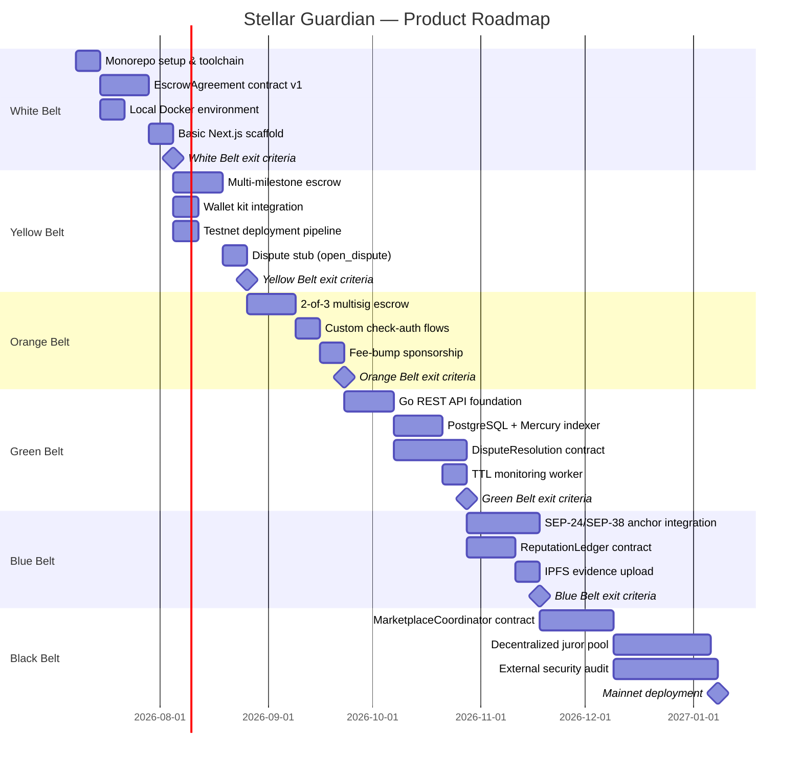
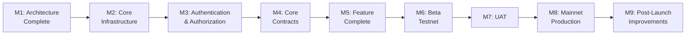
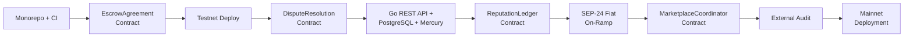

# Stellar Guardian — Product Plan

> **Status:** Draft
> **Version:** 1.0
> **Last Updated:** 2026-07-08
> **Owner:** Product & Engineering

---

## Table of Contents

1. [Product Vision](#1-product-vision)
2. [Agile Delivery Strategy](#2-agile-delivery-strategy)
3. [Product Roadmap](#3-product-roadmap)
4. [Epics](#4-epics)
5. [Features](#5-features)
6. [User Stories](#6-user-stories)
7. [Acceptance Criteria](#7-acceptance-criteria)
8. [Product Backlog](#8-product-backlog)
9. [Sprint Roadmap](#9-sprint-roadmap)
10. [Milestones](#10-milestones)
11. [Dependency Matrix](#11-dependency-matrix)
12. [Risk Register](#12-risk-register)
13. [White Belt → Black Belt Implementation Roadmap](#13-white-belt--black-belt-implementation-roadmap)
14. [Release Plan](#14-release-plan)
15. [Success Metrics](#15-success-metrics)
16. [Engineering Governance](#16-engineering-governance)

---

## 1. Product Vision

### 1.1 Overall Product Goal

Stellar Guardian is a non-custodial, decentralized trust and escrow infrastructure built on the Stellar network using Soroban smart contracts. The product goal is to become the default open-source trust layer for global digital and physical commerce — enabling any two untrusted parties to transact safely without intermediaries, geographic restrictions, or custodial risk.

### 1.2 Business Objectives

| # | Objective | Target | Timeframe |
|---|---|---|---|
| BO-01 | Deploy production-ready `EscrowAgreement` contract on Stellar Mainnet | External audit completed; contract live | Black Belt |
| BO-02 | Reach 1,000 Monthly Active Users (MAU) | Unique wallet addresses per month | 90 days post-Mainnet |
| BO-03 | Process $100K/month in escrow volume | USD value of USDC/EURC locked | Blue Belt |
| BO-04 | Generate $500/month in platform revenue | Net service fee income | Black Belt |
| BO-05 | Secure 3 third-party marketplace SDK integrations | Signed white-label agreements | Black Belt |
| BO-06 | Achieve ≥ 85% escrow completion rate | % completed without manual intervention | Yellow Belt+ |
| BO-07 | Maintain ≤ 8% dispute rate | % of escrows escalated to formal dispute | Ongoing |

### 1.3 Success Metrics

See [Section 15](#15-success-metrics) for the full KPI framework. Summary targets:

- Contract invocation success rate: ≥ 99.5%
- API availability (Green Belt+): ≥ 99.5%
- Escrow creation time (median): ≤ 3 minutes
- Wallet connection success rate: ≥ 90%
- User satisfaction (CSAT): ≥ 4.2 / 5.0

### 1.4 Target Users

| Role | Primary Job To Be Done |
|---|---|
| **Buyer / Payer** | Lock payment in a smart contract that only releases upon confirmed delivery |
| **Seller / Payee** | Verify on-chain that funds are locked before shipping or delivering |
| **Freelancer** | Have project budget locked per milestone before starting work |
| **NGO / Donor** | Trace donations to verifiable on-chain disbursement events |
| **B2B Merchant** | Replace Letters of Credit with smart contract auto-release on delivery confirmation |
| **Arbiter** | Access all escrow state and evidence in structured format to issue fair rulings |

### 1.5 Product Principles

| Principle | Statement |
|---|---|
| **Design for the 99%** | The blockchain is invisible to end users. Wallet mechanics, fee-bump sponsorship, and SEP interactions are handled transparently. |
| **Code is the Custodian** | No administrative key may access escrowed funds except through a pre-defined, auditable dispute path. |
| **Every Escrow Must Decay** | Every escrow has a mathematically guaranteed exit via timelock expiry. Permanent fund trapping is not an acceptable failure mode. |
| **Modularity Over Monolithism** | Escrow logic, dispute resolution, reputation, and marketplace coordination are separate contracts with defined interfaces. |
| **Security First** | Every design decision evaluates security impact before convenience. External audit is a hard gate, not a preference. |

---

## 2. Agile Delivery Strategy

### 2.1 Agile Methodology

Stellar Guardian uses **Scrum** with continuous delivery practices. The small founding team structure lends itself to short feedback loops, frequent releases, and iterative contract hardening. Sprints are time-boxed; scope is adjusted per sprint based on learnings from testnet feedback and contract behavior.

### 2.2 Sprint Cadence

- **Sprint length:** 2 weeks
- **Sprint planning:** First Monday of each sprint (2 hours)
- **Daily standup:** 15 minutes, async-first (written update in team channel)
- **Sprint review:** Last Friday of each sprint (1 hour, includes demo)
- **Sprint retrospective:** Last Friday of each sprint, after review (45 minutes)
- **Backlog refinement:** Mid-sprint Wednesday (1 hour)

### 2.3 Definition of Ready

A backlog item is **Ready** for sprint inclusion when:

- [ ] User story follows the "As a... I want... So that..." format
- [ ] Acceptance criteria are written and testable
- [ ] Dependencies are identified and unblocked
- [ ] Complexity estimate (story points) has been assigned
- [ ] Relevant spec document section is referenced (e.g., `02_ARCHITECTURE_REVIEW.md §5.2`)
- [ ] Security implications have been reviewed for contract-touching stories

### 2.4 Definition of Done

A user story is **Done** when:

- [ ] All acceptance criteria pass
- [ ] Unit tests written and passing (`cargo test`, `pnpm turbo test`, `go test`)
- [ ] CI pipeline passes (lint, type-check, test, build, Scout Audit for contracts)
- [ ] Code reviewed and approved by at least one other engineer
- [ ] No new high/critical vulnerabilities introduced (`cargo audit`, `pnpm audit`, `govulncheck`)
- [ ] Documentation updated if the story changes a public interface or behavior
- [ ] Deployed to testnet (for contract stories) or staging (for API/frontend stories)

### 2.5 Release Strategy

Releases follow the Journey to Mastery belt progression. Each belt is a named release with its own exit criteria. No belt is declared complete until all exit criteria are verified on testnet (and Mainnet for Black Belt).

| Release Cadence | Trigger |
|---|---|
| Testnet deploy | On every merge to `main` (automated via CI) |
| Belt release | When all exit criteria for the belt are met and verified |
| Mainnet deploy | Manual trigger; requires completed external audit + 2 maintainer approvals |
| Patch release | Hotfix branch off latest belt tag; cherry-picked to `main` |

### 2.6 Incremental Delivery Approach

Each sprint delivers a working, tested increment. The increment may be:
- A new contract function deployed to testnet
- A frontend feature connected to a live testnet contract
- An API endpoint backed by real PostgreSQL data (Green Belt+)
- An integration test suite covering a new user flow

No sprint delivers documentation-only or design-only work. Every sprint has at least one deployable artifact.

---

## 3. Product Roadmap

*Figure 1 — High-level product roadmap across all Journey to Mastery phases.*

### 3.1 MVP (White Belt + Yellow Belt)

**Goal:** Demonstrate a working, non-custodial escrow on Stellar Testnet that handles milestone-based payments with timelock expiry.

**Deliverables:**
- `EscrowAgreement` contract with `initialize_escrow`, `fund_escrow`, `approve_milestone`, `claim_after_expiry`
- Next.js web app with wallet connection (Freighter/Albedo/Hana)
- Direct Soroban RPC integration — no backend
- Local Docker development environment
- Testnet deployment pipeline (CI → testnet on merge)

**Exit:** Full fund → release cycle works on Testnet via real wallet signing.

### 3.2 Phase 2 (Orange Belt + Green Belt)

**Goal:** Production-grade infrastructure with real-time data indexing, dispute resolution, and multisig authorization.

**Deliverables:**
- 2-of-3 multisig escrow support with custom `check-auth` flows
- Go REST API (modular monolith) with PostgreSQL read-cache
- Mercury + Zephyr VM event indexing
- `DisputeResolution` contract
- TTL monitoring worker
- Full web UI with dispute flows and escrow history

**Exit:** Full read layer operational; dispute flow works on Testnet; TTL worker monitoring active.

### 3.3 Phase 3 (Blue Belt)

**Goal:** Fiat on-ramp integration and anonymous reputation system.

**Deliverables:**
- SEP-24 / SEP-38 anchor integration (MoneyGram, Circle)
- `ReputationLedger` contract with nullifier-based anonymous reviews
- IPFS dispute evidence upload via Pinata
- End-to-end fiat-to-escrow checkout flow

**Exit:** Live card-to-stablecoin escrow funding verified with a live SEP-24 anchor.

### 3.4 Production Release (Black Belt)

**Goal:** Fully decentralized trust infrastructure on Stellar Mainnet.

**Deliverables:**
- `MarketplaceCoordinator` contract (payment links, B2B trade modules)
- Decentralized juror pool with game-theoretic staking
- Completed external Rust/Soroban security audit (zero critical findings)
- Mainnet deployment with all four contracts
- SDK published for third-party marketplace integration

**Exit:** No critical audit findings; contracts live on Mainnet; initial escrow volume confirmed.

### 3.5 Future Expansion (Post-Black Belt)

- Oracle trust model for physical goods delivery (Risk 1, `02_ARCHITECTURE_REVIEW.md §26`)
- Native mobile application (PWA → iOS/Android post-launch)
- DAO governance framework (deferred — see Out of Scope in `01_PRODUCT_DISCOVERY.md §15`)
- Cross-marketplace portable reputation protocol
- B2B trade finance module for SME Letter of Credit replacement

---

## 4. Epics

### EPIC-01: Smart Contract Core (EscrowAgreement)

| Field | Value |
|---|---|
| **Purpose** | Implement the `EscrowAgreement` Soroban contract — the foundational trust layer that locks, releases, and routes escrowed funds |
| **Business Value** | This is the product. Without a working, audited escrow contract, nothing else in the system has value. |
| **Technical Scope** | `contracts/escrow/` — `initialize_escrow`, `fund_escrow`, `approve_milestone`, `open_dispute`, `claim_after_expiry`, `extend_ttl`, fee collection, donation flag |
| **Priority** | P0 — Must ship |
| **Dependencies** | Soroban SDK `=25.3.0`, `fixed-point-math =1.3.1`, Stellar Testnet account |

### EPIC-02: Dispute Resolution Contract

| Field | Value |
|---|---|
| **Purpose** | Implement the `DisputeResolution` Soroban contract — the state machine that manages evidence submission, arbiter coordination, and ruling execution |
| **Business Value** | Disputes are the highest-friction moment in any escrow system. A structured, on-chain dispute path differentiates Stellar Guardian from simple timelock escrows. |
| **Technical Scope** | `contracts/dispute/` — `register_dispute`, `submit_evidence`, `submit_ruling`, `execute_ruling`, arbiter assignment |
| **Priority** | P0 — Must ship |
| **Dependencies** | EPIC-01 (cross-contract call from `EscrowAgreement`) |

### EPIC-03: Reputation Ledger Contract

| Field | Value |
|---|---|
| **Purpose** | Implement the `ReputationLedger` Soroban contract — anonymous review submission using nullifier-based cryptographic identifiers |
| **Business Value** | On-chain portable reputation is a key network effect driver. Users who build reputation on Stellar Guardian are less likely to abandon the platform. |
| **Technical Scope** | `contracts/reputation/` — `record_outcome`, `submit_review`, nullifier construction, aggregated score queries |
| **Priority** | P1 — Should ship |
| **Dependencies** | EPIC-02 (post-ruling outcome recording) |

### EPIC-04: Marketplace Coordinator Contract

| Field | Value |
|---|---|
| **Purpose** | Implement the `MarketplaceCoordinator` Soroban contract — payment link generation, checkout sessions, and B2B trade module coordination |
| **Business Value** | Enables third-party marketplaces to embed Stellar Guardian checkout with a single SDK call. This is the primary B2B integration revenue driver. |
| **Technical Scope** | `contracts/marketplace/` — `generate_payment_link`, `create_checkout_session`, `initialize_escrow` delegation |
| **Priority** | P1 — Should ship |
| **Dependencies** | EPIC-01, EPIC-03 |

### EPIC-05: Frontend Web Application

| Field | Value |
|---|---|
| **Purpose** | Build the `apps/web/` Next.js 14 customer portal — the primary user interface for all escrow operations |
| **Business Value** | The web application is the product surface that drives user adoption. It must abstract all blockchain complexity. |
| **Technical Scope** | Next.js 14 App Router; wallet kit; escrow create/fund/approve/dispute flows; SSR public pages; SEP-10 auth (Green Belt+); SEP-24 checkout (Blue Belt+) |
| **Priority** | P0 — Must ship |
| **Dependencies** | EPIC-01, `@creit.tech/stellar-wallets-kit` |

### EPIC-06: Go REST API

| Field | Value |
|---|---|
| **Purpose** | Build the `apps/api/` Go modular monolith — the backend API introduced at Green Belt that serves the PostgreSQL read-cache and proxies SEP interactions |
| **Business Value** | Fast, queryable read access to escrow history and reputation data. Cannot be replaced by direct RPC at scale. |
| **Technical Scope** | Go 1.22+; modular monolith (ADR-001); escrow/dispute/reputation/marketplace modules; SEP-10 auth; TTL worker; Prometheus metrics |
| **Priority** | P0 (Green Belt+) |
| **Dependencies** | EPIC-07 (PostgreSQL must exist before API serves data) |

### EPIC-07: Data Layer & Event Indexing

| Field | Value |
|---|---|
| **Purpose** | Deploy the PostgreSQL read-cache and Mercury + Zephyr VM indexer that normalizes on-chain events into queryable rows |
| **Business Value** | The read layer enables escrow history, reputation queries, and platform analytics — none of which are feasible via raw RPC. |
| **Technical Scope** | Mercury + Zephyr VM (ADR-002); PostgreSQL 15+; Redis; goose migrations; `platform_events` audit log |
| **Priority** | P0 (Green Belt+) |
| **Dependencies** | EPIC-01 (contracts must emit events), Mercury subscription |

### EPIC-08: Authentication & Authorization

| Field | Value |
|---|---|
| **Purpose** | Implement SEP-10 wallet-based authentication across the platform — no passwords, no email, no custodial credentials |
| **Business Value** | Non-custodial auth is a product principle. It eliminates password reset flows, phishing vectors, and credential database risk. |
| **Technical Scope** | SEP-10 challenge/verify; JWT issuance (HS256, 24h); Redis nonce storage; Go `AuthMiddleware`; frontend wallet-kit SEP-10 flow |
| **Priority** | P0 (Green Belt+) |
| **Dependencies** | EPIC-06 (Go API), Redis |

### EPIC-09: Fiat On-Ramp (SEP-24 / SEP-38)

| Field | Value |
|---|---|
| **Purpose** | Integrate SEP-24 deposit and SEP-38 quote flows to enable card/bank-to-stablecoin escrow funding |
| **Business Value** | Eliminates the largest onboarding barrier — users who don't already hold USDC can fund escrows via a familiar card payment flow. |
| **Technical Scope** | SEP-24 interactive deposit; SEP-38 exchange rate quotes; anchor selection UI; fiat-to-USDC funded escrow end-to-end |
| **Priority** | P1 (Blue Belt) |
| **Dependencies** | EPIC-06, EPIC-08, MoneyGram/Circle anchor credentials |

### EPIC-10: Monorepo Infrastructure & CI/CD

| Field | Value |
|---|---|
| **Purpose** | Establish the Turborepo monorepo, pnpm workspaces, shared packages, and GitHub Actions CI/CD pipeline |
| **Business Value** | Developer productivity and code quality. Consistent tooling prevents the class of environment-specific failures that slow early-stage teams. |
| **Technical Scope** | Turborepo (ADR-005); pnpm workspaces; `packages/ui`, `types`, `validation`, `api-client`, `shared`, `config`; GitHub Actions CI; Docker Compose local dev |
| **Priority** | P0 — Foundation |
| **Dependencies** | None — must be done first |

### EPIC-11: Observability & Operations

| Field | Value |
|---|---|
| **Purpose** | Implement Prometheus metrics, Grafana dashboards, structured logging (Loki), distributed tracing (OpenTelemetry/Jaeger), and alerting |
| **Business Value** | Operational visibility is required before Mainnet. Silent failures in the TTL worker or Mercury indexer can result in escrow state expiration. |
| **Technical Scope** | Prometheus + Grafana; Loki log aggregation; OpenTelemetry SDK in Go API; TTL heartbeat alerts; Sentry for frontend/API errors |
| **Priority** | P0 (Green Belt+) |
| **Dependencies** | EPIC-06 |

### EPIC-12: Security Hardening & External Audit

| Field | Value |
|---|---|
| **Purpose** | Complete all pre-Mainnet security requirements: Scout Audit CI integration, dependency CVE baseline, contract upgrade governance, and external security audit |
| **Business Value** | No Mainnet deployment is possible without this epic. User funds depend on it. |
| **Technical Scope** | Scout Audit in CI; `cargo audit`/`govulncheck`/`pnpm audit`; 3-of-5 multisig admin setup; contract upgrade governance process; external audit engagement |
| **Priority** | P0 — Hard gate before Mainnet |
| **Dependencies** | All contract EPICs (EPIC-01 through EPIC-04) |

---

## 5. Features

### 5.1 EPIC-01: Smart Contract Core Features

#### F-01.1: Time-Locked Single-Party Escrow
- **Description:** Initialize an escrow with a payer, payee, locked amount, and `claim_after` UNIX timestamp. Funds are released to payee on approval, or auto-refunded to payer on expiry.
- **Functional Scope:** `initialize_escrow`, `fund_escrow`, `approve_milestone` (single milestone), `claim_after_expiry`
- **Technical Considerations:** `Address.require_auth()` on payer; `extend_ttl` on Persistent Storage; fee collection at `Completed` transition; `donation_flag` exempts fee
- **Priority:** P0
- **Complexity:** 8 story points

#### F-01.2: Multi-Milestone Escrow
- **Description:** Initialize an escrow with an ordered array of milestone definitions. Each milestone has a description hash, amount, and independent release path.
- **Functional Scope:** `initialize_escrow` with `Vec<MilestoneDef>`, `approve_milestone(n)`, proportional USDC release per milestone
- **Technical Considerations:** Total milestone amounts must equal escrow balance (invariant); sequential status tracking; partial release on each approval
- **Priority:** P0
- **Complexity:** 13 story points

#### F-01.3: Dispute Initiation from Escrow
- **Description:** Either party can open a dispute on an active or partially-released escrow. The contract transitions to `Disputed` state and calls `DisputeResolution.register_dispute`.
- **Functional Scope:** `open_dispute(escrow_id, evidence_hash)`, cross-contract call to `DisputeResolution`
- **Technical Considerations:** Only one active dispute per escrow; `Disputed` state freezes all other transitions; evidence hash is an IPFS CID
- **Priority:** P0
- **Complexity:** 8 story points

#### F-01.4: Fee Collection & Donation Exemption
- **Description:** Platform fee (50 basis points = 0.5%, capped at 50 USDC) collected at `Completed` transition. Donation escrows set `donation_flag = true` at initialization and are fee-exempt.
- **Functional Scope:** Fee deduction logic in `Completed` transition; `donation_flag` check; treasury address from Instance Storage
- **Technical Considerations:** Integer basis points arithmetic only (no floating point); `fixed-point-math =1.3.1` library; fee logic is on-chain and auditable
- **Priority:** P0
- **Complexity:** 5 story points

#### F-01.5: Emergency Pause
- **Description:** The 3-of-5 admin multisig can pause the contract. No new escrows can be initialized; in-flight escrows freeze at their current state.
- **Functional Scope:** `pause_contract`, `unpause_contract`; `ContractPaused` error on all state-altering calls when paused
- **Technical Considerations:** Paused flag in Instance Storage; 3-of-5 multisig authorization via custom `check-auth`; cannot drain funds while paused
- **Priority:** P0
- **Complexity:** 8 story points

### 5.2 EPIC-02: Dispute Resolution Features

#### F-02.1: Dispute Registration
- **Description:** `DisputeResolution.register_dispute` is called cross-contract from `EscrowAgreement`. Creates a dispute record with the initiating parties, evidence hash, and assigned arbiter set.
- **Functional Scope:** `register_dispute(escrow_id, parties, evidence_hash)`, returns `dispute_id`
- **Technical Considerations:** Arbiter set is defined at escrow initialization; cannot be changed post-dispute; cross-contract call from `EscrowAgreement` only
- **Priority:** P0
- **Complexity:** 8 story points

#### F-02.2: Evidence Submission
- **Description:** Either party can submit additional evidence (IPFS CID) after a dispute is opened. Evidence is append-only; hashes are immutable once stored.
- **Functional Scope:** `submit_evidence(dispute_id, evidence_hash)`, evidence array in Persistent Storage
- **Technical Considerations:** Caller must be a party to the dispute; IPFS CID stored on-chain; full evidence files stored in IPFS via Pinata
- **Priority:** P0
- **Complexity:** 5 story points

#### F-02.3: Arbiter Ruling & Execution
- **Description:** An authorized arbiter submits a ruling (release / refund / split). The contract validates arbiter authorization and executes the ruling atomically via `EscrowAgreement.execute_ruling`.
- **Functional Scope:** `submit_ruling(dispute_id, ruling)`, `execute_ruling(escrow_id, ruling)`, cross-contract fund routing
- **Technical Considerations:** `require_auth(arbiter)` on `submit_ruling`; ruling executes atomically; no partial execution; post-ruling calls `ReputationLedger.record_outcome`
- **Priority:** P0
- **Complexity:** 13 story points

### 5.3 EPIC-03: Reputation Ledger Features

#### F-03.1: Anonymous Review Submission
- **Description:** After an escrow completes or a dispute is resolved, parties can submit anonymous reviews using one-time nullifier-based identifiers. The reviewer's wallet address cannot be derived from the commitment.
- **Functional Scope:** `submit_review(escrow_id, commitment, rating, content_hash)`, nullifier validation
- **Technical Considerations:** Commit-reveal or nullifier scheme (specification in `08_SMART_CONTRACT_SPEC.md`); one review per party per escrow; double-submission prevented by nullifier
- **Priority:** P1
- **Complexity:** 13 story points

#### F-03.2: Reputation Score Aggregation
- **Description:** Aggregated reputation score per wallet address, updated by `DisputeResolution.record_outcome` after every ruling. Score is a weighted average of all reviews.
- **Functional Scope:** `record_outcome(parties, escrow_id)`, score recalculation, read-only score queries
- **Technical Considerations:** Score in `NUMERIC(4,2)` (0.00–5.00); updated only via cross-contract call from `DisputeResolution`; never writable by arbitrary callers
- **Priority:** P1
- **Complexity:** 8 story points

### 5.4 EPIC-04: Marketplace Coordinator Features

#### F-04.1: Payment Link Generation
- **Description:** A seller or marketplace operator generates a signed payment link encoding an escrow configuration (payee, milestones, asset, amount). The link opens the checkout flow when clicked.
- **Functional Scope:** `generate_payment_link(params)`, signed parameter encoding, link ID storage
- **Technical Considerations:** Link parameters are signed; cannot be tampered in transit; `PaymentLink` aggregate in Marketplace domain
- **Priority:** P1
- **Complexity:** 8 story points

#### F-04.2: Checkout Session Management
- **Description:** A buyer clicks a payment link and creates a checkout session. The session links the buyer to an escrow initialization and expires if unfunded within a defined window.
- **Functional Scope:** `create_checkout_session(buyer, listing_id)`, session expiry, escrow initialization delegation to `EscrowAgreement`
- **Technical Considerations:** Session creates at most one escrow; `CheckoutSession.expires_at` enforced on-chain; delegates `initialize_escrow` to `EscrowAgreement`
- **Priority:** P1
- **Complexity:** 8 story points

### 5.5 EPIC-05: Frontend Web Application Features

#### F-05.1: Wallet Connection & SEP-10 Auth
- **Description:** Users connect their Stellar wallet (Freighter, Albedo, or Hana) via `@creit.tech/stellar-wallets-kit`. Green Belt+ adds SEP-10 challenge/response for API authentication.
- **Functional Scope:** Wallet detection, connect/disconnect, public key display, transaction signing, SEP-10 challenge flow (Green Belt+)
- **Technical Considerations:** Private keys never enter application code; `WalletNetwork` from env var; SEP-10 JWT stored in memory only
- **Priority:** P0
- **Complexity:** 8 story points

#### F-05.2: Escrow Creation & Funding UI
- **Description:** Client component form for creating a new escrow — specifying counterparty, milestone definitions, asset, amount, and timelock. Direct Soroban RPC submission (White/Yellow Belt); API proxy (Green Belt+).
- **Functional Scope:** Escrow creation form; milestone array builder; USDC/EURC asset selection; timelock date picker; transaction construction and signing
- **Technical Considerations:** `packages/validation` Zod schemas for all inputs; `packages/api-client` for contract calls; no `any` TypeScript
- **Priority:** P0
- **Complexity:** 13 story points

#### F-05.3: Escrow Detail & Milestone Management
- **Description:** Server-rendered escrow detail page showing current state, milestones, parties, and available actions. Client components for approve/reject milestone and fund actions.
- **Functional Scope:** SSR escrow detail page; milestone status table; approve/reject/dispute action buttons; real-time state polling (Green Belt+: SSE stream)
- **Technical Considerations:** Server component for initial render; client components for wallet-dependent actions; graceful handling of Mercury lag
- **Priority:** P0
- **Complexity:** 13 story points

#### F-05.4: Dispute Management UI
- **Description:** Dispute initiation form with IPFS evidence upload. Dispute status page showing evidence submitted, arbiter assignment, and ruling outcome.
- **Functional Scope:** Open dispute form; IPFS file upload via Pinata; dispute status tracking; ruling display
- **Technical Considerations:** Pinata API integration in `packages/api-client`; evidence hash displayed alongside IPFS link; dispute state polling
- **Priority:** P0
- **Complexity:** 13 story points

#### F-05.5: Reputation Profile UI
- **Description:** Public profile page showing a wallet address's reputation score, review count, and escrow history. Server-rendered for SEO.
- **Functional Scope:** Reputation score display; review list (anonymized); escrow completion history; aggregate stats
- **Technical Considerations:** Server component (SSR); reputation data from Go API (Green Belt+) or direct RPC (earlier); no wallet required to view
- **Priority:** P1
- **Complexity:** 8 story points

#### F-05.6: SEP-24 Fiat Checkout Flow (Blue Belt)
- **Description:** Embedded SEP-24 iframe/popup flow allowing users to deposit fiat (card/bank transfer) directly into a funded escrow via an anchor operator.
- **Functional Scope:** Anchor selection; SEP-24 interactive deposit flow; SEP-38 quote display; post-deposit escrow funding confirmation
- **Technical Considerations:** SEP-24 iframe or popup; anchor list from API; exchange rate from SEP-38 quote; USDC credited to escrow on deposit confirmation
- **Priority:** P1 (Blue Belt)
- **Complexity:** 21 story points

### 5.6 EPIC-06: Go REST API Features

#### F-06.1: Escrow Read Endpoints
- **Description:** REST endpoints serving paginated escrow lists, escrow detail, and milestone status from PostgreSQL read-cache.
- **Functional Scope:** `GET /api/v1/escrows`, `GET /api/v1/escrows/{id}`, `GET /api/v1/escrows/{id}/milestones`
- **Technical Considerations:** pgx/v5 parameterized queries; Redis cache for hot escrow reads; fallback to Stellar RPC on Mercury lag
- **Priority:** P0 (Green Belt)
- **Complexity:** 8 story points

#### F-06.2: Dispute & Reputation Read Endpoints
- **Description:** REST endpoints for dispute records and reputation scores.
- **Functional Scope:** `GET /api/v1/disputes/{id}`, `GET /api/v1/reputation/{address}`, `GET /api/v1/escrows/{id}/dispute`
- **Technical Considerations:** Dispute evidence references IPFS CIDs (not full files); reputation score from `reputation_scores` table
- **Priority:** P0 (Green Belt)
- **Complexity:** 5 story points

#### F-06.3: TTL Monitoring Worker
- **Description:** Background goroutine polling active escrow TTLs every 5 minutes. Alerts when TTL falls below 48-hour safety threshold.
- **Functional Scope:** TTL polling loop; `WARN` log + Prometheus counter on threshold breach; optional `TTL_AUTO_EXTEND` mode
- **Technical Considerations:** Heartbeat monitoring required; must not be a silent failure; secondary monitoring path recommended (see Risk 3 in `02_ARCHITECTURE_REVIEW.md §26`)
- **Priority:** P0 (Green Belt)
- **Complexity:** 8 story points

#### F-06.4: Server-Sent Events (SSE) Stream
- **Description:** SSE endpoint streaming on-chain events to connected web clients. Used for real-time escrow state updates without polling.
- **Functional Scope:** `GET /api/v1/escrows/{id}/events` SSE stream; Mercury webhook handler writes events to stream
- **Technical Considerations:** Mercury webhook → Go API → SSE fan-out; client reconnects on disconnect; events filtered by escrow ID
- **Priority:** P1 (Green Belt)
- **Complexity:** 8 story points

### 5.7 EPIC-07: Data Layer Features

#### F-07.1: Database Schema & Migrations
- **Description:** PostgreSQL schema for `escrow_agreements`, `escrow_milestones`, `dispute_records`, `reputation_scores`, `platform_events`. goose migrations versioned and idempotent.
- **Functional Scope:** All core tables with foreign keys and indexes; migration up/down commands; CI migration test
- **Technical Considerations:** `NUMERIC(20,7)` for amounts; `TIMESTAMPTZ` for all timestamps; `BIGINT` for ledger sequences; append-only `platform_events`
- **Priority:** P0 (Green Belt)
- **Complexity:** 8 story points

#### F-07.2: Mercury Zephyr VM Indexer Programs
- **Description:** Rust Zephyr VM programs for each contract (`escrow_indexer.rs`, `dispute_indexer.rs`, `reputation_indexer.rs`, `marketplace_indexer.rs`) that normalize on-chain events into PostgreSQL rows.
- **Functional Scope:** Event parsing per contract; `DatabaseInteract` row structs; ledger sequence tracking; replay from last processed ledger on restart
- **Technical Considerations:** Mercury subscription setup; Zephyr VM deployment; event ordering guarantees (Soroban FBA atomicity)
- **Priority:** P0 (Green Belt)
- **Complexity:** 13 story points

---

## 6. User Stories

### 6.1 Escrow Creation & Funding

#### US-001: Create a Time-Locked Escrow
- **Story:** As a Buyer, I want to create an escrow with a locked USDC amount and a timelock expiry date, so that my funds are protected while the seller delivers the agreed goods or services.
- **Story ID:** US-001
- **Priority:** P0
- **Story Points:** 5
- **Acceptance Criteria:** See [AC-001](#ac-001-create-time-locked-escrow)
- **Definition of Done:** Contract function `initialize_escrow` deployed to testnet; unit tests passing; wallet-signed transaction confirmed on-chain.

#### US-002: Fund an Initialized Escrow
- **Story:** As a Buyer, I want to fund an initialized escrow by transferring USDC from my wallet, so that the seller can verify on-chain that payment is secured before shipping.
- **Story ID:** US-002
- **Priority:** P0
- **Story Points:** 5
- **Acceptance Criteria:** See [AC-002](#ac-002-fund-escrow)
- **Definition of Done:** `fund_escrow` call transitions contract state to `Active`; USDC balance confirmed in contract; testnet event emitted and indexable.

#### US-003: Create a Multi-Milestone Escrow
- **Story:** As a Client, I want to define up to 10 milestones with individual amounts and descriptions when creating an escrow, so that a freelancer's payment is tied to verifiable deliverables.
- **Story ID:** US-003
- **Priority:** P0
- **Story Points:** 8
- **Acceptance Criteria:** See [AC-003](#ac-003-multi-milestone-escrow)
- **Definition of Done:** `initialize_escrow` accepts `Vec<MilestoneDef>` with validated totals; testnet deployment verified with 3-milestone test escrow.

#### US-004: Create a Donation Escrow
- **Story:** As an NGO, I want to create a fee-exempt donation escrow so that 100% of donated funds reach the intended recipient without platform deduction.
- **Story ID:** US-004
- **Priority:** P1
- **Story Points:** 3
- **Acceptance Criteria:** See [AC-004](#ac-004-donation-escrow)
- **Definition of Done:** `donation_flag = true` skips fee at `Completed` transition; verified in unit test; UI clearly labels donation escrows as fee-free.

### 6.2 Milestone Approval & Release

#### US-005: Approve a Milestone
- **Story:** As a Client, I want to approve a completed milestone so that the freelancer immediately receives the proportional USDC payment for that deliverable.
- **Story ID:** US-005
- **Priority:** P0
- **Story Points:** 5
- **Acceptance Criteria:** See [AC-005](#ac-005-approve-milestone)
- **Definition of Done:** `approve_milestone(n)` releases correct USDC proportion; `MilestoneReleased` event emitted; Mercury indexes the event; frontend shows updated milestone status.

#### US-006: Claim Auto-Refund After Timelock Expiry
- **Story:** As a Seller, I want funds to automatically transfer to me if the buyer fails to respond after the agreed timelock period, so that I am not left waiting indefinitely for an unresponsive counterparty.
- **Story ID:** US-006
- **Priority:** P0
- **Story Points:** 5
- **Acceptance Criteria:** See [AC-006](#ac-006-timelock-expiry)
- **Definition of Done:** `claim_after_expiry` succeeds only when `env.ledger().timestamp() >= claim_after`; reverts with `TimelockNotReached` before expiry; testnet verified.

### 6.3 Dispute Management

#### US-007: Open a Dispute
- **Story:** As a Buyer, I want to open a dispute on an active escrow by uploading evidence to IPFS and submitting the content hash on-chain, so that an arbiter can review the situation and issue a binding ruling.
- **Story ID:** US-007
- **Priority:** P0
- **Story Points:** 8
- **Acceptance Criteria:** See [AC-007](#ac-007-open-dispute)
- **Definition of Done:** `open_dispute` transitions escrow to `Disputed`; cross-contract call to `DisputeResolution.register_dispute` succeeds; `DisputeOpened` event indexed by Mercury.

#### US-008: Submit Additional Evidence
- **Story:** As a Seller, I want to submit additional evidence to an open dispute so that I can present counter-evidence before the arbiter issues a ruling.
- **Story ID:** US-008
- **Priority:** P0
- **Story Points:** 3
- **Acceptance Criteria:** See [AC-008](#ac-008-submit-evidence)
- **Definition of Done:** `submit_evidence` appends IPFS CID to dispute evidence array; only dispute parties can submit; evidence array queryable via API.

#### US-009: Arbiter Issues a Ruling
- **Story:** As an Arbiter, I want to submit a ruling (release to seller, refund to buyer, or split) on a dispute so that the funds are routed fairly based on the evidence presented.
- **Story ID:** US-009
- **Priority:** P0
- **Story Points:** 8
- **Acceptance Criteria:** See [AC-009](#ac-009-arbiter-ruling)
- **Definition of Done:** `submit_ruling` requires arbiter authorization; `execute_ruling` routes funds atomically; `ReputationLedger.record_outcome` called post-ruling; both escrow and dispute states updated.

### 6.4 Wallet & Authentication

#### US-010: Connect a Stellar Wallet
- **Story:** As a User, I want to connect my Stellar wallet (Freighter, Albedo, or Hana) to Stellar Guardian, so that I can sign escrow transactions without exposing my private key to the application.
- **Story ID:** US-010
- **Priority:** P0
- **Story Points:** 3
- **Acceptance Criteria:** See [AC-010](#ac-010-wallet-connection)
- **Definition of Done:** `@creit.tech/stellar-wallets-kit` integration working; public key displayed in UI; `connect()` and `disconnect()` functional; private key never accessible in app code.

#### US-011: Authenticate via SEP-10
- **Story:** As a User, I want to authenticate with the Stellar Guardian API using my wallet's signing capability, so that I access my escrow data without a password or email account.
- **Story ID:** US-011
- **Priority:** P0 (Green Belt)
- **Story Points:** 5
- **Acceptance Criteria:** See [AC-011](#ac-011-sep10-auth)
- **Definition of Done:** SEP-10 challenge generated by API; user signs with wallet; JWT issued with 24h TTL; all protected API endpoints reject requests without valid JWT.

### 6.5 Reputation

#### US-012: Submit an Anonymous Review
- **Story:** As a Seller, I want to submit a review for a completed escrow without my wallet address being identifiable, so that I can give honest feedback without fear of retaliation.
- **Story ID:** US-012
- **Priority:** P1
- **Story Points:** 8
- **Acceptance Criteria:** See [AC-012](#ac-012-anonymous-review)
- **Definition of Done:** Review submitted using nullifier-based identifier; reviewer address not derivable from commitment; double-submission prevented by nullifier check; `ReviewSubmitted` event emitted.

#### US-013: View a Counterparty's Reputation Score
- **Story:** As a Buyer, I want to view a potential counterparty's on-chain reputation score and review count before entering an escrow, so that I can make an informed decision about transaction risk.
- **Story ID:** US-013
- **Priority:** P1
- **Story Points:** 3
- **Acceptance Criteria:** See [AC-013](#ac-013-reputation-display)
- **Definition of Done:** Reputation profile page server-rendered; score from `reputation_scores` PostgreSQL table (Green Belt+); no wallet required to view; score updates within 5 seconds of `ReputationUpdated` event.

### 6.6 Fiat On-Ramp

#### US-014: Fund an Escrow via Card Payment (SEP-24)
- **Story:** As a Buyer who does not hold USDC, I want to fund an escrow using my debit card via a SEP-24 anchor, so that I can use Stellar Guardian without needing to acquire stablecoin in advance.
- **Story ID:** US-014
- **Priority:** P1 (Blue Belt)
- **Story Points:** 13
- **Acceptance Criteria:** See [AC-014](#ac-014-sep24-funding)
- **Definition of Done:** SEP-24 deposit flow opens in-app; exchange rate displayed from SEP-38 quote; USDC credited to escrow after confirmed deposit; full flow tested with a live anchor on testnet.

### 6.7 Platform Operations

#### US-015: Pause Contract in Emergency
- **Story:** As a Platform Admin, I want to pause the `EscrowAgreement` contract using the 3-of-5 multisig so that I can halt new escrow creation during a security incident without affecting in-flight escrows.
- **Story ID:** US-015
- **Priority:** P0
- **Story Points:** 5
- **Acceptance Criteria:** See [AC-015](#ac-015-emergency-pause)
- **Definition of Done:** `pause_contract` requires 3-of-5 multisig signatures; paused contract rejects `initialize_escrow` with `ContractPaused`; in-flight escrows can still be claimed or expired; `unpause_contract` restores normal operation.

#### US-016: Monitor Escrow TTL Health
- **Story:** As a Platform Operator, I want to receive automated alerts when any active escrow's Soroban storage TTL falls below 48 hours, so that I can take action before an escrow's state expires and funds become inaccessible.
- **Story ID:** US-016
- **Priority:** P0 (Green Belt)
- **Story Points:** 5
- **Acceptance Criteria:** See [AC-016](#ac-016-ttl-monitoring)
- **Definition of Done:** TTL worker polls every 5 minutes; `WARN` log emitted with escrow ID and remaining TTL; `stellar_guardian_ttl_warnings_total` Prometheus counter incremented; Grafana alert fires and is visible on dashboard.

---

## 7. Acceptance Criteria

### AC-001: Create Time-Locked Escrow

**Given** a connected wallet with sufficient USDC balance and trustline established,
**When** the user submits the escrow creation form with a valid payee address, amount > 0, and a `claim_after` timestamp at least 24 hours in the future,
**Then:**
1. `EscrowAgreement.initialize_escrow` is called with `payer.require_auth()` enforced
2. The contract stores the escrow record in Persistent Storage
3. Contract state transitions to `Pending`
4. `EscrowInitialized` event is emitted and indexable by Mercury
5. The UI navigates to the escrow detail page showing `Pending` state
6. The transaction confirms within 10 seconds (p95)

**Given** a `claim_after` timestamp less than the current ledger time,
**Then** the contract returns `InvalidAmount` error and no state is written.

---

### AC-002: Fund Escrow

**Given** an escrow in `Pending` state and a connected payer wallet,
**When** the payer calls `fund_escrow` with the correct USDC amount,
**Then:**
1. USDC is transferred from payer's account to the contract
2. Contract state transitions to `Active`
3. `EscrowFunded` event is emitted
4. Seller's UI shows "Funds locked — safe to proceed"

**Given** `fund_escrow` is called a second time on an `Active` escrow,
**Then** the contract returns `AlreadyFunded` error.

---

### AC-003: Multi-Milestone Escrow

**Given** the escrow creation form with 3 milestones totaling 300 USDC,
**When** the form is submitted,
**Then:**
1. `initialize_escrow` is called with `milestones: Vec<MilestoneDef>` length 3
2. Contract validates sum of milestone amounts equals total escrow balance (300 USDC)
3. All milestones stored in Persistent Storage with `Pending` status
4. Milestone list visible in the escrow detail UI with amounts and descriptions

**Given** milestone amounts do not sum to the total escrow amount,
**Then** `initialize_escrow` returns `InvalidAmount`.

---

### AC-004: Donation Escrow

**Given** the escrow creation form with `is_donation = true`,
**When** the escrow completes,
**Then:**
1. No platform fee is deducted from the released amount
2. The full escrow amount reaches the payee
3. The UI displays a "Fee waived — donation escrow" label

---

### AC-005: Approve Milestone

**Given** an active escrow with 3 milestones and the client is connected,
**When** the client calls `approve_milestone(0)` (first milestone),
**Then:**
1. Exactly 1/3 of total USDC is released to the payee
2. Milestone 0 status transitions to `Released`
3. Milestones 1 and 2 remain `Pending`
4. `MilestoneApproved` and `MilestoneReleased` events emitted
5. Payee wallet balance increases by the milestone amount within one ledger close

**Given** the caller is not the designated approver,
**Then** `require_auth` fails and no state changes.

---

### AC-006: Timelock Expiry

**Given** an escrow with `claim_after = T` and no prior action by the approver,
**When** `claim_after_expiry` is called after timestamp T has passed,
**Then:**
1. Remaining locked USDC is returned to the payer
2. Contract state transitions to `Expired`
3. `EscrowExpired` event emitted

**Given** `claim_after_expiry` is called before timestamp T,
**Then** the contract returns `TimelockNotReached` and no funds move.

---

### AC-007: Open Dispute

**Given** an active escrow and a connected party wallet,
**When** the user opens a dispute with a valid IPFS CID as evidence hash,
**Then:**
1. `open_dispute(escrow_id, evidence_hash)` is called
2. Contract state transitions to `Disputed`
3. Cross-contract call to `DisputeResolution.register_dispute` succeeds
4. `dispute_id` is returned and stored
5. `DisputeOpened` event emitted on `EscrowAgreement`
6. `DisputeRegistered` event emitted on `DisputeResolution`
7. Neither party can approve milestones or claim expiry while in `Disputed` state

**Given** a dispute is already open on the same escrow,
**Then** `open_dispute` returns `InvalidState`.

---

### AC-008: Submit Evidence

**Given** an open dispute and a connected party wallet,
**When** the party uploads a file to IPFS via Pinata and submits the resulting CID,
**Then:**
1. `submit_evidence(dispute_id, ipfs_cid)` appends the CID to the evidence array
2. Evidence is immutable after submission (append-only)
3. The dispute detail UI shows the new evidence with timestamp

**Given** a non-party attempts to submit evidence,
**Then** `require_auth` fails.

---

### AC-009: Arbiter Ruling

**Given** an open dispute and a connected arbiter wallet,
**When** the arbiter calls `submit_ruling(dispute_id, "release")`,
**Then:**
1. Arbiter authorization is verified (`require_auth(arbiter)`)
2. Funds route atomically to the payee
3. `DisputeResolution.execute_ruling` calls `EscrowAgreement.execute_ruling`
4. Escrow state transitions to `Completed`
5. `ReputationLedger.record_outcome` called for both parties
6. `RulingExecuted` event emitted

**Given** the arbiter calls `submit_ruling` with `"refund"`,
**Then** funds return to the payer and escrow transitions to `Refunded`.

---

### AC-010: Wallet Connection

**Given** the Stellar Guardian web app is open,
**When** the user clicks "Connect Wallet" and selects Freighter,
**Then:**
1. Freighter extension prompts the user for approval
2. On approval, the user's public key is displayed in the header
3. `signTransaction` is callable for subsequent escrow operations
4. Private key is never accessible in application code

**Given** the user clicks "Disconnect",
**Then** the public key is cleared and all wallet-dependent UI is disabled.

---

### AC-011: SEP-10 Authentication

**Given** a connected wallet and the Green Belt+ Go API,
**When** the user initiates authentication,
**Then:**
1. `POST /api/v1/auth/challenge` returns an unsigned XDR challenge transaction
2. User signs the challenge with their wallet
3. `POST /api/v1/auth/token` verifies signatures and returns a JWT
4. JWT is stored in memory (not localStorage); lifetime is 24 hours
5. All protected API endpoints return `200` with valid JWT and `401` without

**Given** the Redis nonce for an account is missing or expired,
**Then** `POST /api/v1/auth/token` returns `401 challenge_expired`.

---

### AC-012: Anonymous Review

**Given** a completed or resolved escrow and a connected party wallet,
**When** the user submits a review using their nullifier-based identifier,
**Then:**
1. `submit_review` stores the commitment and content hash on-chain
2. The reviewer's wallet address is not stored or derivable from the commitment
3. A second submission with the same nullifier is rejected with `DuplicateReview`
4. `ReviewSubmitted` event emitted; reputation score updated

---

### AC-013: Reputation Display

**Given** any wallet address,
**When** a user navigates to `/reputation/{address}`,
**Then:**
1. The page server-renders with reputation score, review count, and escrow history
2. No wallet connection required to view
3. Score reflects the most recent `ReputationUpdated` event (≤ 5 second lag on Green Belt+)

---

### AC-014: SEP-24 Fiat Funding

**Given** a `Pending` escrow and a user without existing USDC,
**When** the user selects "Pay with Card" and completes the SEP-24 anchor flow,
**Then:**
1. SEP-38 quote is fetched and exchange rate displayed before deposit
2. SEP-24 deposit iframe/popup opens
3. On successful deposit, USDC is credited to the escrow
4. Escrow transitions to `Active`
5. The user is returned to the escrow detail page confirming the funded state

---

### AC-015: Emergency Pause

**Given** a security incident requiring immediate contract pause,
**When** 3 of the 5 admin multisig signers submit `pause_contract` signatures,
**Then:**
1. Contract `paused` flag in Instance Storage is set to `true`
2. All calls to `initialize_escrow` and `fund_escrow` return `ContractPaused`
3. Existing active escrows can still call `claim_after_expiry` (timelock remains)
4. `unpause_contract` with 3-of-5 multisig restores normal operation

---

### AC-016: TTL Monitoring

**Given** the TTL monitoring worker is running and an active escrow TTL drops below 48 hours,
**When** the worker's 5-minute polling cycle runs,
**Then:**
1. A `WARN` log entry is emitted containing the escrow ID and remaining TTL in hours
2. `stellar_guardian_ttl_warnings_total` Prometheus counter is incremented
3. A Grafana alert fires within 5 minutes of the threshold breach
4. If `TTL_AUTO_EXTEND=true`, an `extend_ttl` transaction is submitted and confirmed

---

## 8. Product Backlog

| Story ID | Epic | Feature | Priority | Points | Sprint | Status |
|---|---|---|---|---|---|---|
| US-010 | EPIC-10 | F-10.1 Monorepo setup | P0 | 3 | S01 | Planned |
| US-010 | EPIC-05 | F-05.1 Wallet connection | P0 | 3 | S01 | Planned |
| US-001 | EPIC-01 | F-01.1 Time-locked escrow | P0 | 5 | S01 | Planned |
| US-002 | EPIC-01 | F-01.1 Fund escrow | P0 | 5 | S02 | Planned |
| US-003 | EPIC-01 | F-01.2 Multi-milestone | P0 | 8 | S02 | Planned |
| US-005 | EPIC-01 | F-01.2 Approve milestone | P0 | 5 | S02 | Planned |
| US-006 | EPIC-01 | F-01.1 Timelock expiry | P0 | 5 | S03 | Planned |
| US-015 | EPIC-01 | F-01.5 Emergency pause | P0 | 5 | S03 | Planned |
| US-004 | EPIC-01 | F-01.4 Donation escrow | P1 | 3 | S03 | Planned |
| US-005 | EPIC-05 | F-05.2 Escrow creation UI | P0 | 13 | S03 | Planned |
| US-005 | EPIC-05 | F-05.3 Escrow detail UI | P0 | 13 | S04 | Planned |
| US-007 | EPIC-01 | F-01.3 Dispute initiation | P0 | 8 | S04 | Planned |
| US-007 | EPIC-02 | F-02.1 Dispute registration | P0 | 8 | S04 | Planned |
| US-008 | EPIC-02 | F-02.2 Evidence submission | P0 | 5 | S05 | Planned |
| US-009 | EPIC-02 | F-02.3 Arbiter ruling | P0 | 8 | S05 | Planned |
| US-005 | EPIC-05 | F-05.4 Dispute UI | P0 | 13 | S05 | Planned |
| US-011 | EPIC-08 | F-08.1 SEP-10 auth | P0 | 5 | S06 | Planned |
| US-016 | EPIC-06 | F-06.3 TTL worker | P0 | 5 | S06 | Planned |
| US-001 | EPIC-07 | F-07.1 DB schema | P0 | 8 | S06 | Planned |
| US-001 | EPIC-06 | F-06.1 Escrow read API | P0 | 8 | S07 | Planned |
| US-001 | EPIC-07 | F-07.2 Mercury indexer | P0 | 13 | S07 | Planned |
| US-001 | EPIC-06 | F-06.2 Dispute/rep API | P0 | 5 | S07 | Planned |
| US-001 | EPIC-11 | Observability setup | P0 | 8 | S08 | Planned |
| US-012 | EPIC-03 | F-03.1 Anonymous review | P1 | 13 | S08 | Planned |
| US-013 | EPIC-03 | F-03.2 Score aggregation | P1 | 8 | S08 | Planned |
| US-013 | EPIC-05 | F-05.5 Reputation UI | P1 | 8 | S09 | Planned |
| US-014 | EPIC-09 | F-09.1 SEP-24 flow | P1 | 13 | S09 | Planned |
| US-001 | EPIC-04 | F-04.1 Payment links | P1 | 8 | S10 | Planned |
| US-001 | EPIC-04 | F-04.2 Checkout sessions | P1 | 8 | S10 | Planned |
| US-001 | EPIC-12 | External audit | P0 | — | S11 | Planned |
| US-001 | EPIC-01 | Mainnet deployment | P0 | — | S12 | Planned |

---

## 9. Sprint Roadmap

> Sprint cadence: 2 weeks. Velocity assumption: 30 story points per sprint for a 2-engineer core team.

### Sprint 1 (S01) — Monorepo Foundation & Wallet Connection
**Sprint Goal:** Establish the monorepo, development environment, and prove wallet connection to a locally deployed escrow contract.

| Story | Points |
|---|---|
| Turborepo + pnpm workspace scaffold | 3 |
| Shared packages: `types`, `validation`, `config` skeleton | 3 |
| Docker Compose local dev environment (Stellar standalone + PostgreSQL + Redis) | 3 |
| GitHub Actions CI pipeline (contracts + frontend lint/test/build) | 3 |
| Rust Cargo workspace setup (`contracts/Cargo.toml`, soroban-sdk pinned) | 3 |
| `EscrowAgreement` contract skeleton: `initialize_escrow` basic impl | 5 |
| Wallet connection (US-010) via `@creit.tech/stellar-wallets-kit` | 3 |
| Next.js 14 App Router scaffold with `WalletProvider` | 3 |
| **Total** | **26** |

**Risks:** Docker Compose networking with Soroban RPC; wallet kit compatibility with testnet.
**Expected Deliverables:** Monorepo CI passing; wallet connection to local contract working in browser.

---

### Sprint 2 (S02) — Core Escrow Contract (Fund & Milestone Release)
**Sprint Goal:** A funded, multi-milestone escrow can be created, funded, and have individual milestones approved on the local network.

| Story | Points |
|---|---|
| `fund_escrow` contract function (US-002) | 5 |
| Multi-milestone escrow logic — `Vec<MilestoneDef>`, proportional release (US-003) | 8 |
| `approve_milestone(n)` with auth enforcement (US-005) | 5 |
| `EscrowError` enum with stable discriminants | 2 |
| Contract unit tests for initialize → fund → approve flow | 3 |
| `packages/ui` shared component skeleton (Button, Card, Form) | 3 |
| **Total** | **26** |

**Risks:** Milestone amount invariant validation edge cases; `require_auth` in test env.
**Expected Deliverables:** Full fund → milestone release cycle on local network; all `cargo test` passing.

---

### Sprint 3 (S03) — Timelock, Emergency Pause & Escrow Creation UI
**Sprint Goal:** Timelock expiry and emergency pause are implemented. Users can create escrows through the web UI.

| Story | Points |
|---|---|
| `claim_after_expiry` contract function (US-006) | 5 |
| Emergency pause (3-of-5 multisig, `pause_contract`) (US-015) | 5 |
| Donation escrow `donation_flag` + fee exemption (US-004) | 3 |
| Fee collection at `Completed` transition (F-01.4) | 5 |
| Escrow creation UI form — full milestone builder (US-005, F-05.2) | 13 |
| **Total** | **31** → carry 1 to S04 |

**Risks:** Custom multisig `check-auth` complexity; UI form state for dynamic milestone array.
**Expected Deliverables:** All escrow state transitions working on local network; escrow creation form functional in browser.

---

### Sprint 4 (S04) — Testnet Deployment & Escrow Detail UI
**Sprint Goal:** Contracts deployed to Stellar Testnet. Escrow detail page renders real on-chain state.

| Story | Points |
|---|---|
| Testnet deployment pipeline (CI → testnet on merge to `main`) | 5 |
| `contract-ids.json` management + environment config for testnet | 3 |
| `open_dispute` contract function stub — state transition to `Disputed` (US-007 part 1) | 5 |
| Escrow detail UI — SSR page + milestone status table (F-05.3) | 13 |
| Direct Soroban RPC polling in frontend for state sync | 3 |
| **Total** | **29** |

**Risks:** Testnet RPC availability; SSR data fetching from Soroban RPC.
**Expected Deliverables:** Contracts live on Stellar Testnet; escrow detail page showing live on-chain state.

---

### Sprint 5 (S05) — DisputeResolution Contract & Dispute UI
**Sprint Goal:** Full dispute flow — open, submit evidence, arbiter ruling — works on Testnet end-to-end.

| Story | Points |
|---|---|
| `DisputeResolution.register_dispute` contract (F-02.1) | 8 |
| `submit_evidence` with IPFS CID storage (US-008, F-02.2) | 5 |
| `submit_ruling` + `execute_ruling` with cross-contract fund routing (US-009, F-02.3) | 8 |
| `ReputationLedger.record_outcome` stub (cross-contract call from dispute ruling) | 3 |
| Dispute management UI — evidence upload, dispute status, ruling display (F-05.4) | 13 |
| **Total** | **37** → carry 7 to S06 |

**Risks:** Cross-contract call testing complexity; IPFS Pinata API integration in frontend.
**Expected Deliverables:** Full dispute lifecycle working on Testnet; dispute UI functional with Pinata uploads.

---

### Sprint 6 (S06) — Go REST API Foundation & SEP-10 Auth
**Sprint Goal:** Green Belt begins. Go API is running with SEP-10 auth and TTL monitoring worker operational.

| Story | Points |
|---|---|
| Go REST API scaffold (`cmd/server`, `internal/` module structure) | 5 |
| SEP-10 challenge/verify + JWT issuance (US-011, F-08.1) | 5 |
| Auth middleware (bearer token extraction, JWT validation) | 3 |
| Redis integration (nonce storage, rate limiting) | 3 |
| TTL monitoring worker — polling loop + Prometheus counter (US-016, F-06.3) | 5 |
| PostgreSQL schema + goose migrations (F-07.1) | 8 |
| **Total** | **29** |

**Risks:** SEP-10 signature verification against Stellar Horizon; goose migration idempotency.
**Expected Deliverables:** Go API running; SEP-10 auth working end-to-end; TTL worker alerting in Prometheus.

---

### Sprint 7 (S07) — Mercury Indexer & Read API
**Sprint Goal:** Mercury Zephyr VM indexing all contract events into PostgreSQL. API serves read queries.

| Story | Points |
|---|---|
| Zephyr VM escrow indexer program (F-07.2, part 1) | 8 |
| Zephyr VM dispute + reputation indexer programs (F-07.2, part 2) | 5 |
| Escrow read API endpoints (US-001, F-06.1) | 8 |
| Dispute and reputation read endpoints (F-06.2) | 5 |
| Frontend migration from direct RPC to API for read queries | 5 |
| **Total** | **31** → carry 1 to S08 |

**Risks:** Mercury subscription setup; Zephyr VM deployment and event schema alignment.
**Expected Deliverables:** Full event-driven read layer operational; frontend reads from API not RPC.

---

### Sprint 8 (S08) — Observability, Reputation Contract & SSE
**Sprint Goal:** Full observability stack operational. ReputationLedger contract deployed. SSE stream working.

| Story | Points |
|---|---|
| Prometheus + Grafana setup with escrow + TTL dashboards (EPIC-11) | 8 |
| Loki log aggregation + Sentry error tracking | 3 |
| `ReputationLedger` contract — nullifier-based review submission (US-012, F-03.1) | 13 |
| Reputation score aggregation + `record_outcome` full implementation (F-03.2) | 8 |
| SSE stream endpoint (F-06.4) | 5 |
| **Total** | **37** → carry 7 to S09 |

**Risks:** Nullifier cryptographic scheme design (see Risk 5 in `02_ARCHITECTURE_REVIEW.md §26`).
**Expected Deliverables:** Grafana dashboards with real escrow metrics; reputation reviews working on Testnet.

---

### Sprint 9 (S09) — Reputation UI & SEP-24 Fiat On-Ramp
**Sprint Goal:** Blue Belt begins. Reputation profiles visible. SEP-24 checkout flow functional with live anchor.

| Story | Points |
|---|---|
| Reputation profile UI — SSR page, score display (US-013, F-05.5) | 8 |
| SEP-38 quote fetch + display | 5 |
| SEP-24 anchor integration — deposit flow, USDC escrow funding (US-014, F-09.1) | 13 |
| Admin panel scaffold (emergency pause UI) | 5 |
| **Total** | **31** → carry 1 to S10 |

**Risks:** SEP-24 live anchor availability on testnet; SEP-24 iframe CORS handling.
**Expected Deliverables:** Fiat-to-escrow flow working with live SEP-24 anchor; reputation UI live.

---

### Sprint 10 (S10) — MarketplaceCoordinator & SDK
**Sprint Goal:** MarketplaceCoordinator contract deployed. Payment links functional. SDK alpha published.

| Story | Points |
|---|---|
| `MarketplaceCoordinator.generate_payment_link` (F-04.1) | 8 |
| `MarketplaceCoordinator.create_checkout_session` (F-04.2) | 8 |
| `packages/api-client` SDK — public API for third-party integration | 8 |
| SDK documentation (README + usage examples) | 5 |
| Contract Registry pattern implementation (Recommendation 27.3) | 5 |
| **Total** | **34** → carry 4 to S11 |

**Risks:** SDK API design stability; contract address management via registry.
**Expected Deliverables:** Payment links working on Testnet; SDK installable and functional.

---

### Sprint 11 (S11) — Security Hardening & External Audit Prep
**Sprint Goal:** All pre-audit security hardening complete. External audit engagement begins.

| Story | Points |
|---|---|
| Scout Audit CI integration + resolve all findings | 5 |
| `cargo audit` + `govulncheck` + `pnpm audit` CI gates | 3 |
| Contract upgrade governance documentation + timelock implementation | 8 |
| Decentralized juror pool contract — design + initial implementation | 13 |
| External audit engagement — brief, code freeze, Q&A support | — |
| **Total** | **29 + audit** |

**Risks:** Audit findings requiring contract rework; juror pool staking complexity.
**Expected Deliverables:** All contracts ready for external review; audit commenced.

---

### Sprint 12 (S12) — Audit Remediation & Mainnet Deployment
**Sprint Goal:** All critical and high audit findings resolved. Contracts deployed to Stellar Mainnet.

| Story | Points |
|---|---|
| Audit finding remediation (all critical/high severity) | TBD |
| Mainnet deployment scripts + contract ID registry update | 5 |
| Production environment setup (NGINX, TLS, monitoring) | 8 |
| Final smoke test suite against Mainnet contracts | 5 |
| Launch readiness review | — |
| **Total** | **18 + remediation** |

**Risks:** Audit findings scope unknown until report received; Mainnet deployment irreversible.
**Expected Deliverables:** All four contracts live on Stellar Mainnet; platform publicly accessible.

---

## 10. Milestones

*Figure 2 — Milestone progression from architecture to post-launch.*

| Milestone | Description | Target Belt | Exit Criteria |
|---|---|---|---|
| **M1: Architecture Complete** | All ADRs finalized; monorepo scaffolded; toolchain documented | Pre-White Belt | `02_ARCHITECTURE_REVIEW.md` approved; CI pipeline green; local dev setup documented in `03_ENGINEERING_BLUEPRINT.md` |
| **M2: Core Infrastructure** | Monorepo, Docker Compose, CI/CD pipeline, Cargo workspace, shared packages | White Belt | `pnpm turbo build` passes; `cargo test --workspace` passes; Docker Compose starts clean |
| **M3: Authentication & Authorization** | Wallet connection (all wallets); SEP-10 auth (Green Belt+); multisig admin setup | Orange Belt | Wallet connect/disconnect functional; SEP-10 challenge/token verified end-to-end; 3-of-5 multisig tested |
| **M4: Core Contracts** | `EscrowAgreement` + `DisputeResolution` deployed to Testnet with full state machines | Green Belt | All state transitions work via wallet-signed transactions on Testnet; Scout Audit clean; unit test coverage ≥ 80% |
| **M5: Feature Complete** | All four contracts + full web UI + Go API + Mercury indexer operational | Blue Belt | All user stories S01–S09 accepted; reputation contract on Testnet; SEP-24 flow verified with live anchor |
| **M6: Beta (Testnet)** | Public testnet beta with real users; all contract functions accessible | Blue Belt | 100 active testnet users; ≤ 5% contract failure rate; all monitoring dashboards live |
| **M7: UAT (User Acceptance Testing)** | Structured UAT with 20+ external users across buyer, seller, freelancer, and arbiter roles | Pre-Black Belt | ≥ 80% task completion in UAT sessions; P0 bugs resolved; CSAT ≥ 4.0/5.0 |
| **M8: Mainnet Production** | All four contracts on Stellar Mainnet; external audit complete | Black Belt | Zero critical audit findings; contracts deployed; first real escrow confirmed on Mainnet |
| **M9: Post-Launch Improvements** | Oracle trust model; performance tuning; SDK v1.0; marketplace integrations | Post-Black Belt | 3 marketplace integrations signed; oracle architecture documented and implemented |

---

## 11. Dependency Matrix

### 11.1 Feature Dependencies

| Feature | Depends On | Blocks |
|---|---|---|
| F-01.1 (Escrow core) | Soroban SDK `=25.3.0`, `fixed-point-math =1.3.1` | Everything |
| F-01.2 (Multi-milestone) | F-01.1 | F-01.3, F-05.2 |
| F-01.3 (Dispute initiation) | F-01.2, F-02.1 | F-05.4 |
| F-02.1 (Dispute registration) | F-01.3 (cross-contract call) | F-02.2, F-02.3 |
| F-02.3 (Arbiter ruling) | F-02.1, F-02.2 | F-03.1 (reputation post-ruling) |
| F-03.1 (Anonymous review) | F-02.3 | F-05.5 |
| F-04.1 (Payment links) | F-01.1 | F-04.2 |
| F-05.2 (Escrow creation UI) | F-01.1, F-05.1 (wallet) | F-05.3 |
| F-06.1 (Escrow read API) | F-07.1 (DB schema), F-07.2 (indexer) | F-05.3 (API-backed reads) |
| F-07.2 (Mercury indexer) | F-01.1 (events emitted), Mercury subscription | F-06.1, F-06.2 |
| F-08.1 (SEP-10 auth) | F-06 (Go API), Redis | F-06.1 (protected routes) |
| F-09.1 (SEP-24) | F-06 (API SEP-38 proxy), F-08.1 (auth) | — |

### 11.2 Technical Dependencies

| Dependency | Type | Version Required | Risk |
|---|---|---|---|
| `soroban-sdk` | Contract runtime | `=25.3.0` | CVE-2026-32322 fix; breaking changes on major version |
| `fixed-point-math` | Contract library | `=1.3.1` | CVE-2026-24783 fix |
| `@creit.tech/stellar-wallets-kit` | Frontend wallet | Pinned | Kit abandonment risk; open-source fork fallback |
| `@stellar/stellar-sdk` | Frontend + API | Latest stable | Soroban RPC API compatibility |
| `pgx/v5` | Go database | v5.x | Pool config; parameterized queries enforced |
| Mercury + Zephyr VM | Indexer | Production | External dependency; fallback to RPC polling |
| Node.js | Frontend runtime | 20 LTS | pnpm workspace compatibility |
| Go | API runtime | 1.22+ | Native HTTP path params |
| Rust | Contract compiler | stable ≥ 1.78 | WASM target support |

### 11.3 Infrastructure Dependencies

| Infrastructure | Required For | Introduced At |
|---|---|---|
| Docker Compose (local) | All local development | White Belt |
| Stellar Testnet | Contract testing | White Belt |
| PostgreSQL 15+ | Read-cache | Green Belt |
| Redis 7+ | Session + rate limiting | Green Belt |
| Mercury subscription | Event indexing | Green Belt |
| NGINX | Reverse proxy + TLS | Green Belt |
| Prometheus + Grafana | Metrics + dashboards | Green Belt |
| Pinata (IPFS) | Dispute evidence | Green Belt/Blue Belt |
| SEP-24 Anchor (MoneyGram/Circle) | Fiat on-ramp | Blue Belt |
| Stellar Mainnet | Production | Black Belt |

### 11.4 External Service Dependencies

| Service | Owner | Criticality | Mitigation |
|---|---|---|---|
| Stellar Network / Soroban RPC | SDF | Critical | Multiple RPC endpoints; FBA uptime guarantee |
| Mercury + Zephyr VM | Mercury | High | Fallback to direct RPC polling |
| Circle (USDC anchor) | Circle | High | EURC as secondary; multi-anchor SEP-24 |
| Pinata (IPFS pinning) | Pinata | Medium | Evidence hash on-chain; redundant pinning |
| MoneyGram / Coinbase (SEP-24) | Third-party | Medium | Multiple anchor integrations |

### 11.5 Critical Path

*Figure 3 — Critical path from monorepo setup to Mainnet deployment.*

---

## 12. Risk Register

| ID | Risk | Impact | Probability | Mitigation | Owner |
|---|---|---|---|---|---|
| R-01 | **Smart contract exploit** — fund drain via authorization bypass or logic error | Severe — direct user fund loss | Low | External audit before Mainnet; Scout Audit on every CI PR; 3-of-5 multisig emergency pause; `require_auth()` on every mutating function | Engineering Lead |
| R-02 | **Soroban state expiration** — active escrow TTL expires, funds become inaccessible | High — user funds inaccessible | Medium | Programmatic `extend_ttl` on every state-altering call; TTL monitoring worker with 48-hour threshold; heartbeat monitoring for the worker | DevOps |
| R-03 | **Soroban SDK breaking changes** — upgrade introduces incompatible API or storage format | High — contract redeployment required | Medium | Exact version pin (`=25.3.0`); formal upgrade governance process (48-hour timelock, staging testnet validation) | Engineering Lead |
| R-04 | **Mercury indexer failure** — PostgreSQL read-cache stale; UI shows incomplete data | Medium — read layer degraded, contracts unaffected | Medium | Fallback to direct Stellar RPC polling (30s interval); "data may be delayed" UI banner; Mercury is not in fund-safety critical path | DevOps |
| R-05 | **Reputation privacy breach** — reviewer deanonymization via weak nullifier scheme | High — privacy violation; user trust loss | Low–Medium | Specify nullifier construction in `08_SMART_CONTRACT_SPEC.md` before implementation; external review of cryptographic scheme | Engineering Lead |
| R-06 | **Oracle trust failure** (physical goods) — logistics oracle submits false delivery data | High — premature fund release | Medium | Define oracle trust model before Yellow Belt (see `02_ARCHITECTURE_REVIEW.md §26 Risk 1`); multi-party oracle confirmation or remove oracle dependency | Product Lead |
| R-07 | **Regulatory action** — jurisdictional restrictions on non-custodial crypto infrastructure | High — operational restriction | Medium | Strict non-custodial architecture (platform never holds keys); legal review per jurisdiction before launch | Legal |
| R-08 | **Stablecoin depeg** — USDC loses parity; user escrow values erode | High — user fund value loss | Low | Multi-stablecoin support (USDC primary, EURC secondary); user-visible stablecoin risk disclosure | Product Lead |
| R-09 | **SEP-24 anchor failure** — MoneyGram or Circle SEP-24 unavailable | Medium — fiat on-ramp blocked | Medium | Multiple anchor integrations; direct stablecoin wallet funding always available as fallback | Product Lead |
| R-10 | **TTL worker silent failure** — worker dies without alerting, escrows approach expiry | High — operational blind spot | Medium | Heartbeat monitoring (PagerDuty alert if worker misses 2 cycles); automated TTL extension capability (`TTL_AUTO_EXTEND=true`) | DevOps |
| R-11 | **Black Belt juror pool complexity** — decentralized court architecture significantly more complex than trusted arbiter model | High — delayed Black Belt delivery | High | Treat juror pool as a separate, parallel contract system; trusted arbiter model remains fully functional as fallback | Engineering Lead |
| R-12 | **Team execution risk** — small founding team; key-person dependency on contract engineers | High — critical path delays | Medium | Document all contract logic in `08_SMART_CONTRACT_SPEC.md`; pair programming on all contract code; no single-person ownership of any contract | Engineering Lead |
| R-13 | **Competitor replication** — competitor replicates contract logic on higher-visibility chain | Low–Medium — first-mover advantage lost | Medium | Open-source moat via community, documentation quality, and audit history; Stellar-native advantages (fees, finality) are structural, not replicable | Product Lead |
| R-14 | **Performance degradation at scale** — PostgreSQL read-cache query performance degrades under load | Medium — API latency exceeds 500ms p95 | Low | Connection pooling (MaxConns: 20); Redis caching for hot reads; horizontal API scaling (stateless binary); benchmarking in Green Belt | Engineering Lead |

---

## 13. White Belt → Black Belt Implementation Roadmap

### White Belt — Foundation

**Objective:** Establish the monorepo, toolchain, and local development environment. Deploy a minimal time-locked escrow contract to a local Stellar network.

**Deliverables:**
- Turborepo monorepo with pnpm workspaces (ADR-005)
- Shared packages: `@stellar-guardian/types`, `@stellar-guardian/validation`, `@stellar-guardian/config`
- Docker Compose local environment (Stellar standalone, PostgreSQL placeholder, Redis placeholder)
- Cargo workspace (`contracts/Cargo.toml`) with Soroban SDK `=25.3.0` pinned
- `EscrowAgreement` contract: `initialize_escrow`, `fund_escrow`, `approve_milestone` (single milestone), `claim_after_expiry`
- Basic Next.js 14 scaffold with `WalletProvider`
- GitHub Actions CI: `cargo fmt --check`, `cargo clippy`, `cargo test`, `scout-audit` (stub), `pnpm lint`, `pnpm build`

**Exit Criteria:**
- `cargo test --workspace` passes with ≥ 3 test cases covering the core state machine
- Local fund → release cycle works end-to-end via browser wallet
- CI pipeline green on a clean PR

**Dependencies:** Soroban SDK `=25.3.0`, Rust stable ≥ 1.78, Node.js 20 LTS, Docker 24+

**Expected Outcomes:** Proof of concept that the non-custodial escrow concept works in a controlled environment. Establishes the engineering baseline for all subsequent phases.

---

### Yellow Belt — Testnet Deployment

**Objective:** Deploy the multi-milestone `EscrowAgreement` contract to Stellar Testnet. Users can interact via a real wallet on a public network.

**Deliverables:**
- Multi-milestone escrow (`Vec<MilestoneDef>`) with proportional USDC release
- `open_dispute` stub — state transition to `Disputed` with cross-contract call placeholder
- Wallet kit full integration (Freighter, Albedo, Hana)
- Testnet CI/CD pipeline (deploy on merge to `main`)
- `tooling/scripts/contract-ids.json` per-network contract ID management
- Escrow creation, detail, and milestone approval UI components

**Exit Criteria:**
- All escrow state transitions (Pending → Active → Milestone Released → Completed) work via wallet-signed transactions on Stellar Testnet
- `EscrowInitialized`, `EscrowFunded`, `MilestoneReleased`, `EscrowCompleted` events emitted and visible in Stellar Explorer
- 500 escrows created/month achievable (testnet load test confirms)

**Dependencies:** White Belt complete; Stellar Testnet account with funded keypair; testnet USDC trustline

**Expected Outcomes:** Working testnet product. First external users can interact with real escrows. Hackathon submission ready.

---

### Orange Belt — Custom Auth & Multisig

**Objective:** Add 2-of-3 multisig escrow support, custom `check-auth` authorization flows, and fee-bump sponsorship. Emergency pause via 3-of-5 admin multisig.

**Deliverables:**
- 2-of-3 multisig escrow initialization and approval
- Custom `check-auth` flows in `EscrowAgreement` for complex authorization patterns
- Fee-bump transaction sponsorship (platform sponsors network fees for users)
- 3-of-5 admin multisig emergency pause (`pause_contract` / `unpause_contract`)
- SEP-10 basic wallet authentication in frontend (pre-API version)

**Exit Criteria:**
- Multisig escrow created and released via 2 separate wallet signatures on Testnet
- Emergency pause successfully blocks new escrow creation; existing escrows unaffected
- Fee-bump sponsorship confirmed — user transactions succeed with zero XLM balance

**Dependencies:** Yellow Belt complete; 3 test wallets for multisig testing; fee-bump source account

**Expected Outcomes:** Enterprise-grade authorization patterns available. Platform can sponsor user gas fees to improve UX for non-crypto-native users.

---

### Green Belt — Data Indexing & Dispute Resolution

**Objective:** Introduce the Go REST API, PostgreSQL read-cache, Mercury + Zephyr VM event indexing, and the `DisputeResolution` contract.

**Deliverables:**
- Go REST API (modular monolith, ADR-001) with all domain modules
- PostgreSQL 15 + Redis 7 deployed in production environment
- Mercury + Zephyr VM indexer programs for all active contracts
- `DisputeResolution` contract (full state machine: register, evidence, ruling, execution)
- TTL monitoring worker with Prometheus alerts
- SEP-10 full authentication (Go API challenge/verify/JWT)
- Full web UI backed by API reads (not direct RPC)
- Prometheus + Grafana observability dashboard
- Loki log aggregation; OpenTelemetry distributed tracing

**Exit Criteria:**
- Full read layer operational: `GET /api/v1/escrows` returns real data from PostgreSQL within 5s of on-chain event
- Dispute flow works end-to-end on Testnet (open → evidence → ruling → execution)
- TTL monitoring worker alerts visible in Grafana within 5 minutes of threshold breach
- API availability ≥ 99.5% over 7-day window
- Mercury indexer lag p95 ≤ 5 seconds

**Dependencies:** Orange Belt complete; Mercury subscription activated; PostgreSQL and Redis hosted; Pinata account for IPFS

**Expected Outcomes:** Production-grade read infrastructure. Disputes are fully functional. Real-time monitoring provides operational visibility.

---

### Blue Belt — Fiat Ramps & Reputation

**Objective:** Enable card/bank-to-stablecoin escrow funding via SEP-24. Deploy the `ReputationLedger` contract with anonymous reviews.

**Deliverables:**
- SEP-24 interactive deposit flow (iframe/popup) with MoneyGram and Circle anchors
- SEP-38 real-time exchange rate quotes
- `ReputationLedger` contract with nullifier-based anonymous review system
- IPFS dispute evidence upload via Pinata in the full UI
- `apps/admin/` platform operator panel with emergency controls and monitoring
- End-to-end checkout: fiat card → USDC → funded escrow → completed escrow

**Exit Criteria:**
- Live card-to-stablecoin escrow funding verified with a real SEP-24 anchor on Testnet
- Anonymous review submitted, nullifier validated, score updated — full flow on Testnet
- $100K/month escrow volume achievable (load test + real user validation)
- Dispute rate ≤ 8% in user testing

**Dependencies:** Green Belt complete; SEP-24 anchor credentials (testnet sandbox); Pinata API key; EURC trustline

**Expected Outcomes:** Fiat-native users can fund escrows without holding stablecoin. Reputation system creates network effects. Platform ready for Beta launch.

---

### Black Belt — Mainnet & Decentralized Court

**Objective:** Deploy all four contracts to Stellar Mainnet with a completed external security audit. Launch the game-theoretic decentralized juror pool.

**Deliverables:**
- `MarketplaceCoordinator` contract (payment links, checkout sessions, B2B trade modules)
- Decentralized juror pool with game-theoretic staking and honest-ruling incentive structure
- External Rust/Soroban security audit — all critical and high findings resolved
- Contract upgrade governance: 48-hour timelock, 3-of-5 multisig, staging testnet validation
- Contract Registry contract (Recommendation 27.3)
- Mainnet deployment of all four contracts
- Developer SDK (`@stellar-guardian/api-client` v1.0) published to npm
- 3 third-party marketplace integrations live

**Exit Criteria:**
- External audit complete; zero critical findings; all high findings resolved or accepted with documented rationale
- All four contracts live on Stellar Mainnet
- First real escrow confirmed on Mainnet (non-test funds)
- SDK installable via `pnpm add @stellar-guardian/sdk`; 3 integrations using it
- 1,000 MAU within 90 days of launch

**Dependencies:** Blue Belt complete; external audit firm engagement (allow 4–6 weeks for audit); Mainnet deployment keypair; SDK publishing credentials

**Expected Outcomes:** Globally accessible, non-custodial escrow infrastructure. Full decentralized court system. First-mover position in Soroban-native escrow market.

---

## 14. Release Plan

### Alpha — Internal Testing

**Scope:** White Belt + Yellow Belt deliverables on Testnet.
**Audience:** Internal team and invited beta partners (≤ 10 wallets).
**Goal:** Validate core escrow contract logic and basic UI flows with real wallets.
**Criteria to proceed:** Core state machine working; no critical contract bugs; CI stable.

---

### Internal Testing Phase

**Scope:** Orange Belt deliverables.
**Audience:** Internal team + 5–10 external developers.
**Goal:** Validate multisig flows, fee-bump sponsorship, and emergency pause.
**Criteria to proceed:** Multisig escrow works; emergency pause tested; developer feedback incorporated.

---

### Beta

**Scope:** Green Belt + Blue Belt deliverables on Testnet.
**Audience:** Public testnet beta — open registration.
**Goal:** Gather real user feedback; validate dispute flow and fiat on-ramp; measure KPIs.
**Criteria to proceed:** ≥ 85% escrow completion rate; ≤ 8% dispute rate; Mercury indexer lag ≤ 5s; CSAT ≥ 4.0/5.0.

---

### Release Candidate

**Scope:** Black Belt deliverables minus Mainnet deploy. All contracts on Testnet with full feature set.
**Audience:** External auditors + invited Mainnet testers.
**Goal:** Audit prep; final UAT; contract code freeze.
**Criteria to proceed:** External audit engagement started; all P0 UAT issues resolved; contract code frozen pending audit.

---

### Production (Mainnet)

**Scope:** All four contracts on Stellar Mainnet. Platform publicly accessible.
**Trigger:** External audit complete; all critical/high findings resolved; 2 maintainer approvals in GitHub Environments.
**Rollback plan:** Emergency pause via 3-of-5 multisig; direct Stellar RPC path always accessible for fund recovery.

---

### Patch Releases

- Branch naming: `hotfix/v{major}.{minor}.{patch}` off the latest Mainnet release tag
- Scope: Security fixes, critical bug fixes — no new features
- Deployment: Same Mainnet gate (CI + 2 maintainer approvals), accelerated for critical security patches
- Communication: Release notes published; affected users notified via platform banner

---

## 15. Success Metrics

### 15.1 Delivery Velocity

| Metric | Description | Target |
|---|---|---|
| **Sprint velocity** | Story points completed per sprint | 26–34 points/sprint (team of 2) |
| **Sprint predictability** | % of committed stories completed | ≥ 85% |
| **Lead time** | Time from story creation to production deploy | ≤ 14 days (2 sprints) |
| **Deployment frequency** | Successful testnet deployments per week | ≥ 2 per week (CI-driven) |

### 15.2 Code Quality

| Metric | Description | Target |
|---|---|---|
| **Test coverage (contracts)** | Line coverage via `cargo test` | ≥ 80% |
| **Test coverage (Go API)** | Line coverage via `go test` | ≥ 75% |
| **Defect rate** | P0/P1 bugs found in production per sprint | ≤ 1 per sprint |
| **CI pass rate** | % of PRs passing all CI checks on first run | ≥ 90% |
| **Scout Audit clean** | No unresolved Scout Audit findings | 100% clean before each release |

### 15.3 System Performance

| Metric | Description | Threshold |
|---|---|---|
| **Contract invocation success rate** | % of Soroban calls completing without error | ≥ 99.5% |
| **Average transaction confirmation** | Time from submission to ledger inclusion | ≤ 10 seconds (p95) |
| **RPC latency** | p95 latency for Stellar RPC read calls | ≤ 500 ms |
| **Indexer lag** | On-chain event → PostgreSQL update delta | ≤ 5 seconds (p95) |
| **API availability** (Green Belt+) | REST API uptime | ≥ 99.5% |
| **Smart contract failure rate** | % of contract calls returning errors | ≤ 0.5% |
| **TTL extension coverage** | % of active escrows with TTL extended before expiry | 100% |

### 15.4 User Adoption

| Metric | Description | Target |
|---|---|---|
| **Monthly Active Users (MAU)** | Unique wallet addresses with ≥ 1 escrow/month | 1,000 within 90 days of Mainnet |
| **Escrows created** | New escrow contracts per month | 500/month by Yellow Belt |
| **Escrow completion rate** | % reaching `Completed` or `Refunded` without manual intervention | ≥ 85% |
| **Escrow volume (USD)** | Total USDC/EURC value locked | $100K/month by Blue Belt |
| **Wallet connection success** | % connecting on first attempt | ≥ 90% |
| **Escrow creation time** | Median time from first interaction to funded contract | ≤ 3 minutes |
| **Dispute rate** | % of escrows escalated to formal dispute | ≤ 8% |

### 15.5 Business

| Metric | Description | Target |
|---|---|---|
| **Platform revenue** | Monthly net revenue (service fees + dispute fees) | $500/month by Black Belt |
| **Marketplace integrations** | Third-party platforms using the SDK | 3 by Black Belt |
| **NPS** | Net Promoter Score | ≥ 40 |
| **CSAT** | Post-transaction satisfaction score | ≥ 4.2 / 5.0 |
| **Support ticket rate** | Tickets per 100 completed escrows | ≤ 5 |

---

## 16. Engineering Governance

### 16.1 Code Review Process

Every pull request requires:
1. **Self-review:** Author runs CI locally (`pnpm turbo test`, `cargo test`, `go test ./...`) before pushing
2. **Peer review:** At least one other engineer approves before merge
3. **Contract review:** All Soroban contract changes require review by the engineer most familiar with that contract's domain
4. **Scout Audit review:** For contract changes, the Scout Audit CI report must show no new findings

Review checklist:
- [ ] `require_auth()` present on every state-altering contract function
- [ ] `extend_ttl()` called on all touched Persistent Storage entries
- [ ] Events emitted for every state transition
- [ ] No floating-point arithmetic in fee calculations
- [ ] All error cases return typed errors (never `panic!` in production code)
- [ ] SQL queries parameterized (no string interpolation)
- [ ] No secrets in code (use env vars)

### 16.2 Branching Strategy

| Branch | Purpose | Protection |
|---|---|---|
| `main` | Latest stable state; auto-deploys to Testnet | Requires PR + CI pass + 1 approval |
| `feature/{ticket-id}-{description}` | Individual features or user stories | No protection; branch from `main` |
| `hotfix/v{version}` | Critical bug fixes for production | Requires PR + CI pass + 2 approvals |
| `release/v{belt}` | Belt release candidates | Requires PR + CI pass + 2 approvals + audit confirmation |

Branch naming examples:
- `feature/US-007-open-dispute`
- `hotfix/v1.0.1-ttl-worker-crash`
- `release/v3-green-belt`

**Force push:** Prohibited on `main` and `release/*` branches under any circumstances.

### 16.3 Pull Request Requirements

Every PR description must include:
- **What:** One-sentence summary of what changed
- **Why:** Rationale for the change (reference spec document section if applicable)
- **Testing:** How the change was tested (unit tests, testnet deployment, manual verification)
- **Risks:** Any security, performance, or breaking-change considerations
- **Checklist:** All items from the review checklist above

PR size guidelines:
- Target ≤ 400 lines changed per PR
- Contract changes: prefer smaller PRs per function to reduce review burden
- Large refactors: split into preparatory cleanup PR + behavior-change PR

### 16.4 Testing Expectations

| Layer | Minimum Coverage | Required Test Types |
|---|---|---|
| Soroban contracts | ≥ 80% line coverage | Unit (state transitions), integration (multi-step flows), property (fee invariants) |
| Go REST API | ≥ 75% line coverage | Unit (service logic), integration (real PostgreSQL + Redis via testcontainers), contract (HTTP handler response format) |
| Frontend (TypeScript) | ≥ 70% for utilities | Unit (formatters, validators), component (render + interaction), E2E (wallet connect → escrow create) |

Property-based testing is required for:
- Fee calculation logic (must satisfy `fee = floor(amount * 0.005)` with cap invariant)
- Milestone amount sum invariant
- Timelock monotonicity (no release before `claim_after`)
- Nullifier uniqueness (no double review per escrow per party)

### 16.5 Documentation Standards

All documentation follows `docs-writing-standards.md`. Additional engineering requirements:

- All public Rust contract functions must have `///` doc comments
- All exported Go functions and interfaces must have Go doc comments
- All TypeScript exported functions must have JSDoc comments
- Every new API endpoint must be documented in `07_API_SPECIFICATION.md` before or concurrently with implementation
- Every contract function change must be reflected in `08_SMART_CONTRACT_SPEC.md`
- Architecture Decision Records are written before implementation begins, not after

### 16.6 Release Approvals

| Release Type | Required Approvals | Additional Gate |
|---|---|---|
| Testnet deploy (automated) | 1 PR approval | CI pass |
| Belt release | 2 maintainer approvals | All exit criteria documented and verified |
| Mainnet deploy | 2 maintainer approvals via GitHub Environments | External audit complete; zero critical findings |
| Emergency hotfix (Mainnet) | 2 maintainer approvals | Accelerated CI; post-deploy review required |
| Contract upgrade (Mainnet) | 3-of-5 admin multisig + 2 maintainer approvals | 48-hour timelock; staging testnet validation |

### 16.7 Quality Gates

The following gates are non-negotiable. No exceptions, no waivers:

| Gate | Enforcement | Consequence of Failure |
|---|---|---|
| `cargo fmt --check` | CI — contracts job | PR blocked |
| `cargo clippy -- -D warnings` | CI — contracts job | PR blocked |
| `scout-audit` clean | CI — contracts job | PR blocked |
| `cargo audit` (no critical/high CVEs) | CI — contracts job | PR blocked |
| `pnpm audit` (no critical vulnerabilities) | CI — frontend job | PR blocked |
| `govulncheck` (no known Go vulns) | CI — API job | PR blocked |
| `go vet ./...` | CI — API job | PR blocked |
| All unit tests passing | CI — all jobs | PR blocked |
| External security audit | Pre-Mainnet manual gate | Mainnet deployment blocked |
| 3-of-5 multisig approval | Pre-contract-upgrade manual gate | Contract upgrade blocked |

---

*Document classification: Internal — Product & Engineering*
*Previous document: [`03_ENGINEERING_BLUEPRINT.md`](./03_ENGINEERING_BLUEPRINT.md)*
*Next document: [`05_DOMAIN_MODEL.md`](./05_DOMAIN_MODEL.md)*
*Revision notes: v1.0 — Initial authored version. Synthesized from `01_PRODUCT_DISCOVERY.md` (§9, §12, §14, §15, §19), `02_ARCHITECTURE_REVIEW.md` (§5, §22, §26, §27), and `03_ENGINEERING_BLUEPRINT.md` (§11, §12, §17). Covers full 12-sprint roadmap from White Belt monorepo setup through Black Belt Mainnet deployment.*
